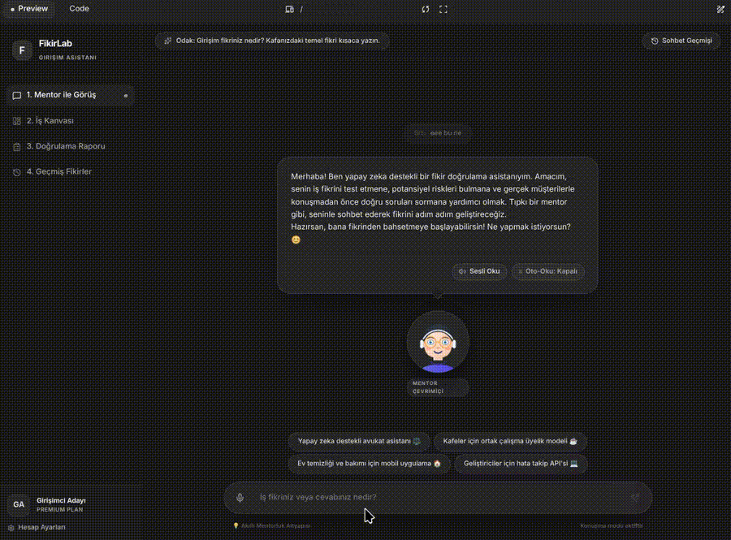

# AI Destekli Fikir Doğrulama Asistanı

## Takım İsmi

TEAM - 138

---

## Takım Üyeleri ve Rolleri

| İsim             | Rol           |
| ---------------- | ------------- |
| Eren Yıldız      | Scrum Master  |
| Sema Yeşilkaya   | Product Owner |
| Semiha Çıtırkı   | Developer     |
| Mücahit Ayyıldız | Developer     |
| Berker Öner      | Developer     |

---

## Ürün İsmi

AI Destekli Fikir Doğrulama Asistanı

---

## Ürün Açıklaması

Bu proje, girişimci adaylarının iş fikirlerini doğrulamasına yardımcı olan AI destekli bir fikir doğrulama panelidir.

Kullanıcı iş fikrini sisteme girer. Sistem bu fikri analiz eder, en riskli varsayımları belirler, müşteri görüşmeleri için doğru sorular üretir, MVP kapsamını daraltır ve kullanıcıya adım adım doğrulama yol haritası sunar.

Bu ürünün amacı, girişimci adaylarının fikirlerini doğrudan ürüne dönüştürmeden önce daha sistemli, ölçülebilir ve kanıta dayalı şekilde doğrulamalarına yardımcı olmaktır.

---

## Ürün Vizyonu

AI Destekli Fikir Doğrulama Asistanı'nın vizyonu, girişimci adaylarının iş fikirlerini yalnızca sezgisel kararlarla değil, sistemli analizler, müşteri içgörüleri ve doğrulama adımlarıyla test edebilecekleri erişilebilir bir karar destek platformu sunmaktır.

Ürün; kullanıcıların fikirlerini daha erken aşamada değerlendirmesine, en riskli varsayımları fark etmesine, doğru müşteri görüşmeleri yapmasına ve MVP kapsamını daha gerçekçi şekilde belirlemesine yardımcı olmayı hedefler.

---

## Problem

Girişimci adayları ve erken aşama ekipler, iş fikirlerini hayata geçirmeden önce çoğu zaman sistemli bir doğrulama süreci yürütememektedir. Fikirler genellikle kişisel sezgilere, çevreden alınan yüzeysel geri bildirimlere veya doğrudan ürün geliştirme isteğine dayanarak ilerlemektedir.

Bu durum; yanlış varsayımlar üzerine ürün geliştirilmesine, müşteri ihtiyacının yeterince anlaşılmamasına, MVP kapsamının gereğinden fazla büyümesine ve zaman/kaynak kaybına neden olmaktadır.

Bu proje kapsamında odaklanılan temel problem; kullanıcıların iş fikirlerindeki en riskli varsayımları belirlemekte, doğru müşteri görüşme soruları hazırlamakta ve fikirlerini kanıta dayalı şekilde doğrulamakta zorlanmalarıdır.

---

## Çözüm

AI Destekli Fikir Doğrulama Asistanı, girişimci adaylarının iş fikirlerini daha sistemli ve kanıta dayalı şekilde değerlendirebilmesi için geliştirilmiş bir doğrulama panelidir.

Kullanıcı iş fikrini sisteme girdikten sonra uygulama, fikri yalnızca genel olarak yorumlamakla kalmaz; fikrin arkasındaki temel varsayımları, potansiyel riskleri, hedef kitleyi ve MVP kapsamını analiz eder.

Sistem; kullanıcıya riskli varsayımlarını gösterir, müşteri görüşmeleri için yönlendirici sorular üretir, MoSCoW yöntemiyle MVP kapsamını daraltmaya yardımcı olur ve doğrulama sürecinde izlenebilecek adımları bir yol haritası halinde sunar.

Bu sayede kullanıcı, fikrini doğrudan geliştirmeye başlamadan önce hangi varsayımları test etmesi gerektiğini, kimlerle görüşmesi gerektiğini ve ilk MVP kapsamında nelere odaklanması gerektiğini daha net görebilir.

---

## Hedef Kitle

AI Destekli Fikir Doğrulama Asistanı'nın ana hedef kitlesi, iş fikrini hayata geçirmeden önce fikrinin uygulanabilirliğini ve müşteri ihtiyacını doğrulamak isteyen erken aşama girişimci adaylarıdır.

Ürün özellikle MVP geliştirme sürecine başlamadan önce hangi varsayımların test edilmesi gerektiğini görmek isteyen bireyler ve küçük ekipler için tasarlanmıştır.

İkincil hedef kitle olarak üniversite öğrencileri, bootcamp ve hackathon katılımcıları, girişimcilik programlarında yer alan ekipler ve proje fikrini daha sistemli bir doğrulama sürecinden geçirmek isteyen kullanıcılar hedeflenmektedir.

---

## Ürün Özellikleri

### MVP Kapsamındaki Temel Özellikler

- Kullanıcının iş fikrini sisteme girebilmesi
- Girilen iş fikrinin AI tarafından temel olarak analiz edilmesi
- Fikrin hedef kitlesi, problem alanı ve değer önerisinin çıkarılması
- İş fikrindeki en riskli varsayımların belirlenmesi
- Müşteri görüşmeleri için Mom Test prensiplerine uygun soru önerileri oluşturulması
- MVP kapsamının MoSCoW yöntemiyle önceliklendirilmesi
- Kullanıcıya fikir doğrulama süreci için adım adım yol haritası sunulması

### Geliştirilmesi Planlanan Özellikler

- Kullanıcının müşteri görüşme notlarını sisteme ekleyebilmesi
- Görüşme notlarından kanıt ve içgörü analizi yapılması
- Fikrin doğrulama durumunu gösteren final validasyon raporu oluşturulması
- RAG destekli girişimcilik bilgi katmanı ile analiz kalitesinin artırılması
- Kullanıcının önceki analizlerini görüntüleyebilmesi

---

## Product Backlog

| ID    | Backlog Item                                                        | Öncelik | Sprint     | Durum |
| ----- | ------------------------------------------------------------------- | ------- | ---------- | ----- |
| PB-01 | Kullanıcı kayıt ve giriş işlemleri için backend endpointlerinin yazılması | Yüksek  | Sprint 1   | Tamamlandı |
| PB-02 | Kullanıcının iş fikri ekleyebilmesi için backend endpointinin yazılması | Yüksek  | Sprint 1   | Tamamlandı |
| PB-03 | Kullanıcının eklediği fikirleri listeleyebilmesi                    | Yüksek  | Sprint 1   | Tamamlandı |
| PB-04 | Kullanıcının fikir detayını görüntüleyebilmesi                      | Yüksek  | Sprint 1   | Tamamlandı |
| PB-05 | Kullanıcının eklediği fikri silebilmesi                             | Orta    | Sprint 1   | Tamamlandı |
| PB-06 | Admin panel üzerinden temel veri yönetiminin sağlanması             | Orta    | Sprint 1   | Tamamlandı |
| PB-07 | Kayıt ve giriş ekranlarının frontend tarafında hazırlanması         | Yüksek  | Sprint 2   | Planlandı |
| PB-08 | Fikir ekleme ve fikir listeleme ekranlarının frontend ile entegre edilmesi | Yüksek | Sprint 2 | Planlandı |
| PB-09 | Girilen iş fikrinin AI ile temel analizinin yapılması               | Yüksek  | Sprint 2   | Planlandı |
| PB-10 | İş fikrindeki riskli varsayımların çıkarılması                      | Yüksek  | Sprint 2   | Planlandı |
| PB-11 | Mom Test prensiplerine uygun müşteri görüşme sorularının üretilmesi | Yüksek  | Sprint 2   | Planlandı |
| PB-12 | MVP kapsamının MoSCoW yöntemiyle önceliklendirilmesi                | Orta    | Sprint 2   | Planlandı |
| PB-13 | Doğrulama yol haritasının oluşturulması                             | Orta    | Sprint 3   | Planlandı |
| PB-14 | Kullanıcının görüşme notlarını sisteme ekleyebilmesi                | Orta    | Sprint 3   | Planlandı |
| PB-15 | Görüşme notlarından kanıt ve içgörü analizi yapılması               | Orta    | Sprint 3   | Planlandı |
| PB-16 | RAG destekli girişimcilik bilgi katmanı için kaynak araştırması ve entegrasyon çalışması | Orta | Sprint 1-3 | Devam Ediyor |
| PB-17 | Final validasyon raporunun oluşturulması                            | Yüksek  | Sprint 3   | Planlandı |
| PB-18 | Ürünün deploy edilebilir hale getirilmesi                           | Orta    | Sprint 3   | Planlandı |
---

## Product Backlog URL

Product backlog GitHub Projects üzerinde takip edilmektedir.  
URL: Sprint 1 sonunda eklenecektir.
---

## Sprint Board URL

Sprint 1 kapsamındaki görevler GitHub Projects üzerinde takip edilmektedir.  
Board üzerinde görevler Backlog, Todo, In Progress ve Done kolonlarıyla yönetilmektedir.

URL: <https://github.com/users/erenylldz/projects/2>

---

## Planlanan Teknolojiler

| Alan             | Teknoloji / Yaklaşım |
| ---------------- | -------------------- |
| Frontend         | Hazırlanan arayüz prototipi ve kullanıcı akışı referans alınarak Sprint 2 kapsamında geliştirilecek |
| Backend          | Django |
| API              | Django REST Framework |
| Database         | PostgreSQL |
| Admin Panel      | Django Admin |
| Authentication   | Kullanıcı kayıt/giriş endpointleri |
| Containerization | Docker |
| AI               | LLM API |
| RAG              | Girişimcilik ve fikir doğrulama içerikleri üzerinden kaynak araştırması ve entegrasyon |
| Deployment       | Sprint 3 kapsamında değerlendirilecek |

---

## Proje Yapısı

```text
.
├── backend/
│   ├── apps/
│   │   ├── users/        # Kullanıcı kayıt ve giriş işlemleri
│   │   ├── ideas/        # İş fikri ekleme, listeleme, detay ve silme işlemleri
│   │   └── analyses/     # AI analiz süreçleri için ayrılan uygulama alanı
│   ├── config/           # Django proje ayarları
│   ├── manage.py
│   └── requirements.txt
├── docs/
│   ├── product/          # Ürün fikri, kapsam ve ürün dokümantasyonu
│   ├── sprint-1/         # Sprint 1 dokümantasyonu
│   ├── sprint-2/         # Sprint 2 dokümantasyonu
│   └── sprint-3/         # Sprint 3 dokümantasyonu
├── Dockerfile
├── docker-compose.yml
├── .env.example
├── .gitignore
└── README.md

---

## Kurulum

Projeyi lokal ortamda çalıştırmak için Docker kullanılması önerilmektedir. Backend tarafı Django ile geliştirilmiş olup PostgreSQL veritabanı Docker Compose üzerinden çalışacak şekilde yapılandırılmıştır.

### 1. Repoyu klonlama

```bash
git clone <repository-url>
cd <repository-name>
```

### 2. Ortam değişkenlerini hazırlama

Proje kök dizininde yer alan `.env.example` dosyası örnek alınarak `.env` dosyası oluşturulmalıdır.

```bash
cp .env.example .env
```


### 3. Docker ile projeyi çalıştırma

```bash
docker compose up --build
```

### 4. Veritabanı migration işlemlerini çalıştırma

Container'lar ayağa kalktıktan sonra Django migration işlemleri çalıştırılmalıdır.

```bash
docker compose exec backend python manage.py migrate
```


### 5. Uygulamayı açma

Backend uygulaması lokal ortamda aşağıdaki adres üzerinden çalışacaktır:

```text
http://localhost:8000/
```

Django admin paneli için:

```text
http://localhost:8000/admin/
```

### MoSCoW MVP kapsam API'si

`GET /api/analyses/ideas/<idea_id>/moscow-scope/` kullanıcının kendi fikri için daha önce
kaydedilmiş analizi döndürür; kayıt yoksa `404` döner. `POST` aynı URL'de request body
gerektirmeden yeni analiz üretir ve kalıcı olarak kaydeder. İlk üretim `201`, var olan kaydın
yenilenmesi `200` döndürür. İki işlem de JWT authentication gerektirir ve başka kullanıcıların
fikirlerini `404` ile gizler.

```json
{
  "id": 1,
  "idea_id": 5,
  "summary": "MVP temel doğrulama akışına odaklanmalıdır.",
  "must_have": [{"title": "Fikir girişi", "reason": "Analiz için temel fikir bilgileri gereklidir."}],
  "should_have": [{"title": "Analiz geçmişi", "reason": "Önceki sonuçlarla karşılaştırmayı kolaylaştırır."}],
  "could_have": [{"title": "PDF çıktısı", "reason": "Sonucun paydaşlarla paylaşılmasını kolaylaştırır."}],
  "wont_have": [{"title": "Ödeme sistemi", "reason": "İlk MVP değerini test etmek için gerekli değildir."}],
  "prompt_version": "moscow-v1",
  "provider": "openai-compatible",
  "model_name": "configured-model"
}
```

Servis OpenAI uyumlu chat-completions endpoint'i için `AI_API_URL`, `AI_API_KEY`,
`AI_PROVIDER` ve `AI_MODEL_NAME` ortam değişkenlerini kullanır.

---

## Geliştirme Ortamı

Backend uygulaması Django ve Django REST Framework kullanılarak geliştirilmiştir. Veritabanı olarak PostgreSQL tercih edilmiş, geliştirme ortamının daha kolay kurulabilmesi için Docker desteği eklenmiştir.

Docker kullanmadan lokal geliştirme yapmak isteyen geliştiriciler için aşağıdaki adımlar izlenebilir:

### 1. Sanal ortam oluşturma

```bash
python3 -m venv venv
```

### 2. Sanal ortamı aktif etme

```bash
source venv/bin/activate
```

### 3. Bağımlılıkları yükleme

```bash
pip install -r backend/requirements.txt
```

### 4. Backend klasörüne geçme

```bash
cd backend
```

### 5. Migration işlemlerini çalıştırma

```bash
python manage.py migrate
```

### 6. Geliştirme sunucusunu başlatma

```bash
python manage.py runserver
```

Uygulama varsayılan olarak aşağıdaki adreste çalışacaktır:

```text
http://localhost:8000/
```

---

## Sprint Dokümantasyonu

Bootcamp süreci 3 sprint üzerinden ilerlemektedir. Her sprint sonunda proje yönetimi, ürün ilerlemesi ve takım içi değerlendirme notları ilgili sprint klasörü altında dokümante edilecektir.

* [Sprint 1](docs/sprint-1/)
* [Sprint 2](docs/sprint-2/)
* [Sprint 3](docs/sprint-3/)

---

## Sprint Sonu Beklenen Dokümanlar

Her sprint sonunda proje yönetimi sürecini ve ürün ilerlemesini göstermek amacıyla aşağıdaki başlıkların güncellenmesi hedeflenmektedir:

- Backlog dağıtma mantığı
- Daily Scrum notları
- Sprint board güncellemeleri
- Ürün durumu
- Sprint review
- Sprint retrospective

Bu dokümanlar ilgili sprint klasörü altında tutulacaktır. Sprint 1 için dokümantasyon `docs/sprint-1/` klasörü altında paylaşılacaktır.

---

## Sprint 1

### Sprint Notları

Sprint 1 sürecinde öncelikli olarak proje fikri netleştirilmiş, takım rolleri belirlenmiş ve ürünün temel kapsamı oluşturulmuştur. Bu sprintte hedef, tüm özellikleri tamamlamak yerine projenin teknik temelini kurmak, backend mimarisini oluşturmak ve sonraki sprintlerde geliştirilecek AI destekli analiz akışları için uygun bir altyapı hazırlamak olmuştur.

Backend tarafında Django mimarisi kurulmuş, kullanıcı kayıt/giriş işlemleri için endpointler hazırlanmıştır. Ayrıca kullanıcıların iş fikirlerini ekleyebildiği, listeleyebildiği, detaylarını görüntüleyebildiği ve silebildiği temel fikir yönetimi endpointleri geliştirilmiştir.

Sprint 1 sonunda admin panel aktif hale getirilmiş, backend tarafındaki ilk geliştirmeler ilgili branch üzerinden GitHub reposuna aktarılmıştır. Frontend tarafında ise kullanıcı kayıt/giriş ekranları ve backend entegrasyonu Sprint 2 kapsamında ele alınacak şekilde planlanmıştır.

Buna ek olarak, ürünün girişimcilik ve fikir doğrulama süreçlerinde daha nitelikli analizler sunabilmesi için RAG destekli bilgi katmanı üzerine kaynak araştırması başlatılmıştır.

### Sprint Hedefi

Sprint 1’in temel hedefi, AI Destekli Fikir Doğrulama Asistanı projesinin ürün kapsamını netleştirmek ve geliştirme süreci için gerekli teknik altyapıyı oluşturmaktır.

Bu sprintte ürünün problem-çözüm yapısı, hedef kitlesi, temel özellikleri ve product backlog’u belirlenmiştir. Teknik tarafta ise Django tabanlı backend mimarisi kurulmuş, kullanıcı yönetimi ve fikir yönetimi için ilk endpointler geliştirilmiştir.

Sprint 1 sonunda hedeflenen ana çıktılar:

- Ürün fikrinin ve MVP kapsamının netleştirilmesi
- Takım rollerinin belirlenmesi
- GitHub repository ve proje dokümantasyon yapısının oluşturulması
- Django backend mimarisinin kurulması
- Kullanıcı kayıt/giriş endpointlerinin hazırlanması
- Fikir ekleme, listeleme, detay görüntüleme ve silme endpointlerinin geliştirilmesi
- Admin panelin aktif hale getirilmesi
- RAG destekli bilgi katmanı için kaynak araştırmasının başlatılması
- Sprint 2’de geliştirilecek frontend ve AI analiz akışları için temel planın çıkarılması

### Sprint Backlog

| ID    | İş | Sorumlu | Durum |
| ----- | -- | ------- | ----- |
| SB-01 | Proje fikrinin netleştirilmesi | Takım | Tamamlandı |
| SB-02 | Takım rollerinin belirlenmesi | Takım | Tamamlandı |
| SB-03 | Product backlog’un oluşturulması | Takım | Tamamlandı |
| SB-04 | GitHub repository yapısının hazırlanması | Eren | Tamamlandı |
| SB-05 | Django backend mimarisinin kurulması | Backend Ekibi | Tamamlandı |
| SB-06 | Kullanıcı kayıt endpointinin yazılması | Backend Ekibi | Tamamlandı |
| SB-07 | Kullanıcı giriş endpointinin yazılması | Backend Ekibi | Tamamlandı |
| SB-08 | Fikir ekleme endpointinin yazılması | Backend Ekibi | Tamamlandı |
| SB-09 | Fikir listeleme endpointinin yazılması | Backend Ekibi | Tamamlandı |
| SB-10 | Fikir detay görüntüleme endpointinin yazılması | Backend Ekibi | Tamamlandı |
| SB-11 | Fikir silme endpointinin yazılması | Backend Ekibi | Tamamlandı |
| SB-12 | Django admin panelinin aktif hale getirilmesi | Backend Ekibi | Tamamlandı |
| SB-13 | Arayüz prototipi ve kullanıcı akışının incelenmesi | Takım | Devam Ediyor |
| SB-14 | RAG destekli bilgi katmanı için kaynak araştırmasının başlatılması | Takım | Devam Ediyor |
| SB-15 | Sprint 1 dokümantasyonunun hazırlanması | Eren | Devam Ediyor |

### Daily Scrum Notları

Sprint 1 sürecinde Daily Scrum görüşmeleri ağırlıklı olarak Slack Huddle üzerinden gerçekleştirilmiştir. Toplantılarda ekip üyelerinin üzerinde çalıştığı görevler, tamamlanan işler, karşılaşılan engeller ve bir sonraki adımlar değerlendirilmiştir.

Slack Huddle görüşmelerine ek olarak, ekip içi hızlı iletişim ve anlık koordinasyon için WhatsApp grubu aktif olarak kullanılmıştır. Bu sayede geliştirme sürecinde ortaya çıkan kısa sorular, görev güncellemeleri ve hızlı karar alınması gereken konular daha pratik şekilde takip edilmiştir.

Bu sprintte Daily Scrum gündemi genel olarak aşağıdaki başlıklar etrafında ilerlemiştir:

- Proje fikrinin netleştirilmesi
- Takım rollerinin belirlenmesi
- Ürün kapsamı ve MVP özelliklerinin konuşulması
- Backend mimarisinin kurulması
- Kullanıcı kayıt/giriş endpointlerinin geliştirilmesi
- Fikir ekleme, listeleme, detay görüntüleme ve silme endpointlerinin geliştirilmesi
- Admin panelin aktif hale getirilmesi
- Frontend tarafında eksik kalan kayıt/giriş ekranlarının belirlenmesi
- RAG destekli bilgi katmanı için kaynak araştırmasının başlatılması
- Sprint 1 dokümantasyonunun hazırlanması

Daily Scrum notları ve ekip içi iletişim çıktıları Sprint 1 dokümantasyonu kapsamında `docs/sprint-1/` klasörü altında ayrıca paylaşılacaktır.

### Sprint Board Güncellemeleri

Sprint 1 sürecinde görev takibi GitHub Projects üzerinden yapılmıştır. Product backlog ve sprint backlog maddeleri; yapılacaklar, devam eden işler ve tamamlanan işler olarak ayrıştırılmıştır.

Sprint board üzerinde özellikle aşağıdaki iş grupları takip edilmiştir:

- Proje fikri ve kapsam belirleme
- Takım rolleri ve görev dağılımı
- Backend mimarisinin kurulması
- Kullanıcı kayıt/giriş endpointleri
- Fikir ekleme, listeleme, detay görüntüleme ve silme endpointleri
- Admin panel kurulumu
- Frontend tarafında geliştirilecek ekranların belirlenmesi
- RAG kaynak araştırması
- Sprint 1 dokümantasyonu

Sprint 1 sonunda backend tarafındaki temel endpoint geliştirmeleri tamamlanmış, frontend entegrasyonu ve AI analiz akışları Sprint 2 kapsamına alınmıştır.

Sprint board ekran görüntüleri ve görev durumları `docs/sprint-1/` klasörü altında paylaşılacaktır.

### Ürün Durumu

Sprint 1 sonunda ürün, tam çalışan bir MVP seviyesinde değildir; ancak projenin temel teknik altyapısı ve ilk backend modülleri oluşturulmuştur.

Backend tarafında Django mimarisi kurulmuş, kullanıcı kayıt/giriş işlemleri için endpointler hazırlanmıştır. Ayrıca kullanıcıların iş fikirlerini ekleyebildiği, listeleyebildiği, detaylarını görüntüleyebildiği ve silebildiği temel fikir yönetimi endpointleri geliştirilmiştir.

Django admin paneli aktif hale getirilmiş ve temel veri yönetimi için kullanılabilir duruma getirilmiştir. Backend geliştirmeleri ilgili branch üzerinden GitHub reposuna aktarılmıştır.

Frontend tarafında arayüz ve kullanıcı akışı üzerine ön hazırlık yapılmış olup, kayıt/giriş ekranları ve backend entegrasyonu Sprint 2 kapsamında ele alınacaktır.

AI analiz akışı, riskli varsayım çıkarımı, müşteri görüşme soruları, MoSCoW önceliklendirme ve doğrulama yol haritası özellikleri sonraki sprintlerde geliştirilecek ana modüller olarak planlanmıştır.

RAG destekli bilgi katmanı için kaynak araştırması Sprint 1’de başlatılmıştır ve bu çalışmanın Sprint 3’e kadar geliştirilerek ürüne entegre edilmesi hedeflenmektedir.



### Sprint Review

Sprint 1 sonunda takım olarak proje fikri, ürün kapsamı, teknik mimari ve geliştirilen ilk backend çıktıları gözden geçirilmiştir.

Bu sprintte ürünün temel problem-çözüm yapısı netleştirilmiş, hedef kitle belirlenmiş ve Product Backlog oluşturulmuştur. Teknik tarafta Django tabanlı backend mimarisi kurulmuş, kullanıcı yönetimi ve fikir yönetimi için ilk endpointler geliştirilmiştir.

Sprint 1 sonunda ortaya çıkan başlıca çıktılar:

- Proje fikri ve ürün vizyonu netleştirildi.
- Takım rolleri belirlendi.
- Product Backlog ve Sprint Backlog oluşturuldu.
- GitHub repository ve proje klasör yapısı hazırlandı.
- Django backend mimarisi kuruldu.
- Kullanıcı kayıt ve giriş endpointleri geliştirildi.
- Kullanıcıların fikir ekleyebildiği, listeleyebildiği, detaylarını görüntüleyebildiği ve silebildiği endpointler geliştirildi.
- Django admin paneli aktif hale getirildi.
- Arayüz prototipi ve kullanıcı akışı üzerinden frontend geliştirme planı değerlendirildi.
- RAG destekli bilgi katmanı için kaynak araştırması başlatıldı.

Sprint Review sonucunda, Sprint 2’de frontend ekranlarının geliştirilmesi, backend ile entegrasyonun yapılması ve AI destekli temel fikir analizi akışının başlatılması öncelikli hedefler olarak belirlenmiştir..

### Sprint Retrospective

Sprint 1 sonunda takım olarak süreç, iletişim, görev dağılımı ve teknik ilerleme açısından değerlendirme yapılmıştır.

#### İyi Gidenler

- Proje fikri erken aşamada netleştirildi.
- Takım rolleri belirlendi.
- Ürün problemi, hedef kitlesi ve temel MVP kapsamı daha anlaşılır hale getirildi.
- Backend tarafında Django mimarisi kuruldu.
- Kullanıcı kayıt/giriş endpointleri geliştirildi.
- Kullanıcıların fikir ekleme, listeleme, detay görüntüleme ve silme işlemleri için temel endpointler tamamlandı.
- Django admin paneli aktif hale getirildi.
- Slack Huddle ve WhatsApp grubu üzerinden ekip içi iletişim aktif şekilde sürdürüldü.
- RAG destekli bilgi katmanı için kaynak araştırması başlatıldı.

#### Geliştirilmesi Gerekenler

- Görevlerin GitHub Issues üzerinde daha küçük ve takip edilebilir parçalara ayrılması gerekiyor.
- Sprint board güncellemelerinin daha düzenli yapılması gerekiyor.
- Daily Scrum notlarının daha sistemli şekilde dokümante edilmesi gerekiyor.
- Frontend tarafındaki teknoloji ve geliştirme planının netleştirilmesi gerekiyor.
- Backend ile frontend arasındaki veri akışının daha açık şekilde tanımlanması gerekiyor.
- AI analiz çıktılarının hangi formatta döneceği netleştirilmeli.

#### Bir Sonraki Sprint İçin Aksiyonlar

- Kayıt ve giriş ekranlarının frontend tarafında geliştirilmesi
- Fikir ekleme, listeleme ve detay görüntüleme ekranlarının backend ile entegre edilmesi
- AI destekli temel fikir analizi akışının başlatılması
- Riskli varsayım analizi için çıktı formatının belirlenmesi
- Mom Test prensiplerine uygun soru üretimi için prompt yapısının hazırlanması
- RAG kaynak araştırmasının sürdürülmesi ve kullanılabilecek veri kaynaklarının listelenmesi
- GitHub Issues ve Sprint Board kullanımının daha düzenli hale getirilmesi

---

## Sprint 2

### Sprint Notları

Belirlenecek.

### Sprint Hedefi

Belirlenecek.

### Sprint Backlog

Belirlenecek.

### Daily Scrum Notları

Belirlenecek.

### Sprint Board Güncellemeleri

Belirlenecek.

### Ürün Durumu

Belirlenecek.

### Sprint Review

Belirlenecek.

### Sprint Retrospective

Belirlenecek.

---

## Sprint 3

### Sprint Notları

Belirlenecek.

### Sprint Hedefi

Belirlenecek.

### Sprint Backlog

Belirlenecek.

### Daily Scrum Notları

Belirlenecek.

### Sprint Board Güncellemeleri

Belirlenecek.

### Ürün Durumu

Belirlenecek.

### Sprint Review

Belirlenecek.

### Sprint Retrospective

Belirlenecek.

---

## Proje Teslim Bilgileri

| Teslim Kalemi | Durum        |
| ------------- | ------------ |
| GitHub reposu | Hazır        |
| Public repo   | Belirlenecek |
| Ürün demosu   | Belirlenecek |
| Canlı link    | Belirlenecek |
| Proje videosu | Belirlenecek |
| Final raporu  | Belirlenecek |

---

## Lisans

Belirlenecek.
