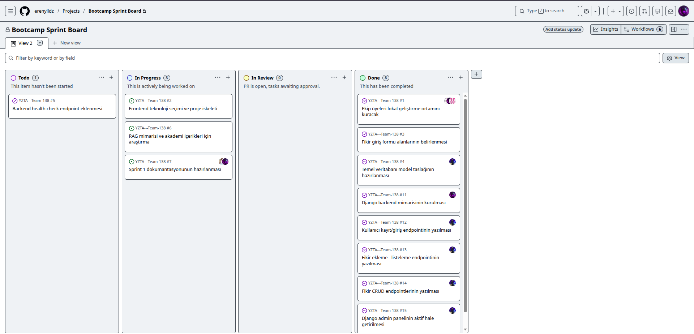
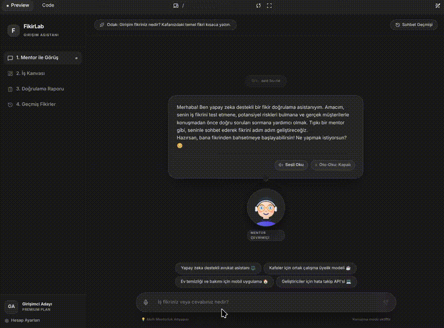
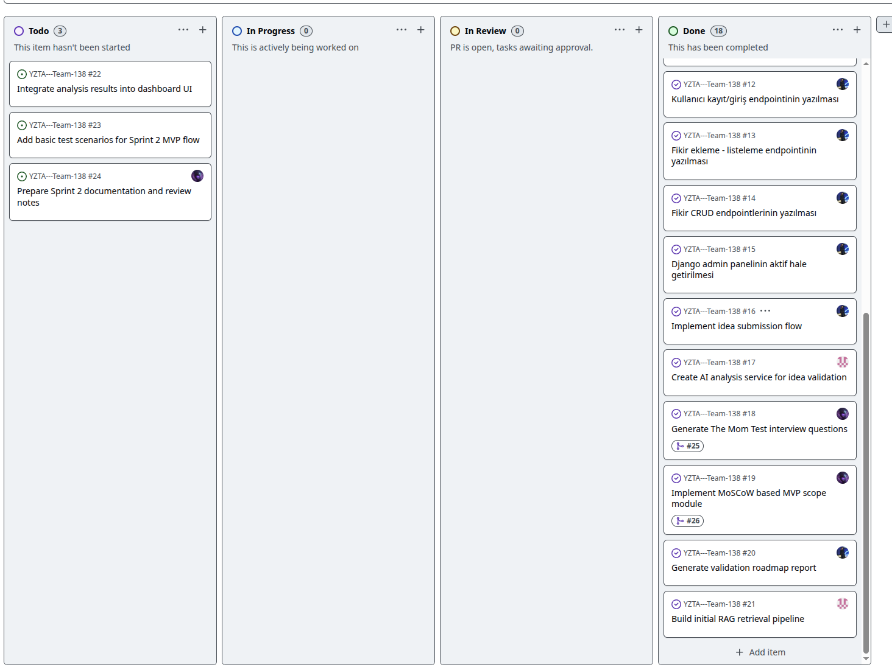
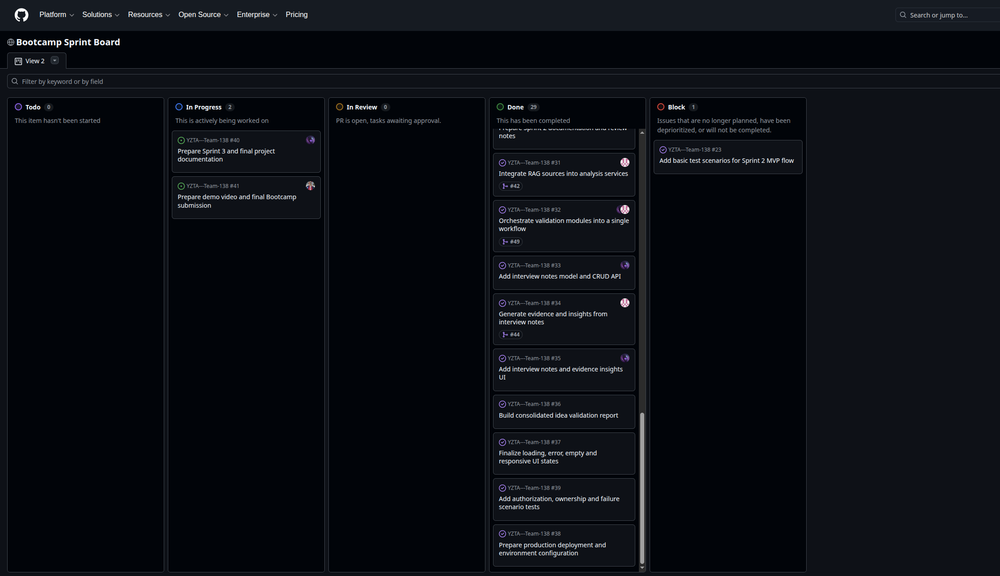
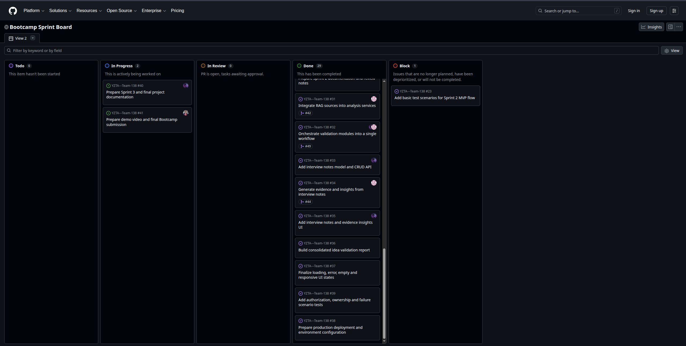
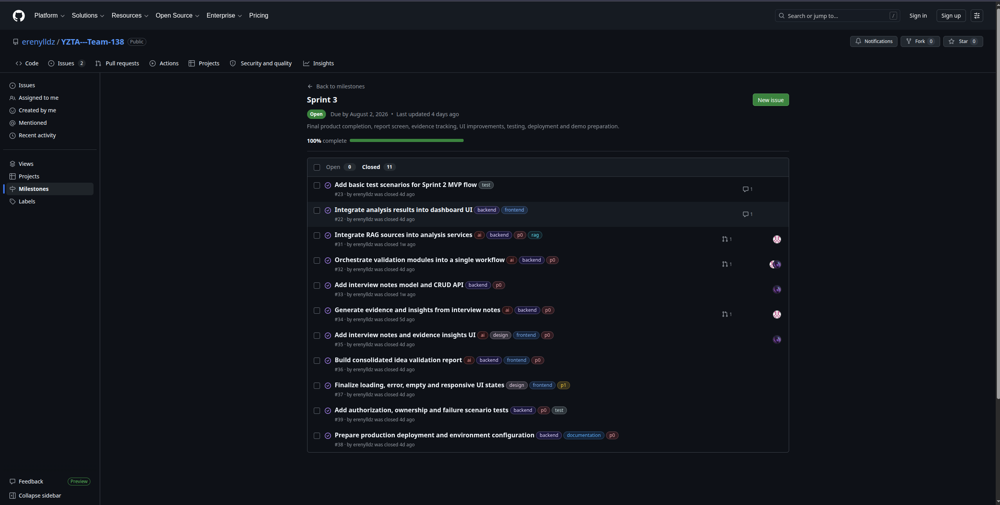
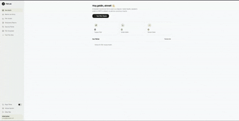

<a name="readme-top"></a>

# FikirLab

### AI Destekli Fikir Doğrulama Asistanı

FikirLab, girişimci adaylarının iş fikirlerini sistemli, ölçülebilir ve kanıta dayalı biçimde doğrulamasına yardımcı olan yapay zekâ destekli bir karar destek platformudur.

## Hızlı Bağlantılar

- [Canlı Uygulama](https://fikirlab-frontend.onrender.com)
- [Proje Tanıtım Videosu](https://www.youtube.com/watch?v=APuWhWGeCEo&feature=youtu.be)
- [GitHub Project Board](https://github.com/users/erenylldz/projects/2)
- [Kurulum](#kurulum)
- [API Dokümantasyonu](#api-kullanimi)
- [Sprint Dokümantasyonu](#sprint-dokumantasyonu)
- [Telif ve Kullanım Hakları](#telif-ve-kullanim-haklari)

## İçindekiler

1. [Takım ve Ürün Bilgileri](#takim-ve-urun)
2. [Ürün Özellikleri](#urun-ozellikleri)
3. [Product Backlog ve Sprint Board](#proje-yonetimi)
4. [Kullanılan Teknolojiler ve Teknik Mimari](#teknik-mimari)
5. [Proje Yapısı](#proje-yapisi)
6. [Kurulum ve Deployment](#kurulum)
7. [API Kullanımı](#api-kullanimi)
8. [Geliştirme ve Test Süreci](#gelistirme-ortami)
9. [Sprint Dokümantasyonu](#sprint-dokumantasyonu)
10. [Proje Teslim Bilgileri](#proje-teslimi)
11. [Telif ve Kullanım Hakları](#telif-ve-kullanim-haklari)


<a name="takim-ve-urun"></a>

## Takım İsmi

TEAM - 138

---

## Takım Üyeleri ve Rolleri

| İsim             | Rol           |
| ---------------- | ------------- |
| Eren Yıldız      | Scrum Master  |
| Sema Yeşilkaya   | Product Owner |
| Semiha Çıtırkı   | Developer     |
| Mücahit Ayyıldız | Developer     |
| Berker Öner      | Developer     |

---

## Ürün Açıklaması

Bu proje, girişimci adaylarının iş fikirlerini doğrulamasına yardımcı olan AI destekli bir fikir doğrulama panelidir.

Kullanıcı iş fikrini sisteme girer. Sistem bu fikri analiz eder, en riskli varsayımları belirler, müşteri görüşmeleri için doğru sorular üretir, MVP kapsamını daraltır ve kullanıcıya adım adım doğrulama yol haritası sunar.

Bu ürünün amacı, girişimci adaylarının fikirlerini doğrudan ürüne dönüştürmeden önce daha sistemli, ölçülebilir ve kanıta dayalı şekilde doğrulamalarına yardımcı olmaktır.

---

## Ürün Vizyonu

AI Destekli Fikir Doğrulama Asistanı'nın vizyonu, girişimci adaylarının iş fikirlerini yalnızca sezgisel kararlarla değil, sistemli analizler, müşteri içgörüleri ve doğrulama adımlarıyla test edebilecekleri erişilebilir bir karar destek platformu sunmaktır.

Ürün; kullanıcıların fikirlerini daha erken aşamada değerlendirmesine, en riskli varsayımları fark etmesine, doğru müşteri görüşmeleri yapmasına ve MVP kapsamını daha gerçekçi şekilde belirlemesine yardımcı olmayı hedefler.

---

## Problem

Girişimci adayları ve erken aşama ekipler, iş fikirlerini hayata geçirmeden önce çoğu zaman sistemli bir doğrulama süreci yürütememektedir. Fikirler genellikle kişisel sezgilere, çevreden alınan yüzeysel geri bildirimlere veya doğrudan ürün geliştirme isteğine dayanarak ilerlemektedir.

Bu durum; yanlış varsayımlar üzerine ürün geliştirilmesine, müşteri ihtiyacının yeterince anlaşılmamasına, MVP kapsamının gereğinden fazla büyümesine ve zaman/kaynak kaybına neden olmaktadır.

Bu proje kapsamında odaklanılan temel problem; kullanıcıların iş fikirlerindeki en riskli varsayımları belirlemekte, doğru müşteri görüşme soruları hazırlamakta ve fikirlerini kanıta dayalı şekilde doğrulamakta zorlanmalarıdır.

---

## Çözüm

AI Destekli Fikir Doğrulama Asistanı, girişimci adaylarının iş fikirlerini daha sistemli ve kanıta dayalı şekilde değerlendirebilmesi için geliştirilmiş bir doğrulama panelidir.

Kullanıcı iş fikrini sisteme girdikten sonra uygulama, fikri yalnızca genel olarak yorumlamakla kalmaz; fikrin arkasındaki temel varsayımları, potansiyel riskleri, hedef kitleyi ve MVP kapsamını analiz eder.

Sistem; kullanıcıya riskli varsayımlarını gösterir, müşteri görüşmeleri için yönlendirici sorular üretir, MoSCoW yöntemiyle MVP kapsamını daraltmaya yardımcı olur ve doğrulama sürecinde izlenebilecek adımları bir yol haritası halinde sunar.

Bu sayede kullanıcı, fikrini doğrudan geliştirmeye başlamadan önce hangi varsayımları test etmesi gerektiğini, kimlerle görüşmesi gerektiğini ve ilk MVP kapsamında nelere odaklanması gerektiğini daha net görebilir.

---

## Hedef Kitle

AI Destekli Fikir Doğrulama Asistanı'nın ana hedef kitlesi, iş fikrini hayata geçirmeden önce fikrinin uygulanabilirliğini ve müşteri ihtiyacını doğrulamak isteyen erken aşama girişimci adaylarıdır.

Ürün özellikle MVP geliştirme sürecine başlamadan önce hangi varsayımların test edilmesi gerektiğini görmek isteyen bireyler ve küçük ekipler için tasarlanmıştır.

İkincil hedef kitle olarak üniversite öğrencileri, bootcamp ve hackathon katılımcıları, girişimcilik programlarında yer alan ekipler ve proje fikrini daha sistemli bir doğrulama sürecinden geçirmek isteyen kullanıcılar hedeflenmektedir.

---

<a name="urun-ozellikleri"></a>

## Ürün Özellikleri

### Tamamlanan MVP Özellikleri

#### Kullanıcı ve Hesap Yönetimi

- Kullanıcıların hesap oluşturabilmesi
- Kayıt sırasında e-posta doğrulama kodu gönderilmesi
- Kullanıcının altı haneli doğrulama koduyla hesabını doğrulayabilmesi
- Doğrulanmış hesaplarla giriş yapılabilmesi
- JWT tabanlı kimlik doğrulama altyapısının kullanılması
- Parolasını unutan kullanıcıların doğrulama koduyla yeni parola belirleyebilmesi
- Giriş yapan kullanıcının ad ve soyad bilgilerini güncelleyebilmesi
- Kullanıcının mevcut parolasını doğrulayarak parolasını değiştirebilmesi
- Parola alanlarında görünürlük kontrolünün sağlanması
- Kimlik doğrulama ve kod gönderme işlemlerinde istek sınırlandırmalarının uygulanması

#### İş Fikri Yönetimi

- Kullanıcının yeni bir iş fikri oluşturabilmesi
- Kullanıcının yalnızca kendisine ait iş fikirlerini listeleyebilmesi
- Fikir detaylarının görüntülenebilmesi
- Fikir bilgilerinin güncellenebilmesi
- Fikirlerin silinebilmesi
- Kullanıcının daha önce oluşturduğu fikirler arasında geçiş yapabilmesi
- Aktif fikir bilgisinin uygulama ekranları arasında korunması
- Silinen veya artık erişilemeyen fikirlerin aktif kullanıcı akışından güvenli biçimde temizlenmesi
- Eski API isteklerinin yeni seçilen fikir üzerinde hatalı işlem oluşturmasının engellenmesi

#### Yapay Zekâ Destekli Fikir Doğrulama

- Girilen iş fikrinin yapay zekâ destekli olarak analiz edilmesi
- Fikrin temel problemi, hedef kitlesi, değer önerisi ve riskli varsayımlarının değerlendirilmesi
- Kullanıcının hedef kitlesiyle gerçekleştireceği görüşmeler için Mom Test prensiplerine uygun sorular oluşturulması
- İş fikrinin MVP kapsamının MoSCoW yöntemiyle önceliklendirilmesi
- Kullanıcıya uygulanabilir bir fikir doğrulama yol haritası hazırlanması
- Rakip ve pazar değerlendirmelerinin oluşturulması
- Yatırımcı sunumu hazırlama sürecine yönelik yapay zekâ desteği sunulması
- Kullanıcının fikrine özel sorular sorabildiği AI mentor deneyiminin sağlanması
- Mentor yanıtlarının Markdown biçiminde gösterilmesi

#### Merkezi Doğrulama Workflow’u

- Ayrı çalışan doğrulama modüllerinin merkezi bir workflow altında birleştirilmesi
- Doğrulama analizlerinin belirli bir işlem sırası içerisinde yürütülmesi
- Analiz aşamalarının birbirinden bağımsız olarak hata yönetimine sahip olması
- Uzun süren doğrulama işlemlerinde kullanıcıya HTTP polling tabanlı yakın gerçek zamanlı ilerleme bilgisi gösterilmesi
- Tamamlanan analiz sonuçlarının veritabanında saklanması
- Kullanıcının daha önce oluşturulan analiz sonuçlarını tekrar görüntüleyebilmesi

#### RAG Destekli Bilgi Katmanı

- Yapay Zekâ ve Teknoloji Akademisi tarafından sağlanan girişimcilik eğitim videolarının RAG bilgi tabanında kullanılabilmesi
- Eğitim videolarına ait metadata ve Türkçe transcript içeriklerinin işlenmesi
- Kaynak içeriklerin parçalara ayrılarak vektör tabanlı biçimde saklanması
- Gemini embedding modeliyle kaynak ve sorgu vektörlerinin oluşturulması
- PostgreSQL ve `pgvector` üzerinden benzerlik araması yapılması
- İlgili eğitim bağlamının beş aşamalı doğrulama workflow’undaki analiz promptlarına eklenmesi
- Kullanılan kaynakların doğrulama raporu ve PDF çıktısında kaynak listesi olarak gösterilmesi

#### Müşteri Görüşme Notları ve Kanıt Analizi

- Kullanıcının müşteri görüşme notlarını sisteme ekleyebilmesi
- Görüşme notlarını listeleyebilmesi
- Mevcut görüşme notlarını düzenleyebilmesi
- Görüşme notlarını silebilmesi
- Görüşme notlarından yapay zekâ destekli kanıt ve içgörü oluşturulması
- Görüşmelerde belirtilen problem, davranış, ihtiyaç ve itirazların değerlendirilmesi
- Görüşme sonuçlarının fikir doğrulama sürecine dahil edilmesi
- Kullanıcıların yalnızca kendilerine ait görüşme notlarına ve analiz sonuçlarına erişebilmesi

#### Bütünleşik Doğrulama Raporu

- Fikir analizi, riskli varsayımlar, Mom Test soruları, MoSCoW kapsamı ve doğrulama yol haritasının tek raporda birleştirilmesi
- Fikir analizi, riskli varsayımlar, Mom Test soruları, MoSCoW kapsamı, doğrulama yol haritası ve RAG kaynaklarının tek raporda birleştirilmesi
- Kullanıcının fikrine ait güncel doğrulama sonuçlarını rapor ekranından inceleyebilmesi
- Doğrulama raporunun metin tabanlı PDF olarak dışa aktarılabilmesi
- PDF içerisinde Türkçe karakterlerin ve düzenli metin yapısının korunması

#### Kullanıcı Arayüzü ve Deneyimi

- Backend analiz sonuçlarının dashboard ve ilgili analiz ekranlarına entegre edilmesi
- Fikir oluşturma, analiz başlatma ve sonuç görüntüleme adımlarının uçtan uca bir kullanıcı akışında birleştirilmesi
- Gerçek kullanıcı fikirlerinin ve analiz geçmişinin arayüzde gösterilmesi
- Açık ve koyu tema desteği
- Responsive sayfa düzenleri
- Yüklenme durumlarının kullanıcıya gösterilmesi
- API ve analiz hataları için anlaşılır hata durumlarının hazırlanması
- Veri bulunmayan ekranlar için boş durum bileşenlerinin oluşturulması
- Formların klavye üzerinden gönderilebilmesi
- Kullanılmayan veya güncelliğini kaybeden frontend özelliklerinin temizlenmesi

### Teknik ve Operasyonel Özellikler

- Django ve Django REST Framework tabanlı modüler backend mimarisi
- React, TypeScript ve Vite tabanlı frontend uygulaması
- PostgreSQL ve `pgvector` destekli veritabanı altyapısı
- Docker ve Docker Compose tabanlı geliştirme ortamı
- Kullanıcı sahipliği ve yetkilendirme kontrolleri
- Başarısız istek ve erişim senaryolarına yönelik backend testleri
- Production ortamında Brevo Transactional Email HTTP API, yerel geliştirmede Django console e-posta backend desteği
- Production ortam değişkenleri ve güvenlik yapılandırmaları
- Render üzerinde deployment yapılabilmesi için production yapılandırması
- Sık kullanılan proje yaşam döngüsü işlemlerini yöneten Makefile
- Makefile üzerinden proje kurulumu, başlatma, durdurma, build ve temizlik işlemleri
- Makefile üzerinden RAG kaynaklarının sisteme aktarılması ve bilgi tabanı istatistiklerinin görüntülenmesi

### Gelecekte Geliştirilebilecek Özellikler

- Müşteri görüşmelerinden elde edilen kanıtlara göre riskli varsayımların otomatik olarak yeniden önceliklendirilmesi
- Fikrin doğrulama seviyesinin zaman içerisindeki değişimini gösteren ayrıntılı ilerleme ve skor sistemi
- PDF çıktısına ek olarak bağlantı üzerinden paylaşılabilen doğrulama raporları
- Birden fazla kullanıcının aynı fikir üzerinde birlikte çalışabilmesini sağlayan takım çalışma alanları
- Görüşme kanıtlarının zaman, hedef kitle ve doğrulama konusu bazında karşılaştırılması
- RAG bilgi tabanının daha fazla açık kaynak girişimcilik içeriği ve farklı kaynak türleriyle genişletilmesi
- Kullanıcı davranışlarına göre kişiselleştirilmiş doğrulama önerileri
- Doğrulama adımları ve yaklaşan görevler için bildirim sistemi

---

<a name="proje-yonetimi"></a>

## Product Backlog

Product Backlog, ürünün geliştirme sürecinde planlanan kullanıcı özelliklerini, yapay zekâ çalışmalarını, teknik altyapı ihtiyaçlarını ve final teslim faaliyetlerini göstermektedir.

Backlog maddelerinin ayrıntılı takibi GitHub Issues, Milestones, branch'ler, pull request'ler ve GitHub Project Board üzerinden gerçekleştirilmiştir.

| ID | Backlog Item | Öncelik | Sprint | Durum |
|---|---|---|---|---|
| PB-01 | Kullanıcı kayıt ve giriş endpointlerinin geliştirilmesi | Yüksek | Sprint 1 | Tamamlandı |
| PB-02 | JWT tabanlı kimlik doğrulama altyapısının hazırlanması | Yüksek | Sprint 1 | Tamamlandı |
| PB-03 | Kullanıcının yeni bir iş fikri oluşturabilmesi | Yüksek | Sprint 1 | Tamamlandı |
| PB-04 | Kullanıcının kendisine ait fikirleri listeleyebilmesi ve detaylarını görüntüleyebilmesi | Yüksek | Sprint 1 | Tamamlandı |
| PB-05 | Kullanıcının fikirlerini güncelleyebilmesi ve silebilmesi | Orta | Sprint 1 | Tamamlandı |
| PB-06 | Django Admin üzerinden temel veri yönetiminin sağlanması | Orta | Sprint 1 | Tamamlandı |
| PB-07 | Docker ve PostgreSQL tabanlı geliştirme ortamının hazırlanması | Yüksek | Sprint 1 | Tamamlandı |
| PB-08 | Fikir gönderme akışının frontend ve backend üzerinde geliştirilmesi | Yüksek | Sprint 2 | Tamamlandı |
| PB-09 | İş fikirleri için yapay zekâ destekli temel analiz servisinin geliştirilmesi | Yüksek | Sprint 2 | Tamamlandı |
| PB-10 | Mom Test prensiplerine uygun müşteri görüşme sorularının üretilmesi | Yüksek | Sprint 2 | Tamamlandı |
| PB-11 | MVP kapsamının MoSCoW yöntemiyle önceliklendirilmesi | Yüksek | Sprint 2 | Tamamlandı |
| PB-12 | Kullanıcıya fikir doğrulama yol haritası oluşturulması | Yüksek | Sprint 2 | Tamamlandı |
| PB-13 | Girişimcilik içerikleri için başlangıç RAG retrieval altyapısının hazırlanması | Yüksek | Sprint 2 | Tamamlandı |
| PB-14 | Analiz sonuçlarının dashboard ve ilgili frontend ekranlarına entegre edilmesi | Yüksek | Sprint 3 | Tamamlandı |
| PB-15 | Fikir oluşturma, analiz başlatma ve sonuç görüntüleme adımlarının uçtan uca birleştirilmesi | Yüksek | Sprint 3 | Tamamlandı |
| PB-16 | Sprint 2 MVP akışı için ayrı temel test senaryolarının hazırlanması | Orta | Sprint 3 | Kapsamdan çıkarıldı – `Block` |
| PB-17 | Kullanıcının önceki fikirlerini ve analiz geçmişini arayüzden görüntüleyebilmesi | Orta | Sprint 3 | Tamamlandı |
| PB-18 | RAG kaynaklarının yapay zekâ analiz servisleriyle bütünleştirilmesi | Yüksek | Sprint 3 | Tamamlandı |
| PB-19 | Doğrulama modüllerinin merkezi bir workflow altında birleştirilmesi | Yüksek | Sprint 3 | Tamamlandı |
| PB-20 | Müşteri görüşme notları için veri modeli ve CRUD API geliştirilmesi | Yüksek | Sprint 3 | Tamamlandı |
| PB-21 | Görüşme notlarının frontend üzerinden eklenmesi, düzenlenmesi ve silinmesi | Yüksek | Sprint 3 | Tamamlandı |
| PB-22 | Görüşme notlarından yapay zekâ destekli kanıt ve içgörü oluşturulması | Yüksek | Sprint 3 | Tamamlandı |
| PB-23 | Temel fikir doğrulama analizlerini ve RAG kaynaklarını birleştiren bütünleşik doğrulama raporunun hazırlanması | Yüksek | Sprint 3 | Tamamlandı |
| PB-24 | Doğrulama raporunun PDF olarak dışa aktarılabilmesi | Orta | Sprint 3 | Tamamlandı |
| PB-25 | Uzun süren doğrulama işlemleri için HTTP polling tabanlı yakın gerçek zamanlı ilerleme takibinin geliştirilmesi | Orta | Sprint 3 | Tamamlandı |
| PB-26 | Yüklenme, hata, boş durum ve responsive arayüz davranışlarının tamamlanması | Yüksek | Sprint 3 | Tamamlandı |
| PB-27 | Kullanıcı sahipliği, yetkilendirme ve başarısız istek senaryolarının test edilmesi | Yüksek | Sprint 3 | Tamamlandı |
| PB-28 | Kullanıcı profil bilgileri ve hesap ayarları ekranının geliştirilmesi | Orta | Sprint 3 | Tamamlandı |
| PB-29 | E-posta doğrulama, doğrulama kodu yeniden gönderme ve parola sıfırlama akışlarının geliştirilmesi | Yüksek | Sprint 3 | Tamamlandı |
| PB-30 | Mentor yanıtlarında Markdown desteği ve kullanıcı deneyimi iyileştirmelerinin yapılması | Orta | Sprint 3 | Tamamlandı |
| PB-31 | Aktif fikir yönetimi, silinmiş fikirler ve eski API isteklerinden kaynaklanan durum sorunlarının giderilmesi | Yüksek | Sprint 3 | Tamamlandı |
| PB-32 | YouTube kaynaklarının RAG bilgi tabanına aktarılması için ingestion pipeline hazırlanması | Orta | Sprint 3 | Tamamlandı |
| PB-33 | Proje yaşam döngüsü ve RAG komutlarının Makefile üzerinden yönetilmesi | Orta | Sprint 3 | Tamamlandı |
| PB-34 | Production ortam değişkenleri ve deployment yapılandırmasının hazırlanması | Yüksek | Sprint 3 | Teknik hazırlık tamamlandı |
| PB-35 | Ürünün canlı ortamda yayınlanması ve canlı bağlantının oluşturulması | Yüksek | Final Delivery | Tamamlandı – <https://fikirlab-frontend.onrender.com> |
| PB-36 | Sprint 3 ve final proje dokümantasyonunun tamamlanması | Yüksek | Final Delivery | Tamamlandı |
| PB-37 | Sprint 3 ürün durumu videosunun repository'ye eklenmesi | Orta | Final Delivery | Tamamlandı |
| PB-38 | Final ürün demosunun hazırlanması | Yüksek | Final Delivery | Tamamlandı |
| PB-39 | Üç dakikalık proje tanıtım videosunun hazırlanması | Yüksek | Final Delivery | Tamamlandı |
| PB-40 | Final Bootcamp teslim bilgilerinin hazırlanması ve teslim formunun tamamlanması | Yüksek | Final Delivery | Tamamlandı |

Sprint 3 sonunda ürünün temel MVP akışı tamamlanmıştır. Önceki sprintlerde ayrı ayrı geliştirilen frontend, backend, yapay zekâ ve RAG bileşenleri tek bir kullanıcı akışı içerisinde birleştirilmiştir.

`PB-16` kapsamında takip edilen temel MVP test senaryoları işi, süreç içerisinde ayrı bir backlog maddesi olarak sürdürülmemesine karar verildiği için tamamlanmış kabul edilmemiş ve Project Board üzerinde `Block` durumuna alınmıştır.

Production deployment için gerekli teknik yapılandırmalar tamamlanmış ve ürün Render üzerinde canlı ortama alınmıştır.

Canlı uygulama: <https://fikirlab-frontend.onrender.com>

Final dokümantasyonu, ürün demosu ve üç dakikalık proje tanıtım videosu tamamlanmıştır. Proje canlı ortamda çalışır durumdadır ve Bootcamp final teslimi için gerekli çıktılar hazırlanmıştır.

---

## Sprint Board URL

Bootcamp süresince planlanan ve geliştirilen çalışmalar GitHub Projects üzerinden takip edilmiştir.

Board üzerinde görevler aşağıdaki durumlara göre yönetilmektedir:

- `To Do`: İlgili sprintte yapılması planlanan ancak henüz başlanmamış çalışmalar
- `In Progress`: Geliştirmesi aktif olarak devam eden çalışmalar
- `In Review`: Pull request'i açılmış ve inceleme veya birleştirme süreci devam eden çalışmalar
- `Done`: Geliştirmesi, kontrolleri ve gerekli birleştirme işlemleri tamamlanan çalışmalar
- `Block`: Sprint sürecinde kapsamdan çıkarılan, önceliği kaldırılan veya artık tamamlanması planlanmayan çalışmalar

Geliştirmesine başlanan işler `In Progress`, pull request aşamasına ulaşan işler `In Review`, geliştirme ve kontrol süreçleri tamamlanan işler ise `Done` durumuna taşınmıştır.

Sprint içerisinde tamamlanamayan ancak geliştirilmesine devam edilmesi planlanan çalışmalar, ilgili issue'lara açıklayıcı yorumlar eklenerek sonraki sprinte veya ayrı bir teslim milestone'una aktarılmıştır.

Yapılmasından vazgeçilen, kapsamdan çıkarılan veya önceliği kaldırılan çalışmalar ise tamamlanmış olarak gösterilmeden `Block` durumuna alınmıştır.

Product Backlog ve Sprint Board:

<https://github.com/users/erenylldz/projects/2>

---

<a name="teknik-mimari"></a>

## Kullanılan Teknolojiler

Projenin backend, frontend, yapay zekâ, RAG, geliştirme ortamı ve deployment süreçlerinde kullanılan temel teknolojiler aşağıdaki tabloda gösterilmiştir.

| Alan | Teknoloji / Yaklaşım | Projedeki Kullanımı |
|---|---|---|
| Backend çalışma ortamı | Python 3.12 | Django uygulaması, servis katmanı ve yapay zekâ işlemleri |
| Backend framework | Django 6.0.6 | Veri modelleri, admin paneli, uygulama ve URL yapısı |
| REST API | Django REST Framework 3.17.1 | Serializer, APIView, ViewSet ve endpoint geliştirme |
| Kimlik doğrulama | SimpleJWT 5.5.1 | JWT access ve refresh token tabanlı kullanıcı oturumu |
| Veritabanı | PostgreSQL 16 | Kullanıcı, fikir, analiz, workflow ve RAG kayıtlarının saklanması |
| PostgreSQL sürücüsü | psycopg 3.3.4 | Django ile PostgreSQL bağlantısı |
| Vektör veritabanı katmanı | pgvector | Embedding verilerinin saklanması ve cosine distance tabanlı retrieval |
| Yapay zekâ üretim modeli | Google Gemini | Fikir analizleri, doğrulama modülleri ve mentor yanıtları |
| Varsayılan Gemini modeli | `gemini-3.1-flash-lite` | Yapay zekâ destekli içerik üretimi |
| Embedding modeli | `gemini-embedding-001` | Doküman ve sorgu embedding’lerinin oluşturulması |
| Yapay zekâ SDK’sı | Google GenAI 2.12.1 | Gemini içerik üretimi, embedding ve native function calling |
| Alternatif AI sağlayıcı yolu | OpenAI-compatible HTTP client | Yalnızca MoSCoW servisinde Gemini anahtarı bulunmadığında opsiyonel fallback |
| Frontend | React 18.3.1 | Tek sayfalı web uygulaması |
| Frontend kaynak dili | TypeScript / TSX | Sayfa, component, hook ve API tiplerinin geliştirilmesi |
| Frontend geliştirme aracı | Vite 6.3.5 | Development server ve production bundle oluşturma |
| Arayüz ve stil | Tailwind CSS 4.1.12 | Utility tabanlı stil, tema ve responsive tasarım |
| Routing | React Router 7.13.0 | Public ve kimlik doğrulama korumalı sayfa yönlendirmeleri |
| UI bileşenleri | Lucide React, Radix UI, CVA, clsx, tailwind-merge | İkonlar ve ortak arayüz bileşenleri |
| Markdown gösterimi | React Markdown 10.1.0 | AI mentor yanıtlarının biçimlendirilmiş gösterimi |
| PDF oluşturma | `@react-pdf/renderer` 4.5.1 | Metin tabanlı doğrulama raporu ve kaynak listesinin PDF çıktısı |
| Containerization | Docker ve Docker Compose v2 | Django backend ve PostgreSQL geliştirme ortamı |
| Production sunucusu | Gunicorn 26.0.0 (`gthread`) | Render üzerinde bir worker ve dört thread ile Django WSGI servisi; uzun süren workflow sırasında ilerleme polling isteklerinin eş zamanlı karşılanması |
| E-posta altyapısı | Brevo Transactional Email HTTP API / Django Console Backend | Production ortamında doğrulama ve parola sıfırlama kodlarının Brevo HTTP API üzerinden, yerel geliştirmede console backend üzerinden gönderimi |
| HTTP istemcisi | Requests 2.32.3 | Brevo Transactional Email API çağrılarının gerçekleştirilmesi |
| Yerel otomasyon | GNU Make ve Bash | Kurulum, servis yaşam döngüsü, build, temizlik ve RAG işlemleri |
| Deployment | Render Blueprint | Docker backend, statik frontend ve yönetilen PostgreSQL kurulumu |
| Backend testleri | Django Test Framework | API, kullanıcı sahipliği, workflow, RAG ve servis testleri |
| Versiyon kontrolü | Git ve GitHub | Branch, commit, pull request ve kaynak kod yönetimi |
| Proje yönetimi | GitHub Issues, Milestones ve GitHub Projects | Sprint backlog ve görev durumlarının takibi |
| Dokümantasyon | Markdown | README ve sprint dokümantasyonlarının hazırlanması |

### Teknoloji Kullanımına İlişkin Notlar

Frontend kaynak kodları TypeScript ve TSX ile yazılmıştır. Bununla birlikte repository içerisinde ayrı bir `tsconfig.json`, TypeScript dependency’si veya bağımsız type-check komutu bulunmamaktadır. Vite ve esbuild kaynak kodu transpile ederek production bundle oluşturmaktadır.

Material UI, Emotion, jsPDF, Motion, Recharts, React DnD, React Hook Form ve bazı Radix UI paketleri dependency listesinde yer almakla birlikte güncel aktif uygulama akışında kullanılmamakta veya yalnızca önceki arayüz geliştirme çalışmalarından kalmış bulunmaktadır.

Projenin ana yapay zekâ sağlayıcısı Google Gemini’dir. OpenAI-compatible istemci bütün yapay zekâ servislerinde kullanılan genel bir abstraction değildir; yalnızca MoSCoW servisi için opsiyonel fallback olarak bulunmaktadır.

Canlı uygulama Render üzerinde yayınlanmaktadır:

<https://fikirlab-frontend.onrender.com>

---

### Teknik Yaklaşım

FikirLab; Django tabanlı backend, React tabanlı frontend, Gemini destekli yapay zekâ servisleri, pgvector tabanlı RAG katmanı ve Render deployment yapılandırmasından oluşan modüler bir web uygulamasıdır.

#### Backend Mimarisi

Backend tarafı sorumluluklarına göre üç temel Django uygulamasına ayrılmıştır:

- `users`: Kullanıcı kaydı, giriş, profil bilgileri, e-posta doğrulama ve parola işlemleri
- `ideas`: İş fikri yönetimi, fikir tabanlı analiz sonuçları, mentor agent, rakip analizi ve yatırımcı sunumu
- `analyses`: Merkezi doğrulama workflow’u, Mom Test, MoSCoW, görüşme notları, kanıt analizi ve RAG bileşenleri

API endpointleri Django REST Framework kullanılarak geliştirilmiştir. Kullanıcı oturumları SimpleJWT üzerinden access ve refresh token ile yönetilmektedir.

Korumalı endpointlerde yalnızca kimliği doğrulanmış kullanıcıların işlem yapmasına izin verilir. Fikir, analiz ve görüşme notu işlemlerinde kullanıcı sahipliği kontrol edilerek bir kullanıcının başka bir kullanıcıya ait verilere erişmesi engellenir.

Yapay zekâ çağrıları doğrudan view katmanında yürütülmek yerine servis fonksiyonlarına ayrılmıştır. Prompt oluşturma, sağlayıcı çağrısı, yanıt doğrulama, veri normalizasyonu ve veritabanına kaydetme işlemleri ilgili servis katmanlarında gerçekleştirilir.

#### Merkezi Doğrulama Workflow’u

Yeni bir fikir oluşturulduktan sonra kullanıcı, aşağıdaki beş aşamadan oluşan doğrulama workflow’unu başlatabilir:

1. Riskli varsayımların oluşturulması
2. Mom Test görüşme sorularının hazırlanması
3. MoSCoW tabanlı MVP kapsamının belirlenmesi
4. Doğrulama yol haritasının oluşturulması
5. Genel değerlendirmenin hazırlanması

Workflow bir yapay zekâ agent’ı değildir. Aşamaları backend tarafından önceden belirlenmiş sırayla çalıştırılan senkron bir servis orkestrasyonudur.

Her aşamanın sonucu ilgili veri modelinde saklanır. Aşamalardan biri başarısız olduğunda hata ilgili aşama bilgisiyle kaydedilir ve workflow sonraki aşamalara geçmeden durdurulur.

Workflow aşağıdaki endpoint üzerinden başlatılır:

```text
POST /api/analyses/ideas/<idea_id>/workflow/
```

Workflow ilerleme durumu ayrı bir endpoint üzerinden takip edilir:

```text
GET /api/analyses/workflow-runs/<run_id>/
```

Frontend, ilerleme endpointine yaklaşık bir saniyelik aralıklarla HTTP isteği gönderir. Bu nedenle ilerleme sistemi WebSocket veya Server-Sent Events tabanlı gerçek zamanlı iletişim değil, HTTP polling ile sağlanan yakın gerçek zamanlı ilerleme takibidir.

Rakip analizi, yatırımcı sunumu, AI mentor ve görüşme kanıtı analizi merkezi beş aşamalı workflow’un dışında çalışan ayrı özelliklerdir.

#### RAG Mimarisi

FikirLab’ın RAG katmanı, Yapay Zekâ ve Teknoloji Akademisi tarafından sağlanan girişimcilik eğitim içeriklerinden oluşturulan bilgi tabanını kullanmaktadır.

Fikir doğrulama workflow’unun beş aşaması, analiz sırasında kullanıcının iş fikriyle ilişkili eğitim içeriklerini bulmak ve yapay zekâ promptlarını bu bağlamla desteklemek için ortak RAG katmanından yararlanır.

RAG akışı genel olarak şu şekilde çalışır:

```text
Fikir bilgileri ve aşamaya özgü analiz amacı
→ sorgu metninin hazırlanması
→ Gemini query embedding oluşturulması
→ PostgreSQL ve pgvector üzerinde cosine distance sorgusu
→ uygun içerik parçalarının seçilmesi
→ kaynak bağlamının analiz promptuna eklenmesi
→ yapay zekâ sonucunun oluşturulması
→ kullanılan kaynak metadatasının fikir kaydına eklenmesi
```

Bilgi tabanında iki temel model kullanılmaktadır:

- `KnowledgeSource`: Kaynak başlığı, kaynak türü ve kaynak bağlantısı
- `KnowledgeChunk`: Kaynağa ait metin parçası, parça sırası ve 768 boyutlu embedding

Doküman embedding’leri `RETRIEVAL_DOCUMENT`, sorgu embedding’leri ise `RETRIEVAL_QUERY` göreviyle oluşturulur.

Retriever aşağıdaki kuralları uygular:

- Embedding modeli: `gemini-embedding-001`
- Embedding boyutu: 768
- Mesafe metriği: cosine distance
- İlk aday sayısı: 12
- Mesafe eşiği: `0.40`
- Döndürülen en yüksek içerik sayısı: 4
- Aynı kaynaktan alınabilecek en yüksek içerik sayısı: 2

Veritabanında HNSW veya IVFFlat tabanlı ayrı bir yaklaşık en yakın komşu indeksi bulunmamaktadır. Retrieval işlemleri mevcut pgvector cosine distance sorguları üzerinden yürütülmektedir.

Workflow aşamalarında bulunan kaynakların metadatası `Idea.rag_sources` alanında saklanır. Bu kaynaklar fikir detay endpointi üzerinden frontend’e iletilir ve mevcut olduklarında doğrulama raporu ile PDF çıktısında kaynak listesi olarak gösterilir.

Gösterilen kaynaklar inline veya cümle bazlı citation değildir. Sistem, model tarafından oluşturulan belirli bir ifadenin hangi kaynak parçasına dayandığını programatik olarak kanıtlamaz. Raporda yalnız retrieval sırasında bulunan kaynakların başlıkları ve varsa bağlantıları listelenir.

#### RAG Kaynaklarının Hazırlanması

RAG bilgi tabanının temel kaynaklarını, Yapay Zekâ ve Teknoloji Akademisi tarafından Bootcamp katılımcılarına sağlanan girişimcilik eğitim videoları oluşturmaktadır.

Bu eğitim içerikleri; iş fikri doğrulama, müşteri görüşmeleri, problem ve hedef kitle analizi, MVP kapsamı, girişimcilik süreçleri ve benzeri konularda proje analizlerini desteklemek amacıyla kullanılmaktadır.

Repository içerisinde videoların doğrudan medya dosyaları yerine, ingestion sürecinde kullanılan metadata ve Türkçe transcript dosyaları bulunmaktadır. Bu içerikler işlenerek metin parçalarına ayrılmakta, Gemini embedding modeliyle vektörleştirilmekte ve PostgreSQL ile pgvector tabanlı bilgi tabanına kaydedilmektedir.

YouTube ingestion süreci:

- Akademi tarafından sağlanan video kaynaklarına ait metadata dosyalarını okur.
- Videolara ait Türkçe transcript segmentlerini işler.
- İçerikleri varsayılan olarak yaklaşık 750 karakterlik parçalara ayırır.
- Ardışık parçalar arasında iki transcript segmenti overlap uygular.
- Parçalara başlangıç ve bitiş zaman bilgilerini ekler.
- Gemini embedding modeliyle 768 boyutlu vektörler oluşturur.
- Kaynak ve içerik parçalarını PostgreSQL veritabanına kaydeder.

#### AI Mentor Agent

AI mentor, merkezi doğrulama workflow’undan farklı olarak gerçek bir tool-calling agent yapısına sahiptir.

Mentor, Google Gemini’nin native function calling özelliğini kullanır. Model, kullanıcının mesajına göre uygun aracı seçebilir, backend seçilen aracı çalıştırır ve araç sonucu function response olarak tekrar modele gönderilir.

Mentor en fazla üç model ve araç turu çalıştırabilir.

Mentor tarafından kullanılabilen araçlar:

- `update_target_audience`
- `regenerate_validation_roadmap`
- `regenerate_moscow_scope`
- `generate_mom_test_questions`
- `regenerate_risky_assumptions`
- `regenerate_general_evaluation`
- `regenerate_competitor_analysis`
- `generate_investor_pitch`
- `save_interview_note`
- `analyze_interview_evidence`

Riskli varsayımlar, Mom Test, MoSCoW, doğrulama yol haritası ve genel değerlendirme araçları, ilgili analiz servislerini çağırdıkları için dolaylı olarak RAG katmanını kullanabilir.

Mentorun serbest sohbet yanıtı doğrudan ayrı bir retrieval işlemi gerçekleştirmez ve mentor cevabında yapılandırılmış kaynak veya citation listesi dönmez.

Mentor sohbet geçmişi backend veritabanında saklanmaz. Mesaj geçmişi fikir bazında frontend `localStorage` içerisinde tutulur ve son mesajların sınırlı bir bölümü yeni mentor isteğiyle backend’e gönderilir.

#### Görüşme Notları ve Kanıt Analizi

Kullanıcılar fikirlerine ait müşteri görüşme notlarını oluşturabilir, listeleyebilir, güncelleyebilir ve silebilir.

Görüşme kanıtı analizi, kayıtlı notları Gemini modeline göndererek problem, davranış, ihtiyaç, itiraz ve doğrulama sinyalleri üretir. Ayrıca mentor içerisindeki kanıt analizi aracı, görüşme notlarına göre riskli varsayımların durumlarını güncelleyebilir.

Görüşme kanıtı analizi merkezi beş aşamalı workflow’un bir parçası değildir.

Güncel frontend yapısında görüşme kanıtı analizinin sonuçları doğrulama raporu veya PDF içerisinde ayrı bir bölüm olarak gösterilmemektedir. Bu nedenle rapor, temel analiz modüllerini ve RAG kaynak listesini birleştirirken standalone evidence analizinin bütün sonuçlarını içeren eksiksiz bir final rapor olarak değerlendirilmemelidir.

#### Frontend Mimarisi

Frontend, React ve Vite kullanılarak tek sayfalı uygulama biçiminde geliştirilmiştir.

Uygulama içerisinde:

- Sayfalar `pages` klasöründe
- Tekrar kullanılabilir arayüz parçaları `components` klasöründe
- Kullanıcı ve tema durumu `context` klasöründe
- API tabanlı veri ve işlem mantığı `hooks` klasöründe
- REST API istemcisi `lib/api.ts` içerisinde
- PDF raporu `pdf/ReportDocument.tsx` içerisinde

yönetilmektedir.

React Router, public sayfalar ile JWT oturumu gerektiren korumalı uygulama sayfalarını birbirinden ayırır.

Aktif fikir bilgisi frontend state ve yerel depolama üzerinden korunur. Silinen veya artık erişilemeyen fikirlerde aktif fikir temizlenir ve bağımlı API çağrılarının hatalı biçimde devam etmesi engellenir.

Tema yönetimi açık ve koyu görünüm desteği sağlar. Mentor yanıtları React Markdown ile gösterilir. Doğrulama raporu `@react-pdf/renderer` kullanılarak metin tabanlı PDF olarak oluşturulur.

#### Geliştirme ve Deployment Yaklaşımı

Yerel geliştirme ortamında Django backend ve PostgreSQL servisi Docker Compose içerisinde çalışır. React frontend ise Makefile tarafından host üzerinde Vite development server ile başlatılır.

Makefile aşağıdaki işlemleri merkezi biçimde yönetir:

- Sistem ve proje kurulumu
- Ortam değişkeni dosyasının hazırlanması
- Backend image build işlemi
- PostgreSQL servisinin başlatılması
- Migration işlemlerinin uygulanması
- Frontend bağımlılıklarının kurulması
- Backend ve frontend servislerinin başlatılması
- Production build oluşturulması
- RAG ingestion ve bilgi tabanı istatistikleri
- Servislerin durdurulması ve yeniden başlatılması
- Yerel geliştirme verilerinin temizlenmesi

Production ortamı Render Blueprint üzerinden tanımlanmıştır:

- Yönetilen PostgreSQL veritabanı
- Docker tabanlı Django backend servisi
- Statik React frontend servisi

Backend production başlangıcında migration ve static dosya toplama işlemleri çalıştırılır, ardından uygulama Gunicorn ile başlatılır.

Frontend production build çıktısı `frontend/dist` klasöründen yayınlanır ve SPA route’ları `index.html` dosyasına yönlendirilir.

Canlı uygulama:

<https://fikirlab-frontend.onrender.com>

---

<a name="proje-yapisi"></a>

## Proje Yapısı

Proje; Django tabanlı backend, React tabanlı frontend, Gemini destekli yapay zekâ servisleri, pgvector tabanlı RAG altyapısı, AI mentor agent, PDF raporlama sistemi ve sprint dokümantasyonlarından oluşmaktadır.

```text
.
├── backend/
│   ├── apps/
│   │   ├── users/
│   │   │   ├── migrations/             # Kullanıcı ve doğrulama kodu migration dosyaları
│   │   │   ├── admin.py
│   │   │   ├── apps.py
│   │   │   ├── models.py               # Özel kullanıcı modeli ve doğrulama kodları
│   │   │   ├── serializers.py          # Kayıt, profil ve parola işlemleri
│   │   │   ├── services.py             # E-posta doğrulama ve parola sıfırlama servisleri
│   │   │   ├── throttles.py            # Kimlik doğrulama istek sınırlandırmaları
│   │   │   ├── tests.py
│   │   │   ├── urls.py
│   │   │   └── views.py
│   │   │
│   │   ├── ideas/
│   │   │   ├── migrations/
│   │   │   ├── admin.py
│   │   │   ├── apps.py
│   │   │   ├── mentor_agent.py         # Gemini native function-calling mentor agent
│   │   │   ├── models.py               # Fikir ve fikir tabanlı analiz sonuçları
│   │   │   ├── rag_context.py          # RAG sorgusu, context ve kaynak kayıt işlemleri
│   │   │   ├── serializers.py
│   │   │   ├── services.py             # Risk, roadmap, evaluation, rakip ve pitch servisleri
│   │   │   ├── tests.py
│   │   │   ├── urls.py
│   │   │   └── views.py                # Fikir CRUD ve ViewSet action endpointleri
│   │   │
│   │   └── analyses/
│   │       ├── migrations/
│   │       ├── rag/
│   │       │   ├── embedding_service.py
│   │       │   ├── retriever.py
│   │       │   ├── chunker.py
│   │       │   ├── rag_answer_service.py
│   │       │   ├── ingestion.py
│   │       │   └── ingestion/
│   │       │       ├── transcript_parser.py
│   │       │       ├── youtube_ingestion.py
│   │       │       └── youtube_metadata.py
│   │       │
│   │       ├── services/
│   │       │   ├── validation_workflow.py
│   │       │   ├── workflow_runs.py
│   │       │   ├── mom_test_questions.py
│   │       │   ├── moscow_scope.py
│   │       │   ├── interview_evidence.py
│   │       │   ├── llm_client.py
│   │       │   ├── prompts.py
│   │       │   └── schemas.py
│   │       │
│   │       ├── tests/
│   │       │   ├── test_validation_workflow.py
│   │       │   ├── test_retriever.py
│   │       │   ├── test_rag.py
│   │       │   └── ...
│   │       │
│   │       ├── admin.py
│   │       ├── apps.py
│   │       ├── models.py               # Workflow, görüşme notları ve RAG modelleri
│   │       ├── serializers.py
│   │       ├── urls.py
│   │       ├── views.py
│   │       └── workflow_contract.py    # Workflow aşama ve çıktı sözleşmeleri
│   │
│   ├── config/
│   │   ├── settings.py                 # Django, Gemini, e-posta, CORS ve DB ayarları
│   │   ├── urls.py                     # Ana URL yönlendirmeleri ve health endpointi
│   │   ├── asgi.py
│   │   └── wsgi.py
│   │
│   ├── data/
│   │   └── youtube/
│   │       ├── metadata/               # YouTube kaynak metadata dosyaları
│   │       ├── transcripts/            # Türkçe transcript JSON3 dosyaları
│   │       ├── video_urls.txt
│   │       └── test_urls.txt
│   │
│   ├── scripts/
│   │   └── ingest_all_youtube_videos.py
│   │
│   ├── manage.py
│   └── requirements.txt
│
├── frontend/
│   ├── public/
│   │   └── fonts/                      # PDF raporunda kullanılan Noto Sans fontları
│   │
│   ├── src/
│   │   ├── main.tsx                    # Frontend başlangıç noktası
│   │   │
│   │   ├── app/
│   │   │   ├── App.tsx                 # Public ve korumalı route yapısı
│   │   │   │
│   │   │   ├── pages/
│   │   │   │   ├── LoginPage.tsx
│   │   │   │   ├── RegisterPage.tsx
│   │   │   │   ├── VerifyEmailPage.tsx
│   │   │   │   ├── ForgotPasswordPage.tsx
│   │   │   │   ├── ResetPasswordPage.tsx
│   │   │   │   ├── AccountSettingsPage.tsx
│   │   │   │   ├── DashboardPage.tsx
│   │   │   │   ├── NewIdeaPage.tsx
│   │   │   │   ├── AnalysisPage.tsx
│   │   │   │   ├── HistoryPage.tsx
│   │   │   │   ├── ComparePage.tsx
│   │   │   │   ├── MentorPage.tsx
│   │   │   │   └── ReportPage.tsx
│   │   │   │
│   │   │   ├── components/
│   │   │   │   ├── analysis/           # Analiz kartları ve sonuç bileşenleri
│   │   │   │   ├── auth/               # Kimlik doğrulama bileşenleri
│   │   │   │   ├── common/             # Ortak durum ve yardımcı bileşenler
│   │   │   │   ├── ideas/              # Fikir yönetimi bileşenleri
│   │   │   │   ├── layout/             # Uygulama düzeni ve navigasyon
│   │   │   │   ├── mentor/             # Mentor sohbet ve Markdown bileşenleri
│   │   │   │   └── ui/                 # Tekrar kullanılabilir UI bileşenleri
│   │   │   │
│   │   │   ├── context/
│   │   │   │   ├── AuthContext.tsx
│   │   │   │   └── ThemeContext.tsx
│   │   │   │
│   │   │   ├── hooks/                  # Fikir, analiz, not, mentor ve rapor hook’ları
│   │   │   │
│   │   │   ├── lib/
│   │   │   │   ├── api.ts              # REST API istemcisi ve response tipleri
│   │   │   │   └── authForm.ts         # Auth form yardımcıları
│   │   │   │
│   │   │   ├── pdf/
│   │   │   │   └── ReportDocument.tsx  # Metin tabanlı PDF raporu
│   │   │   │
│   │   │   └── types/                  # Ortak TypeScript tipleri
│   │   │
│   │   └── styles/                     # Global stil, tema ve Tailwind dosyaları
│   │
│   ├── index.html
│   ├── package.json
│   ├── package-lock.json
│   └── vite.config.ts
│
├── docs/
│   ├── product/                        # Ürün kapsamı ve ürün dokümantasyonu
│   ├── sprint-1/                       # Sprint 1 notları, görselleri ve demo kayıtları
│   ├── sprint-2/                       # Sprint 2 notları, görselleri ve demo kayıtları
│   └── sprint-3/                       # Sprint 3 board görselleri ve ürün durumu kaydı
│
├── .dockerignore
├── .env.example                       # Yerel ve production ortam değişkenleri örneği
├── .gitignore
├── Dockerfile                         # Django backend production image tanımı
├── docker-compose.yml                 # Backend ve pgvector PostgreSQL servisleri
├── Makefile                           # Kurulum, yaşam döngüsü, build ve RAG komutları
├── render.yaml                        # Render backend, frontend ve DB yapılandırması
└── README.md
```

### Backend Uygulama Ayrımı

Backend içerisindeki uygulamalar sorumluluklarına göre ayrılmıştır:

- `users`, kimlik doğrulama ve kullanıcı hesabı işlemlerini yönetir.
- `ideas`, iş fikri CRUD işlemlerini ve fikir odaklı AI özelliklerini yönetir.
- `analyses`, doğrulama workflow’unu, RAG altyapısını, görüşme notlarını ve kapsam analizlerini yönetir.

Yapay zekâ üretim işlemleri mümkün olduğunca servis katmanında tutulur. View katmanı; kimlik doğrulama, kullanıcı sahipliği, istek doğrulama ve HTTP response üretiminden sorumludur.

### RAG Dosya Yapısı

RAG altyapısının temel bileşenleri `backend/apps/analyses/rag/` altında yer almaktadır:

- `embedding_service.py`: Doküman ve sorgu embedding’lerini oluşturur.
- `retriever.py`: PostgreSQL ve pgvector üzerinden cosine distance sorgusu yapar.
- `chunker.py`: Genel metinleri overlap kullanarak parçalara ayırır.
- `rag_answer_service.py`: RAG bağlamıyla cevap üretmek için hazırlanmış servis katmanıdır.
- `ingestion/`: YouTube metadata ve transcript dosyalarını işler.

Workflow aşamalarının retrieval sorguları ve kullanılan kaynakların fikir kaydına eklenmesi `backend/apps/ideas/rag_context.py` üzerinden yönetilmektedir.

### Frontend Uygulama Ayrımı

Frontend içerisinde sayfa, veri ve arayüz sorumlulukları ayrı klasörlerde yönetilmektedir:

- `pages`: Route seviyesindeki sayfalar
- `components`: Tekrar kullanılabilir arayüz bileşenleri
- `hooks`: API çağrıları ve frontend veri yönetimi
- `context`: Kullanıcı oturumu ve tema durumu
- `lib/api.ts`: Backend API istemcisi
- `pdf`: Doğrulama raporunun PDF çıktısı

### Gösterilmeyen Dosyalar

Okunabilirliği korumak amacıyla aşağıdaki dosya ve klasörler proje ağacında gösterilmemiştir:

- `.git/`
- `.make/`
- `.run/`
- `node_modules/`
- `frontend/dist/`
- Python sanal ortamları
- `__pycache__/`
- `*.pyc`
- Geçici cache ve log dosyaları
- Migration klasörlerinin içerisindeki tek tek migration dosyaları

---

<a name="kurulum"></a>

## Kurulum

FikirLab; Django REST Framework tabanlı backend, PostgreSQL ve pgvector tabanlı veritabanı ile React tabanlı frontend uygulamasından oluşmaktadır.

Yerel geliştirme ortamının kurulumu ve proje servislerinin yönetimi Makefile üzerinden gerçekleştirilebilir.

Canlı uygulama:

<https://fikirlab-frontend.onrender.com>

### Sistem Gereksinimleri

Makefile akışı Linux `/proc` dosya sistemi ve GNU araçlarını kullandığı için Linux ve WSL2 ortamları hedeflenmektedir.

Otomatik sistem paketi kurulumu yalnızca Ubuntu ve Debian dağıtımlarında desteklenmektedir.

Projeyi çalıştırmak için gereken temel araçlar:

- Git
- GNU Make
- Bash
- Docker
- Docker Compose v2
- Node.js 22, 24 veya 26
- npm

Ubuntu veya Debian üzerinde eksik sistem paketlerinin otomatik kurulabilmesi için `sudo` yetkisi gerekebilir.

### 1. Repository’yi Klonlama

```bash
git clone https://github.com/erenylldz/YZTA---Team-138.git
cd YZTA---Team-138
```

### 2. Hızlı Kurulum

Ubuntu veya Debian tabanlı bir sistemde eksik araçları kontrol etmek, gerekli kurulumları gerçekleştirmek ve projeyi başlatmak için:

```bash
make setup
```

`make setup` aşağıdaki işlemleri gerçekleştirir:

- Gerekli GNU araçlarını kontrol eder.
- Docker ve Docker Compose kurulumunu kontrol eder.
- Node.js sürümünü kontrol eder.
- Node.js sürümü desteklenmiyorsa Node.js 24 kurar.
- `.env` dosyası yoksa `.env.example` üzerinden oluşturur.
- Frontend bağımlılıklarını hazırlar.
- Backend Docker image’ını oluşturur.
- PostgreSQL servisini başlatır.
- Veritabanı migration işlemlerini uygular.
- Django backend servisini başlatır.
- Frontend Vite geliştirme sunucusunu başlatır.

`make setup`, sistem paketi kurulumu yaptığı için yalnızca Ubuntu ve Debian üzerinde kullanılmalıdır.

Gerekli sistem araçları zaten kuruluysa projeyi doğrudan başlatmak için:

```bash
make up
```

Tek başına aşağıdaki komutun çalıştırılması da aynı sonucu verir:

```bash
make
```

Makefile’ın varsayılan hedefi `up` olduğu için `make` komutu `make up` ile aynıdır.

### 3. Ortam Değişkenlerinin Hazırlanması

Makefile, proje kök dizininde `.env` dosyası bulunmuyorsa `.env.example` üzerinden yeni bir dosya oluşturur.

Manuel olarak oluşturmak için:

```bash
cp .env.example .env
```

Var olan `.env` dosyası Makefile tarafından değiştirilmez. Güvenlik amacıyla symbolic link biçimindeki `.env` dosyaları kabul edilmez.

Yapay zekâ ve RAG özellikleri için temel değişkenler:

```env
GEMINI_API_KEY=<gerçek-api-anahtarı>
GEMINI_MODEL_NAME=gemini-3.1-flash-lite
GEMINI_EMBEDDING_MODEL_NAME=gemini-embedding-001
```

`.env.example` içerisinde bulunan örnek API anahtarı gerçek bir erişim anahtarı değildir. Uygulama kullanılmadan önce geçerli bir Gemini API anahtarı tanımlanmalıdır.

MoSCoW servisi için isteğe bağlı OpenAI-compatible fallback değişkenleri:

```env
AI_API_URL=
AI_API_KEY=
AI_PROVIDER=
AI_MODEL_NAME=
```

Bu değişkenler projenin ana yapay zekâ sağlayıcısını belirlemez. Temel analiz servisleri Google Gemini kullanmaktadır. OpenAI-compatible yapı yalnızca MoSCoW servisinde opsiyonel fallback olarak bulunmaktadır.

Gerçek API anahtarları ve gizli erişim bilgileri repository’ye gönderilmemelidir.

### 4. E-posta Ayarları

FikirLab, e-posta doğrulama ve parola sıfırlama kodlarını ortam yapılandırmasına göre iki farklı yöntemle gönderir:

- `BREVO_API_KEY` tanımlıysa Brevo Transactional Email HTTP API kullanılır.
- `BREVO_API_KEY` boşsa Django'nun `EMAIL_BACKEND` yapılandırması kullanılır.

#### Yerel Geliştirme

Yerel geliştirme ortamında varsayılan olarak Django console e-posta backend'i kullanılır:

```env
EMAIL_BACKEND=django.core.mail.backends.console.EmailBackend
BREVO_API_KEY=
DEFAULT_FROM_EMAIL=no-reply@example.com
```

Bu yapılandırmada doğrulama ve parola sıfırlama e-postaları gerçek bir e-posta adresine gönderilmez. Oluşturulan e-posta içeriği backend container loglarında görüntülenir:

```bash
docker compose logs -f web
```

#### Production Ortamı

Production ortamında doğrulama ve parola sıfırlama kodları Brevo Transactional Email HTTP API üzerinden gönderilir.

Gerekli temel ortam değişkenleri:

```env
BREVO_API_KEY=<brevo-api-anahtarı>
DEFAULT_FROM_EMAIL=<gonderici-e-posta-adresi>
```

`BREVO_API_KEY` gizli bir erişim anahtarıdır. Gerçek anahtar `.env.example`, README, commit veya repository içerisinde paylaşılmamalıdır. Render deployment sırasında secret environment variable olarak tanımlanmalıdır.

`BREVO_API_KEY` tanımlı olduğunda uygulama, Django SMTP backend'i yerine Brevo HTTP API üzerinden gönderim yapar. Anahtar boş bırakıldığında uygulama mevcut `EMAIL_BACKEND` yapılandırmasına geri döner.

Repository içerisinde bulunan aşağıdaki SMTP değişkenleri, alternatif Django e-posta backend yapılandırmaları için korunmaktadır:

```env
EMAIL_HOST=
EMAIL_PORT=
EMAIL_HOST_USER=
EMAIL_HOST_PASSWORD=
EMAIL_USE_TLS=True
EMAIL_USE_SSL=False
EMAIL_TIMEOUT=10
```

Render üzerindeki güncel production e-posta akışında SMTP kullanıcı adı, parola veya port bilgisi yerine `BREVO_API_KEY` kullanılmaktadır.

Doğrulama kodu politikaları aşağıdaki değişkenlerle yönetilebilir:

```env
AUTH_CODE_TTL_MINUTES=10
AUTH_CODE_RESEND_COOLDOWN_SECONDS=60
AUTH_CODE_MAX_ATTEMPTS=5
```

### 5. Projeyi Başlatma

Backend, PostgreSQL ve frontend servislerini başlatmak için:

```bash
make up
```

Bu komut:

1. `.env` dosyasını kontrol eder.
2. Frontend bağımlılıklarını hazırlar.
3. Backend Docker image’ını oluşturur.
4. PostgreSQL servisini başlatır.
5. Veritabanının hazır olmasını bekler.
6. Django migration işlemlerini otomatik uygular.
7. Backend servisini başlatır.
8. Frontend Vite geliştirme sunucusunu başlatır.

Migration işlemleri `make up`, `make setup` ve `make restart` sırasında otomatik olarak çalıştırıldığı için normal Makefile kullanımında ayrıca `python manage.py migrate` komutu çalıştırılması gerekmez.

### 6. Yerel Servis Adresleri

Frontend:

```text
http://localhost:5173/
```

Backend:

```text
http://localhost:8000/
```

Backend API:

```text
http://localhost:8000/api/
```

Django Admin:

```text
http://localhost:8000/admin/
```

Backend health check:

```text
http://localhost:8000/health/
```

PostgreSQL host portu:

```text
localhost:5455
```

### 7. RAG Bilgi Tabanının Hazırlanması

RAG bilgi tabanının temel kaynaklarını, Yapay Zekâ ve Teknoloji Akademisi tarafından Bootcamp katılımcılarına sağlanan girişimcilik eğitim videoları oluşturmaktadır.

Repository içerisinde bu videolara ait metadata ve Türkçe transcript dosyaları bulunmaktadır.

Backend ve PostgreSQL servisleri çalışır durumdayken ingestion işlemini başlatmak için:

```bash
make rag-ingest
```

Bu komut:

- YouTube metadata dosyalarını okur.
- Türkçe transcript dosyalarını işler.
- İçerikleri parçalara ayırır.
- Gemini embedding modeli üzerinden vektörler oluşturur.
- `KnowledgeSource` ve `KnowledgeChunk` kayıtlarını veritabanına ekler.

Komutun çalışabilmesi için:

- Backend `web` container’ı çalışıyor olmalıdır.
- Migration işlemleri uygulanmış olmalıdır.
- Geçerli bir `GEMINI_API_KEY` bulunmalıdır.
- İnternet bağlantısı ve yeterli API kotası bulunmalıdır.

Ingestion scripti video bazlı hataları yakalayarak sonuç özetine ekler. Bazı videolar başarısız olsa bile komut sıfır exit code ile tamamlanabileceğinden, işlem sonunda başarı ve hata sayıları ayrıca kontrol edilmelidir.

Bilgi tabanındaki kaynak ve chunk sayılarını görüntülemek için:

```bash
make rag-stats
```

Örnek çıktı:

```text
KnowledgeSource: 33
KnowledgeChunk: 426
```

Yerel geliştirme veritabanının doldurulması, production veritabanının otomatik olarak aynı RAG kaynaklarını içereceği anlamına gelmez. Production veritabanı için ingestion işlemi ayrıca gerçekleştirilmelidir.

### 8. Servisleri Durdurma ve Yeniden Başlatma

Frontend ile Docker Compose servislerini durdurmak için:

```bash
make down
```

Bu komut veritabanı volume’unu, Docker image’larını ve frontend bağımlılıklarını silmez.

Tüm servisleri yeniden başlatmak için:

```bash
make restart
```

`make restart`, sırasıyla `make down` ve `make up` işlemlerini uygular.

### 9. Production Build Oluşturma

Backend Docker image’ını ve frontend production build çıktısını oluşturmak için:

```bash
make build
```

Bu komut servisleri başlatmaz.

Backend image’ını Docker cache kullanmadan yeniden oluşturmak için:

```bash
make build NO_CACHE=1
```

`NO_CACHE` yalnızca `0` veya `1` değerini kabul eder.

`NO_CACHE=1` seçeneği yalnızca `make build` hedefini etkiler. `make up`, `make setup` ve `make restart` içerisindeki build işlemleri cache kullanmaya devam eder.

Frontend production çıktısı aşağıdaki klasörde oluşturulur:

```text
frontend/dist/
```

### 10. Yerel Verileri Temizleme

Onay alarak proje container’larını, volume’ları, veritabanını, frontend bağımlılıklarını ve build çıktılarını temizlemek için:

```bash
make clean
```

Onay istemeden aynı işlemleri gerçekleştirmek için:

```bash
make force-clean
```

> `make clean` ve `make force-clean`, PostgreSQL volume’unu ve yerel veritabanı kayıtlarını siler. Silinen veriler geri alınamaz.

Temizlik işlemi aşağıdaki öğeleri kaldırabilir:

- Docker Compose container’ları
- Docker Compose network’leri
- PostgreSQL volume’u ve yerel veritabanı
- Projeye ait local Docker image’ları
- `frontend/node_modules/`
- `frontend/dist/`
- Makefile runtime dosyaları
- Python cache dosyaları

`.env` dosyası ve proje kaynak kodları korunur.

`make force-clean` yalnızca veri kaybının kabul edildiği durumlarda kullanılmalıdır.

### 11. Manuel Docker Komutları

Makefile kullanmadan backend ve PostgreSQL servislerini başlatmak için:

```bash
docker compose up --build
```

Servisleri arka planda başlatmak için:

```bash
docker compose up --build -d
```

Migration işlemlerini manuel uygulamak için:

```bash
docker compose exec web python manage.py migrate
```

Django Admin kullanıcısı oluşturmak için:

```bash
docker compose exec web python manage.py createsuperuser
```

Frontend’i manuel başlatmak için:

```bash
cd frontend
npm install
npm run dev
```

Servisleri manuel olarak durdurmak için:

```bash
docker compose down
```

Veritabanı volume’unu da silmek için:

```bash
docker compose down -v
```

> `docker compose down -v` yerel PostgreSQL verilerini kalıcı olarak siler.

### 12. Production Deployment

Production ortamı `render.yaml` üzerinden aşağıdaki kaynaklarla tanımlanmıştır:

- Render Managed PostgreSQL veritabanı
- Docker tabanlı Django backend servisi
- React production build’ini yayınlayan statik frontend servisi

Backend başlangıç süreci:

```text
Migration işlemleri
→ static dosyaların toplanması
→ Gunicorn sunucusunun başlatılması
```
Gunicorn production ortamında aşağıdaki eş zamanlılık ayarlarıyla çalıştırılmaktadır:

- Worker sınıfı: `gthread`
- Worker sayısı: `1`
- Thread sayısı: `4`
- İstek zaman aşımı: `300` saniye

Beş aşamalı doğrulama workflow'u senkron bir HTTP isteği içerisinde çalışmaktadır. Gunicorn'un thread tabanlı yapılandırılması sayesinde bir thread uzun süren workflow isteğini yürütürken diğer thread'ler frontend tarafından yaklaşık bir saniyelik aralıklarla gönderilen workflow ilerleme sorgularına yanıt verebilir.

Bu yapı, production ortamında analiz aşamalarının `running` ve `completed` durumlarının kullanıcı arayüzünde işlem devam ederken görüntülenmesini sağlar.

Frontend build süreci:

```text
npm install
→ npm run build
→ frontend/dist çıktısının yayınlanması
```

Frontend API adresi production ortamında aşağıdaki backend servisine yönlendirilir:

```text
https://fikirlab-backend.onrender.com/api
```

Canlı uygulama:

<https://fikirlab-frontend.onrender.com>

Canlı backend health check:

<https://fikirlab-backend.onrender.com/health/>

### Render Ücretsiz Plan Notu

Proje, geçici Bootcamp teslim ortamı için Render’ın ücretsiz servisleri kullanılarak yayınlanmıştır.

Render ücretsiz web servisleri yaklaşık 15 dakika boyunca istek almadığında otomatik olarak durdurulur. Bu nedenle uygulama bir süre kullanılmadıktan sonra yapılan ilk giriş, fikir listeleme veya analiz isteğinde backend servisinin yeniden başlaması beklenebilir. İlk istek normalden daha uzun sürebilir; servis yeniden çalışmaya başladıktan sonra sonraki istekler normal şekilde devam eder.

Bu gecikme PostgreSQL veritabanının uykuya geçmesinden değil, ücretsiz Django backend web servisinin yeniden başlatılmasından kaynaklanmaktadır.

Ayrıca ücretsiz Render PostgreSQL veritabanları oluşturulduktan 30 gün sonra sona ermektedir. Projenin uzun süreli kullanılmaya devam edilmesi durumunda veritabanının ücretli bir plana taşınması veya veriler için ayrı bir yedekleme ve taşıma planı hazırlanması gerekir.

### Production E-posta Gönderimi

Render üzerindeki backend servisinde e-posta doğrulama ve parola sıfırlama kodları Brevo Transactional Email HTTP API üzerinden gönderilmektedir.

`render.yaml` içerisinde production e-posta gönderimi için aşağıdaki ortam değişkenleri tanımlanmıştır:

- `DEFAULT_FROM_EMAIL`: Gönderici e-posta adresi
- `BREVO_API_KEY`: Render Dashboard üzerinden girilen gizli Brevo API anahtarı

`BREVO_API_KEY`, `sync: false` olarak tanımlandığı için gerçek API anahtarı repository içerisinde tutulmaz. Anahtar, Render Dashboard üzerinden backend servisine manuel olarak eklenir.

`BREVO_API_KEY` tanımlı olduğunda uygulama e-postaları Brevo HTTP API üzerinden gönderir. Anahtar tanımlı değilse Django'nun mevcut `EMAIL_BACKEND` yapılandırmasına geri dönülür.

Yerel geliştirme ortamında `BREVO_API_KEY` boş bırakılır ve varsayılan olarak Django console e-posta backend'i kullanılır.

---

<a name="api-kullanimi"></a>

## API Kullanımı

FikirLab backend API’si Django REST Framework ile geliştirilmiştir.

Yerel geliştirme ortamındaki temel API adresi:

```text
http://localhost:8000/api/
```

Production API adresi:

```text
https://fikirlab-backend.onrender.com/api/
```

Kimlik doğrulama gerektiren endpointlere JWT access token ile istek gönderilmelidir:

```http
Authorization: Bearer <access_token>
```

Fikir ve analiz endpointlerinde kullanıcı sahipliği kontrolü uygulanır. Kullanıcılar yalnızca kendilerine ait fikirler, analiz sonuçları ve görüşme notları üzerinde işlem yapabilir.

### Kimlik Doğrulama ve Kullanıcı Hesabı

| Metot | Endpoint | Açıklama | Erişim | Frontend Kullanımı |
|---|---|---|---|---|
| `POST` | `/api/auth/register/` | Yeni kullanıcı hesabı ve e-posta doğrulama kodu oluşturur. | Public | Kayıt sayfası |
| `POST` | `/api/auth/login/` | Doğrulanmış kullanıcı için access token, refresh token ve kullanıcı bilgilerini döndürür. | Public | Giriş sayfası |
| `POST` | `/api/auth/verify-email/` | Altı haneli doğrulama koduyla e-posta adresini doğrular. | Public | E-posta doğrulama sayfası |
| `POST` | `/api/auth/resend-verification/` | Uygun kullanıcı için yeni doğrulama kodu gönderir. | Public | E-posta doğrulama sayfası |
| `POST` | `/api/auth/password-reset/request/` | Parola sıfırlama kodu gönderir. | Public | Şifremi unuttum sayfası |
| `POST` | `/api/auth/password-reset/confirm/` | Doğrulama kodu ve yeni parola ile parola sıfırlama işlemini tamamlar. | Public | Parola sıfırlama sayfası |
| `GET` | `/api/auth/me/` | Giriş yapan kullanıcının profil bilgilerini getirir. | JWT | Hesap ayarları |
| `PATCH` | `/api/auth/me/` | Giriş yapan kullanıcının ad ve soyad bilgilerini günceller. | JWT | Hesap ayarları |
| `POST` | `/api/auth/change-password/` | Mevcut parola doğrulandıktan sonra kullanıcının parolasını değiştirir. | JWT | Hesap ayarları |

Kayıt isteği örneği:

```json
{
  "email": "kullanici@example.com",
  "password": "guclu-parola",
  "password_confirm": "guclu-parola",
  "first_name": "Eren",
  "last_name": "Yıldız"
}
```

E-posta doğrulama isteği örneği:

```json
{
  "email": "kullanici@example.com",
  "code": "123456"
}
```

Giriş isteği örneği:

```json
{
  "email": "kullanici@example.com",
  "password": "guclu-parola"
}
```

Profil güncelleme isteği örneği:

```json
{
  "first_name": "Eren",
  "last_name": "Yıldız"
}
```

Parola değiştirme isteği örneği:

```json
{
  "old_password": "mevcut-parola",
  "new_password": "yeni-parola",
  "new_password_confirm": "yeni-parola"
}
```

Backend tarafında ayrı bir refresh-token endpointi veya logout endpointi bulunmamaktadır. Frontend logout işlemi, tarayıcıda tutulan token ve oturum bilgilerini temizleyerek gerçekleştirilir.

### İş Fikri Yönetimi

İş fikri işlemleri Django REST Framework `ViewSet` ve router yapısı üzerinden yönetilmektedir.

| Metot | Endpoint | Açıklama | Erişim ve Sahiplik | Frontend Kullanımı |
|---|---|---|---|---|
| `GET` | `/api/ideas/` | Kullanıcının kendisine ait fikirleri listeler. | JWT, yalnız kendi fikirleri | Dashboard, geçmiş ve karşılaştırma |
| `POST` | `/api/ideas/` | Yeni bir iş fikri oluşturur. | JWT, sahip mevcut kullanıcı olur | Yeni fikir sayfası |
| `GET` | `/api/ideas/<idea_id>/` | Fikir detaylarını, analiz özetlerini ve kayıtlı RAG kaynaklarını getirir. | JWT, fikir sahipliği | Analiz, mentor ve rapor sayfaları |
| `PUT` | `/api/ideas/<idea_id>/` | Fikrin bütün güncellenebilir alanlarını değiştirir. | JWT, fikir sahipliği | Aktif frontend çağrısı yok |
| `PATCH` | `/api/ideas/<idea_id>/` | Fikrin belirtilen alanlarını kısmen günceller. | JWT, fikir sahipliği | Analiz sayfası |
| `DELETE` | `/api/ideas/<idea_id>/` | Fikri ve ilişkili kullanıcı akışını siler. | JWT, fikir sahipliği | Geçmiş sayfası |
| `GET` | `/api/ideas/compare/?ids=1,2` | İki veya üç fikri karşılaştırır. | JWT, tüm fikirlerde sahiplik | Fikir karşılaştırma sayfası |

Yeni fikir isteği örneği:

```json
{
  "title": "AI destekli eğitim platformu",
  "description": "Öğrenciler için kişiselleştirilmiş çalışma planı oluşturan platform.",
  "target_audience": "Üniversite öğrencileri"
}
```

Karşılaştırma endpointinde iki veya üç fikir ID’si virgülle ayrılarak gönderilir:

```text
GET /api/ideas/compare/?ids=1,2,3
```

Kullanıcı karşılaştırmaya dahil edilen bütün fikirlerin sahibi olmalıdır.

### Merkezi Doğrulama Workflow’u

Yeni bir fikir oluşturulduktan sonra beş aşamalı doğrulama workflow’u aşağıdaki endpoint üzerinden başlatılır:

| Metot | Endpoint | Açıklama | Erişim ve Sahiplik | Frontend Kullanımı |
|---|---|---|---|---|
| `POST` | `/api/analyses/ideas/<idea_id>/workflow/` | Beş aşamalı fikir doğrulama workflow’unu başlatır. | JWT, fikir sahipliği | Yeni fikir sayfası |
| `GET` | `/api/analyses/workflow-runs/<run_id>/` | Workflow çalışma durumu ve aşama ilerlemesini getirir. | JWT, workflow’a bağlı fikir sahipliği | Yaklaşık bir saniyelik HTTP polling |

Workflow sırasıyla şu aşamaları çalıştırır:

1. Riskli varsayımlar
2. Mom Test görüşme soruları
3. MoSCoW MVP kapsamı
4. Doğrulama yol haritası
5. Genel değerlendirme

Workflow başlatma isteği request body gerektirmez:

```http
POST /api/analyses/ideas/15/workflow/
Authorization: Bearer <access_token>
```

Workflow başlatıldıktan sonra dönen çalışma kimliğiyle ilerleme sorgulanır:

```http
GET /api/analyses/workflow-runs/42/
Authorization: Bearer <access_token>
```

Workflow aşamalarından biri başarısız olursa çalışma ilgili aşamada durur ve sonraki aşamalar çalıştırılmaz.

Workflow response’u RAG kaynaklarını doğrudan içermez. Retrieval sırasında kullanılan kaynaklar fikir kaydında tutulur ve daha sonra fikir detay endpointindeki `sources` alanı üzerinden alınır.

### Riskli Varsayımlar

| Metot | Endpoint | Açıklama | Erişim ve Sahiplik | Frontend Kullanımı |
|---|---|---|---|---|
| `GET` | `/api/ideas/<idea_id>/risky-assumptions/` | Fikir için kayıtlı riskli varsayımları getirir. | JWT, fikir sahipliği | Riskli varsayımlar bileşeni |
| `POST` | `/api/ideas/<idea_id>/generate-risky-assumptions/` | Riskli varsayımları yapay zekâ ve RAG bağlamıyla üretir veya yeniler. | JWT, fikir sahipliği | Analiz sayfası |

Üretim isteği request body gerektirmez:

```http
POST /api/ideas/15/generate-risky-assumptions/
Authorization: Bearer <access_token>
```

### Doğrulama Yol Haritası

| Metot | Endpoint | Açıklama | Erişim ve Sahiplik | Frontend Kullanımı |
|---|---|---|---|---|
| `GET` | `/api/ideas/<idea_id>/roadmap/` | Kayıtlı doğrulama yol haritasını getirir. | JWT, fikir sahipliği | Doğrulama yol haritası bileşeni |
| `POST` | `/api/ideas/<idea_id>/generate-roadmap/` | Fikir için yeni doğrulama yol haritası üretir veya mevcut sonucu yeniler. | JWT, fikir sahipliği | Analiz sayfası |

### Genel Değerlendirme

| Metot | Endpoint | Açıklama | Erişim ve Sahiplik | Frontend Kullanımı |
|---|---|---|---|---|
| `GET` | `/api/ideas/<idea_id>/evaluation/` | Fikir için kayıtlı genel değerlendirmeyi getirir. | JWT, fikir sahipliği | Genel değerlendirme bileşeni |
| `POST` | `/api/ideas/<idea_id>/generate-evaluation/` | Genel değerlendirme sonucunu üretir veya yeniler. | JWT, fikir sahipliği | Analiz sayfası |

### Rakip ve Pazar Analizi

| Metot | Endpoint | Açıklama | Erişim ve Sahiplik | Frontend Kullanımı |
|---|---|---|---|---|
| `GET` | `/api/ideas/<idea_id>/competitor-analysis/` | Kayıtlı rakip ve pazar analizini getirir. | JWT, fikir sahipliği | Rakip analizi bileşeni |
| `POST` | `/api/ideas/<idea_id>/generate-competitor-analysis/` | Fikir için rakip ve pazar analizi üretir veya yeniler. | JWT, fikir sahipliği | Analiz sayfası |

Rakip analizi doğrudan Gemini modeliyle oluşturulur. Bu özellik web araması veya RAG retrieval kullanmamaktadır. Sonuçlar doğrulanmış dış kaynak veya citation içermez.

### Yatırımcı Sunumu

| Metot | Endpoint | Açıklama | Erişim ve Sahiplik | Frontend Kullanımı |
|---|---|---|---|---|
| `GET` | `/api/ideas/<idea_id>/pitch/` | Kayıtlı yatırımcı sunumu içeriğini getirir. | JWT, fikir sahipliği | Yatırımcı sunumu bileşeni |
| `POST` | `/api/ideas/<idea_id>/generate-pitch/` | Fikir ve mevcut analiz sonuçlarına göre yatırımcı sunumu oluşturur veya yeniler. | JWT, fikir sahipliği | Analiz sayfası |

Yatırımcı sunumu hazırlanırken fikir bilgileriyle birlikte mevcut riskli varsayımlar, MoSCoW `must_have` maddeleri, rakip analizi farklılaşma bilgileri ve genel değerlendirme sonuçları kullanılabilir.

### AI Mentor

| Metot | Endpoint | Açıklama | Erişim ve Sahiplik | Frontend Kullanımı |
|---|---|---|---|---|
| `POST` | `/api/ideas/<idea_id>/mentor-chat/` | Kullanıcı mesajını işler, mentor yanıtı ve varsa tool action sonuçlarını döndürür. | JWT, fikir sahipliği | Mentor ve analiz sayfaları |

İstek örneği:

```json
{
  "message": "Hedef kitlemi daha daraltmak için ne yapmalıyım?",
  "history": [
    {
      "role": "user",
      "content": "Fikrim üniversite öğrencilerine yönelik."
    },
    {
      "role": "assistant",
      "content": "Öncelikle belirli bir öğrenci grubuna odaklanabiliriz."
    }
  ]
}
```

Mentor, Gemini native function calling kullanarak aşağıdaki araçlardan uygun olanı seçebilir:

- `update_target_audience`
- `regenerate_validation_roadmap`
- `regenerate_moscow_scope`
- `generate_mom_test_questions`
- `regenerate_risky_assumptions`
- `regenerate_general_evaluation`
- `regenerate_competitor_analysis`
- `generate_investor_pitch`
- `save_interview_note`
- `analyze_interview_evidence`

Mentor en fazla üç model ve araç turu çalıştırabilir.

Mentor response’u serbest metin yanıtına ek olarak çalıştırılan araçları ve işlem durumlarını içerebilir. Ancak structured RAG source veya cümle bazlı citation listesi döndürmez.

Mentor sohbet geçmişi backend veritabanında saklanmaz. Frontend mesajları fikir bazında `localStorage` içerisinde tutar ve geçmişin sınırlı bir bölümünü yeni istekle backend’e gönderir.

### Mom Test Görüşme Soruları

| Metot | Endpoint | Açıklama | Erişim ve Sahiplik | Frontend Kullanımı |
|---|---|---|---|---|
| `GET` | `/api/analyses/ideas/<idea_id>/mom-test-questions/` | Daha önce oluşturulmuş Mom Test sorularını getirir. | JWT, fikir sahipliği | Mom Test bileşeni |
| `POST` | `/api/analyses/ideas/<idea_id>/mom-test-questions/` | Fikir için Mom Test yaklaşımına uygun sorular oluşturur veya yeniler. | JWT, fikir sahipliği | Analiz sayfası |

İstek içerisinde oluşturulacak soru sayısı belirtilebilir:

```json
{
  "question_count": 10
}
```

`question_count` değeri 8 ile 10 arasında olmalıdır. Değer gönderilmediğinde varsayılan olarak 10 soru oluşturulur.

Mom Test servisi workflow veya bağımsız endpoint üzerinden çağrıldığında RAG bağlamını kullanabilir.

### MoSCoW MVP Kapsamı

| Metot | Endpoint | Açıklama | Erişim ve Sahiplik | Frontend Kullanımı |
|---|---|---|---|---|
| `GET` | `/api/analyses/ideas/<idea_id>/moscow-scope/` | Kayıtlı MoSCoW kapsam analizini getirir. | JWT, fikir sahipliği | MoSCoW bileşeni |
| `POST` | `/api/analyses/ideas/<idea_id>/moscow-scope/` | Yeni MoSCoW kapsam analizi oluşturur veya mevcut analizi yeniler. | JWT, fikir sahipliği | Analiz sayfası |

`POST` isteği request body gerektirmez.

Kayıtlı analiz bulunmayan `GET` isteğinde `404 Not Found` yanıtı dönebilir.

MoSCoW analizi aşağıdaki grupları içerir:

- `must_have`
- `should_have`
- `could_have`
- `wont_have`

MoSCoW servisinin ana sağlayıcısı Gemini’dir. Gemini anahtarı bulunmadığında opsiyonel OpenAI-compatible fallback kullanılabilir.

### Müşteri Görüşme Notları

| Metot | Endpoint | Açıklama | Erişim ve Sahiplik | Frontend Kullanımı |
|---|---|---|---|---|
| `GET` | `/api/analyses/ideas/<idea_id>/interview-notes/` | Fikre ait görüşme notlarını listeler. | JWT, fikir sahipliği | Görüşme notları bileşeni |
| `POST` | `/api/analyses/ideas/<idea_id>/interview-notes/` | Yeni müşteri görüşme notu oluşturur. | JWT, fikir sahipliği | Görüşme notları bileşeni |
| `GET` | `/api/analyses/ideas/<idea_id>/interview-notes/<note_id>/` | Belirtilen görüşme notunu getirir. | JWT, fikir ve not sahipliği | Aktif frontend çağrısı yok |
| `PUT` | `/api/analyses/ideas/<idea_id>/interview-notes/<note_id>/` | Görüşme notunun bütün alanlarını günceller. | JWT, fikir ve not sahipliği | Aktif frontend çağrısı yok |
| `PATCH` | `/api/analyses/ideas/<idea_id>/interview-notes/<note_id>/` | Görüşme notunun belirtilen alanlarını günceller. | JWT, fikir ve not sahipliği | Görüşme notları bileşeni |
| `DELETE` | `/api/analyses/ideas/<idea_id>/interview-notes/<note_id>/` | Görüşme notunu siler. | JWT, fikir ve not sahipliği | Görüşme notları bileşeni |

Not oluşturma isteği örneği:

```json
{
  "participant_name": "Katılımcı 1",
  "content": "Kullanıcı mevcut sürecin çok fazla manuel işlem gerektirdiğini belirtti."
}
```

Not alanlarının kesin biçimi backend serializer doğrulamasına tabidir.

### Görüşme Kanıtı Analizi

| Metot | Endpoint | Açıklama | Erişim ve Sahiplik | Frontend Kullanımı |
|---|---|---|---|---|
| `GET` | `/api/analyses/ideas/<idea_id>/interview-evidence-analysis/` | Fikir için oluşturulan son görüşme kanıtı analizini getirir. | JWT, fikir sahipliği | API fonksiyonu bulunuyor ancak aktif caller yok |
| `POST` | `/api/analyses/ideas/<idea_id>/interview-evidence-analysis/` | Görüşme notlarından yeni kanıt analizi oluşturur. | JWT, fikir sahipliği | Aktif frontend çağrısı yok |

Standalone görüşme kanıtı analizi merkezi beş aşamalı workflow’un bir parçası değildir.

Güncel frontend response tipi ile backend serializer çıktısı arasında uyumsuzluk bulunmaktadır. Frontend nested `result` alanı beklerken backend düz yapıda evidence alanları döndürmektedir.

Bu nedenle evidence endpointleri backend tarafında mevcut olsa da güncel aktif kullanıcı akışında tam olarak kullanılmamaktadır.

Görüşme kanıtı sonuçları güncel rapor ve PDF içerisinde ayrı bir bölüm olarak gösterilmemektedir.

### RAG Kaynaklarının API Üzerinden Alınması

RAG için ayrı bir public endpoint veya ayrı frontend RAG sayfası bulunmamaktadır.

Workflow aşamalarında retrieval ile bulunan kaynaklar fikir kaydındaki `rag_sources` alanında saklanır. Bu kaynaklar fikir detay endpointi üzerinden `sources` alanıyla alınır:

```http
GET /api/ideas/<idea_id>/
Authorization: Bearer <access_token>
```

Kaynak nesnesi aşağıdaki alanları içerebilir:

```json
{
  "title": "Kaynak başlığı",
  "source_type": "youtube",
  "source_url": "https://www.youtube.com/...",
  "chunk_id": 42,
  "chunk_index": 3,
  "distance": 0.18
}
```

Bu bilgiler doğrulama raporu ve PDF çıktısında kaynak listesi oluşturmak için kullanılmaktadır.

Kaynak listesi, belirli bir model cümlesinin hangi kaynağa dayandığını gösteren inline veya claim-level citation sistemi değildir.

### Sistem Endpointleri

| Metot | Endpoint | Açıklama | Erişim |
|---|---|---|---|
| `GET` | `/health/` | Backend servisinin sağlık durumunu kontrol eder. | Public |
| — | `/admin/` | Django Admin paneli | Staff kullanıcı ve session |

Yerel health check:

```text
http://localhost:8000/health/
```

Production health check:

```text
https://fikirlab-backend.onrender.com/health/
```

### Frontend Tarafından Kullanılmayan Endpointler

Backend üzerinde tanımlı olmasına rağmen güncel frontend kullanıcı akışında çağrılmayan başlıca endpointler:

- `PUT /api/ideas/<idea_id>/`
- `GET /api/analyses/ideas/<idea_id>/interview-notes/<note_id>/`
- `PUT /api/analyses/ideas/<idea_id>/interview-notes/<note_id>/`
- `POST /api/analyses/ideas/<idea_id>/interview-evidence-analysis/`

Görüşme kanıtı analizinin `GET` fonksiyonu frontend API istemcisinde tanımlıdır ancak aktif bir component veya sayfa tarafından çağrılmamaktadır.

Önceki dokümantasyonda yer alan aşağıdaki endpoint güncel URL yapılandırmasında bulunmamaktadır:

```text
POST /api/analyses/analyze/
```

Temel fikir doğrulama işlemleri merkezi workflow ve fikir bazlı analiz endpointleri üzerinden gerçekleştirilmektedir.

---

<a name="gelistirme-ortami"></a>

## Geliştirme Ortamı

FikirLab geliştirme ortamında Django backend ve PostgreSQL veritabanı Docker Compose içerisinde, React frontend ise host sistem üzerinde Vite geliştirme sunucusu ile çalışmaktadır.

Proje yaşam döngüsü işlemlerinin Makefile üzerinden yürütülmesi önerilmektedir.

### Günlük Geliştirme Akışı

Projeyi başlatmak için:

```bash
make up
```

Makefile’ın varsayılan hedefi `up` olduğu için aşağıdaki komut da aynı işlemi gerçekleştirir:

```bash
make
```

Servisleri durdurmak için:

```bash
make down
```

Servisleri yeniden başlatmak için:

```bash
make restart
```

Backend image’ını ve frontend production build çıktısını oluşturmak için:

```bash
make build
```

Backend Docker image’ını cache kullanmadan oluşturmak için:

```bash
make build NO_CACHE=1
```

### Backend Geliştirme Komutları

Django sistem kontrollerini çalıştırmak için:

```bash
docker compose exec web python manage.py check
```

Model değişikliklerinden sonra yeni migration oluşturmak için:

```bash
docker compose exec web python manage.py makemigrations
```

Oluşturulmamış migration bulunup bulunmadığını kontrol etmek için:

```bash
docker compose exec web python manage.py makemigrations --check
```

Migration işlemlerini manuel olarak uygulamak için:

```bash
docker compose exec web python manage.py migrate
```

Normal Makefile akışında migration işlemleri `make up`, `make setup` ve `make restart` sırasında otomatik olarak çalıştırılmaktadır.

Django shell açmak için:

```bash
docker compose exec web python manage.py shell
```

Admin kullanıcısı oluşturmak için:

```bash
docker compose exec web python manage.py createsuperuser
```

Backend container loglarını görüntülemek için:

```bash
docker compose logs -f web
```

PostgreSQL loglarını görüntülemek için:

```bash
docker compose logs -f db
```

Yerel geliştirme ortamında console e-posta backend’i kullanılıyorsa e-posta doğrulama ve parola sıfırlama kodları backend loglarında görüntülenir:

```bash
docker compose logs -f web
```

### Backend Testleri

Bütün backend testlerini çalıştırmak için:

```bash
docker compose exec web python manage.py test --noinput
```

Belirli bir uygulamanın testlerini çalıştırmak için:

```bash
docker compose exec web python manage.py test apps.users
docker compose exec web python manage.py test apps.ideas
docker compose exec web python manage.py test apps.analyses
```

Belirli bir test modülünü çalıştırmak için:

```bash
docker compose exec web python manage.py test \
  apps.analyses.tests.test_validation_workflow
```

RAG ve retrieval testlerini çalıştırmak için ilgili test modülleri ayrıca seçilebilir:

```bash
docker compose exec web python manage.py test \
  apps.analyses.tests.test_rag \
  apps.analyses.tests.test_retriever
```

Güncel teknik kontrolde:

- Django sistem kontrolü hatasız tamamlandı.
- Bekleyen migration bulunmadığı doğrulandı.
- Toplam 202 backend testi başarıyla geçti.
- Workflow testleri başarıyla tamamlandı.
- RAG, retriever ve YouTube ingestion testleri başarıyla tamamlandı.
- Görüşme notları ve evidence servislerine yönelik backend testleri çalıştı.

AI mentor agent için ayrı bir dispatcher veya function-calling test paketi bulunmamaktadır.

### Frontend Geliştirme Komutları

Frontend bağımlılıklarını manuel olarak yüklemek için:

```bash
cd frontend
npm install
```

Lockfile ile temiz bağımlılık kurulumu yapmak için:

```bash
cd frontend
npm ci
```

Vite geliştirme sunucusunu başlatmak için:

```bash
cd frontend
npm run dev
```

Production build oluşturmak için:

```bash
cd frontend
npm run build
```

Production build çıktısı:

```text
frontend/dist/
```

Güncel teknik kontrolde frontend production build işlemi başarıyla tamamlanmıştır.

Frontend kaynak kodu TypeScript ve TSX kullanılarak geliştirilmiştir. Ancak repository içerisinde ayrı bir `typecheck` scripti veya bağımsız TypeScript kontrol adımı bulunmamaktadır. Vite ve esbuild kaynak kodu transpile ederek build çıktısı üretmektedir.

Frontend tarafında ayrıca tanımlanmış bir unit test, component test veya browser E2E test altyapısı bulunmamaktadır.

### RAG Geliştirme Komutları

RAG bilgi tabanına Akademi tarafından sağlanan girişimcilik eğitim içeriklerini aktarmak için:

```bash
make rag-ingest
```

Bilgi tabanındaki kaynak ve chunk sayılarını görüntülemek için:

```bash
make rag-stats
```

Teknik inceleme sırasında yerel geliştirme veritabanında aşağıdaki değerler doğrulanmıştır:

```text
KnowledgeSource: 33
KnowledgeChunk: 426
```

Kaynakların tamamı YouTube türündedir ve 426 chunk kaydının tamamında embedding bulunmaktadır.

`make rag-ingest` çalıştırılmadan önce:

- Backend `web` container’ının çalıştığı
- Migration işlemlerinin tamamlandığı
- Geçerli bir Gemini API anahtarının bulunduğu
- İnternet bağlantısı ve API kotasının yeterli olduğu

kontrol edilmelidir.

Ingestion işlemi veritabanına yeni kaynak ve chunk kayıtları yazar. İşlem bazı videolarda başarısız olsa bile script sıfır exit code ile tamamlanabileceğinden komut çıktısındaki başarı ve hata sayıları ayrıca incelenmelidir.

### Makefile Runtime Dosyaları

Makefile, frontend sürecini ve proje yaşam döngüsünü takip etmek için bazı yerel runtime dosyaları oluşturur:

```text
.run/frontend.pid
.run/frontend.log
.run/frontend.lock
.make/compose-project
```

Bu dosyaların amaçları:

- `frontend.pid`: Frontend process group kimliği
- `frontend.log`: Vite geliştirme sunucusu logları
- `frontend.lock`: Frontend sürecine ait lock bilgisi
- `compose-project`: Docker Compose proje adı bilgisi

Frontend logunu doğrudan görüntülemek için:

```bash
tail -f .run/frontend.log
```

Makefile aynı proje dizininde eş zamanlı ve çakışan işlemleri engellemek amacıyla `/tmp` altında proje yoluna özel bir lock dosyası kullanır.

Docker Compose proje adı checkout yolundan oluşturulan hash ile belirlenir. Bununla birlikte `docker-compose.yml` içerisinde sabit container isimleri ve host portları kullanıldığı için aynı projeye ait iki farklı checkout’un aynı anda tamamen izole biçimde çalıştırılması garanti edilmez.

### Docker Kullanmadan Backend Geliştirme

Backend uygulaması Docker dışında da çalıştırılabilir; ancak PostgreSQL, pgvector extension’ı ve gerekli ortam değişkenleri manuel olarak hazırlanmalıdır.

Python sanal ortamı oluşturmak için:

```bash
python3 -m venv venv
source venv/bin/activate
```

Backend bağımlılıklarını yüklemek için:

```bash
pip install -r backend/requirements.txt
```

Backend dizinine geçmek için:

```bash
cd backend
```

Migration işlemlerini uygulamak ve geliştirme sunucusunu başlatmak için:

```bash
python manage.py migrate
python manage.py runserver
```

Docker kullanılmadığında aşağıdaki altyapılar geliştirici tarafından ayrıca hazırlanmalıdır:

- PostgreSQL 16
- pgvector extension
- Uygun veritabanı bağlantı bilgileri
- Gemini API anahtarı
- Gerekli e-posta ayarları
- CORS ve frontend URL ayarları

RAG retrieval işlemlerinin çalışabilmesi için PostgreSQL veritabanında pgvector extension’ının etkin olması gerekir.

### Doğrulanan Test ve Build Sonuçları

Güncel teknik incelemede aşağıdaki kontroller gerçekleştirilmiştir:

| Kontrol | Sonuç |
|---|---|
| `docker compose config --quiet` | Başarılı |
| `python manage.py check` | Sorun bulunmadı |
| `python manage.py makemigrations --check` | Yeni migration gerekmiyor |
| Backend testleri | 202 test başarılı |
| `npm ci` | Başarılı |
| `npm run build` | Başarılı |
| `git diff --check` | Başarılı |
| `make rag-stats` | 33 kaynak, 426 chunk |

Frontend build çıktısında yaklaşık 2 MB büyüklüğündeki JavaScript bundle için Vite boyut uyarısı alınmıştır. Build işlemi bu uyarıya rağmen başarıyla tamamlanmıştır.

Bağımlılık kurulumu sırasında npm tarafından bir orta ve üç yüksek seviye güvenlik uyarısı raporlanmıştır. Bu uyarılar uygulamanın build işlemini engellememektedir ancak bağımlılık güncellemeleri sırasında ayrıca değerlendirilmelidir.

### Mevcut Test Kapsamı ve Eksikler

Backend tarafında aşağıdaki alanlar için testler bulunmaktadır:

- Kullanıcı kayıt ve kimlik doğrulama işlemleri
- Fikir CRUD işlemleri
- Kullanıcı sahipliği ve yetkilendirme
- Merkezi doğrulama workflow’u
- RAG retriever
- pgvector sorguları
- RAG cevap servisi
- YouTube transcript işleme ve ingestion
- Mom Test ve MoSCoW servisleri
- Görüşme notları ve evidence analizi

Aşağıdaki alanlarda ayrı veya kapsamlı test altyapısı bulunmamaktadır:

- Gemini embedding servisinin gerçek provider entegrasyonu
- Mentor agent function-calling ve tool dispatcher
- Workflow endpointinden gerçek RAG persistence zinciri için kalıcı entegrasyon testi
- Rapor ekranındaki kaynak gösterimi
- Frontend unit ve component testleri
- Frontend API testleri
- Browser tabanlı uçtan uca testler
- Production RAG corpus doğrulaması
- Canlı Gemini provider smoke testi

Bu eksikler, mevcut backend testlerinin başarısız olduğu anlamına gelmez. Mevcut test paketi 202 testle başarıyla tamamlanmaktadır; ancak belirtilen alanlar için ek entegrasyon ve frontend testleri geliştirilebilir.

### Temizlik İşlemleri

Yerel geliştirme verilerini onay alarak temizlemek için:

```bash
make clean
```

Onay istemeden temizlemek için:

```bash
make force-clean
```

> Bu komutlar PostgreSQL volume’unu, yerel veritabanını, frontend bağımlılıklarını ve build çıktılarını silebilir.

Temizlik sonrasında proje tekrar aşağıdaki komutla kurulabilir:

```bash
make up
```

RAG bilgi tabanı silindiyse yeniden oluşturmak için:

```bash
make rag-ingest
```

### Git ve Pull Request Akışı

Yeni geliştirmeler doğrudan `main` branch üzerinde yapılmamalıdır.

Önerilen geliştirme akışı:

1. Çalışmayla ilgili GitHub issue oluşturulur veya mevcut issue seçilir.
2. Issue için ayrı bir branch açılır.
3. Geliştirme ve test işlemleri tamamlanır.
4. Değişiklikler anlamlı commitlere ayrılır.
5. GitHub üzerinde pull request açılır.
6. Çalışma Project Board üzerinde `In Review` durumuna taşınır.
7. Kontroller tamamlandıktan sonra pull request birleştirilir.
8. Tamamlanan issue kapatılır ve `Done` durumuna taşınır.

Geliştirme tamamlanmadan önce aşağıdaki kontrollerin yapılması önerilir:

- İlgili issue kabul kriterlerinin karşılandığının doğrulanması
- Django sistem kontrolünün çalıştırılması
- Yeni migration gerekip gerekmediğinin kontrol edilmesi
- İlgili backend testlerinin başarıyla tamamlanması
- Frontend production build işleminin hatasız tamamlanması
- Ortam değişkenleri ve gizli anahtarların repository’ye eklenmediğinin kontrol edilmesi
- `git diff --check` ile biçim ve whitespace kontrolü
- Issue, milestone ve Project Board durumlarının güncellenmesi

---

<a name="sprint-dokumantasyonu"></a>

## Sprint Dokümantasyonu

Bootcamp süreci toplam üç sprint üzerinden ilerlemektedir. Her sprint sonunda proje yönetimi süreci, ürün ilerlemesi, takım içi değerlendirmeler ve ortaya çıkan ürün artımı ilgili sprint klasörü altında dokümante edilmektedir.

Sprint dokümantasyonlarında aşağıdaki içeriklere yer verilmektedir:

- Sprint hedefi ve sprint notları
- Sprint backlog dağılımı
- Daily Scrum kayıtları
- Sprint Board güncellemeleri
- Ürün durumu ve demo kayıtları
- Sprint Review
- Sprint Retrospective
- Ekran görüntüleri ve ilerleme kanıtları

Sprint dokümantasyonlarına aşağıdaki bağlantılardan ulaşılabilir:

- [Sprint 1 Dokümantasyonu](docs/sprint-1/)
- [Sprint 2 Dokümantasyonu](docs/sprint-2/)
- [Sprint 3 Dokümantasyonu](docs/sprint-3/)

Her sprintin dokümantasyonu, ekran görüntüleri ve ürün ilerleme kayıtları ilgili sprint klasörü altında saklanmaktadır.

---

## Sprint Sonu Beklenen Dokümanlar

Her sprint sonunda proje yönetimi sürecini, takımın çalışma biçimini ve ürünün geldiği noktayı göstermek amacıyla aşağıdaki başlıklar güncellenmektedir:

- Backlog dağıtma mantığı
- Sprint hedefi ve sprint notları
- Daily Scrum notları
- Sprint Board güncellemeleri
- Ürün durumu
- Sprint Review
- Sprint Retrospective
- Tamamlanan ve sonraki sprinte aktarılan işlerin durumu
- Ürün ekran görüntüleri ve demo kayıtları

Dokümantasyon hazırlanırken GitHub Issues, Milestones, Project Board, pull request'ler ve ürün çıktıları kanıt olarak kullanılmaktadır.

Tamamlanamayan işler ilgili issue'lara açıklayıcı yorumlar eklenerek açık biçimde belirtilmekte ve gerekli olması durumunda sonraki sprinte aktarılmaktadır.

Tüm sprint dokümanları `docs/` klasörü altında, ilgili sprint dizinlerinde tutulmaktadır.

---

## Sprint 1

### Sprint Notları

Sprint 1 sürecinde öncelikli olarak proje fikri netleştirilmiş, takım rolleri belirlenmiş ve ürünün temel kapsamı oluşturulmuştur. Bu sprintte hedef, tüm özellikleri tamamlamak yerine projenin teknik temelini kurmak, backend mimarisini oluşturmak ve sonraki sprintlerde geliştirilecek AI destekli analiz akışları için uygun bir altyapı hazırlamak olmuştur.

Backend tarafında Django mimarisi kurulmuş, kullanıcı kayıt/giriş işlemleri için endpointler hazırlanmıştır. Ayrıca kullanıcıların iş fikirlerini ekleyebildiği, listeleyebildiği, detaylarını görüntüleyebildiği ve silebildiği temel fikir yönetimi endpointleri geliştirilmiştir.

Sprint 1 sonunda admin panel aktif hale getirilmiş, backend tarafındaki ilk geliştirmeler ilgili branch üzerinden GitHub reposuna aktarılmıştır. Frontend tarafında ise kullanıcı kayıt/giriş ekranları ve backend entegrasyonu Sprint 2 kapsamında ele alınacak şekilde planlanmıştır.

Buna ek olarak, ürünün girişimcilik ve fikir doğrulama süreçlerinde daha nitelikli analizler sunabilmesi için RAG destekli bilgi katmanı üzerine kaynak araştırması başlatılmıştır.

### Sprint Hedefi

Sprint 1’in temel hedefi, AI Destekli Fikir Doğrulama Asistanı projesinin ürün kapsamını netleştirmek ve geliştirme süreci için gerekli teknik altyapıyı oluşturmaktır.

Bu sprintte ürünün problem-çözüm yapısı, hedef kitlesi, temel özellikleri ve product backlog’u belirlenmiştir. Teknik tarafta ise Django tabanlı backend mimarisi kurulmuş, kullanıcı yönetimi ve fikir yönetimi için ilk endpointler geliştirilmiştir.

Sprint 1 sonunda hedeflenen ana çıktılar:

- Ürün fikrinin ve MVP kapsamının netleştirilmesi
- Takım rollerinin belirlenmesi
- GitHub repository ve proje dokümantasyon yapısının oluşturulması
- Django backend mimarisinin kurulması
- Kullanıcı kayıt/giriş endpointlerinin hazırlanması
- Fikir ekleme, listeleme, detay görüntüleme ve silme endpointlerinin geliştirilmesi
- Admin panelin aktif hale getirilmesi
- RAG destekli bilgi katmanı için kaynak araştırmasının başlatılması
- Sprint 2’de geliştirilecek frontend ve AI analiz akışları için temel planın çıkarılması

### Sprint Backlog

| ID    | İş | Sorumlu | Durum |
| ----- | -- | ------- | ----- |
| SB-01 | Proje fikrinin netleştirilmesi | Takım | Tamamlandı |
| SB-02 | Takım rollerinin belirlenmesi | Takım | Tamamlandı |
| SB-03 | Product backlog’un oluşturulması | Takım | Tamamlandı |
| SB-04 | GitHub repository yapısının hazırlanması | Eren | Tamamlandı |
| SB-05 | Django backend mimarisinin kurulması | Backend Ekibi | Tamamlandı |
| SB-06 | Kullanıcı kayıt endpointinin yazılması | Backend Ekibi | Tamamlandı |
| SB-07 | Kullanıcı giriş endpointinin yazılması | Backend Ekibi | Tamamlandı |
| SB-08 | Fikir ekleme endpointinin yazılması | Backend Ekibi | Tamamlandı |
| SB-09 | Fikir listeleme endpointinin yazılması | Backend Ekibi | Tamamlandı |
| SB-10 | Fikir detay görüntüleme endpointinin yazılması | Backend Ekibi | Tamamlandı |
| SB-11 | Fikir silme endpointinin yazılması | Backend Ekibi | Tamamlandı |
| SB-12 | Django admin panelinin aktif hale getirilmesi | Backend Ekibi | Tamamlandı |
| SB-13 | Arayüz prototipi ve kullanıcı akışının incelenmesi | Takım | Devam Ediyor |
| SB-14 | RAG destekli bilgi katmanı için kaynak araştırmasının başlatılması | Takım | Devam Ediyor |
| SB-15 | Sprint 1 dokümantasyonunun hazırlanması | Eren | Devam Ediyor |

### Daily Scrum Notları

Sprint 1 sürecinde Daily Scrum görüşmeleri ağırlıklı olarak Slack Huddle üzerinden gerçekleştirilmiştir. Toplantılarda ekip üyelerinin üzerinde çalıştığı görevler, tamamlanan işler, karşılaşılan engeller ve bir sonraki adımlar değerlendirilmiştir.

Slack Huddle görüşmelerine ek olarak, ekip içi hızlı iletişim ve anlık koordinasyon için WhatsApp grubu aktif olarak kullanılmıştır. Bu sayede geliştirme sürecinde ortaya çıkan kısa sorular, görev güncellemeleri ve hızlı karar alınması gereken konular daha pratik şekilde takip edilmiştir.

Bu sprintte Daily Scrum gündemi genel olarak aşağıdaki başlıklar etrafında ilerlemiştir:

- Proje fikrinin netleştirilmesi
- Takım rollerinin belirlenmesi
- Ürün kapsamı ve MVP özelliklerinin konuşulması
- Backend mimarisinin kurulması
- Kullanıcı kayıt/giriş endpointlerinin geliştirilmesi
- Fikir ekleme, listeleme, detay görüntüleme ve silme endpointlerinin geliştirilmesi
- Admin panelin aktif hale getirilmesi
- Frontend tarafında eksik kalan kayıt/giriş ekranlarının belirlenmesi
- RAG destekli bilgi katmanı için kaynak araştırmasının başlatılması
- Sprint 1 dokümantasyonunun hazırlanması

Daily Scrum notları ve ekip içi iletişim çıktıları Sprint 1 dokümantasyonu kapsamında `docs/sprint-1/` klasörü altında ayrıca paylaşılacaktır.

### Sprint Board Güncellemeleri

Sprint 1 sürecinde görev takibi GitHub Projects üzerinden yapılmıştır. Product backlog ve sprint backlog maddeleri; yapılacaklar, devam eden işler ve tamamlanan işler olarak ayrıştırılmıştır.

Sprint board üzerinde özellikle aşağıdaki iş grupları takip edilmiştir:

- Proje fikri ve kapsam belirleme
- Takım rolleri ve görev dağılımı
- Backend mimarisinin kurulması
- Kullanıcı kayıt/giriş endpointleri
- Fikir ekleme, listeleme, detay görüntüleme ve silme endpointleri
- Admin panel kurulumu
- Frontend tarafında geliştirilecek ekranların belirlenmesi
- RAG kaynak araştırması
- Sprint 1 dokümantasyonu

Sprint 1 sonunda backend tarafındaki temel endpoint geliştirmeleri tamamlanmış, frontend entegrasyonu ve AI analiz akışları Sprint 2 kapsamına alınmıştır.



### Ürün Durumu

Sprint 1 sonunda ürün, tam çalışan bir MVP seviyesinde değildir; ancak projenin temel teknik altyapısı ve ilk backend modülleri oluşturulmuştur.

Backend tarafında Django mimarisi kurulmuş, kullanıcı kayıt/giriş işlemleri için endpointler hazırlanmıştır. Ayrıca kullanıcıların iş fikirlerini ekleyebildiği, listeleyebildiği, detaylarını görüntüleyebildiği ve silebildiği temel fikir yönetimi endpointleri geliştirilmiştir.

Django admin paneli aktif hale getirilmiş ve temel veri yönetimi için kullanılabilir duruma getirilmiştir. Backend geliştirmeleri ilgili branch üzerinden GitHub reposuna aktarılmıştır.

Frontend tarafında arayüz ve kullanıcı akışı üzerine ön hazırlık yapılmış olup, kayıt/giriş ekranları ve backend entegrasyonu Sprint 2 kapsamında ele alınacaktır.

AI analiz akışı, riskli varsayım çıkarımı, müşteri görüşme soruları, MoSCoW önceliklendirme ve doğrulama yol haritası özellikleri sonraki sprintlerde geliştirilecek ana modüller olarak planlanmıştır.

RAG destekli bilgi katmanı için kaynak araştırması Sprint 1’de başlatılmıştır ve bu çalışmanın Sprint 3’e kadar geliştirilerek ürüne entegre edilmesi hedeflenmektedir.



### Sprint Review

Sprint 1 sonunda takım olarak proje fikri, ürün kapsamı, teknik mimari ve geliştirilen ilk backend çıktıları gözden geçirilmiştir.

Bu sprintte ürünün temel problem-çözüm yapısı netleştirilmiş, hedef kitle belirlenmiş ve Product Backlog oluşturulmuştur. Teknik tarafta Django tabanlı backend mimarisi kurulmuş, kullanıcı yönetimi ve fikir yönetimi için ilk endpointler geliştirilmiştir.

Sprint 1 sonunda ortaya çıkan başlıca çıktılar:

- Proje fikri ve ürün vizyonu netleştirildi.
- Takım rolleri belirlendi.
- Product Backlog ve Sprint Backlog oluşturuldu.
- GitHub repository ve proje klasör yapısı hazırlandı.
- Django backend mimarisi kuruldu.
- Kullanıcı kayıt ve giriş endpointleri geliştirildi.
- Kullanıcıların fikir ekleyebildiği, listeleyebildiği, detaylarını görüntüleyebildiği ve silebildiği endpointler geliştirildi.
- Django admin paneli aktif hale getirildi.
- Arayüz prototipi ve kullanıcı akışı üzerinden frontend geliştirme planı değerlendirildi.
- RAG destekli bilgi katmanı için kaynak araştırması başlatıldı.

Sprint Review sonucunda, Sprint 2’de frontend ekranlarının geliştirilmesi, backend ile entegrasyonun yapılması ve AI destekli temel fikir analizi akışının başlatılması öncelikli hedefler olarak belirlenmiştir.

### Sprint Retrospective

Sprint 1 sonunda takım olarak süreç, iletişim, görev dağılımı ve teknik ilerleme açısından değerlendirme yapılmıştır.

#### İyi Gidenler

- Proje fikri erken aşamada netleştirildi.
- Takım rolleri belirlendi.
- Ürün problemi, hedef kitlesi ve temel MVP kapsamı daha anlaşılır hale getirildi.
- Backend tarafında Django mimarisi kuruldu.
- Kullanıcı kayıt/giriş endpointleri geliştirildi.
- Kullanıcıların fikir ekleme, listeleme, detay görüntüleme ve silme işlemleri için temel endpointler tamamlandı.
- Django admin paneli aktif hale getirildi.
- Slack Huddle ve WhatsApp grubu üzerinden ekip içi iletişim aktif şekilde sürdürüldü.
- RAG destekli bilgi katmanı için kaynak araştırması başlatıldı.

#### Geliştirilmesi Gerekenler

- Görevlerin GitHub Issues üzerinde daha küçük ve takip edilebilir parçalara ayrılması gerekiyor.
- Sprint board güncellemelerinin daha düzenli yapılması gerekiyor.
- Daily Scrum notlarının daha sistemli şekilde dokümante edilmesi gerekiyor.
- Frontend tarafındaki teknoloji ve geliştirme planının netleştirilmesi gerekiyor.
- Backend ile frontend arasındaki veri akışının daha açık şekilde tanımlanması gerekiyor.
- AI analiz çıktılarının hangi formatta döneceği netleştirilmeli.

#### Bir Sonraki Sprint İçin Aksiyonlar

- Kayıt ve giriş ekranlarının frontend tarafında geliştirilmesi
- Fikir ekleme, listeleme ve detay görüntüleme ekranlarının backend ile entegre edilmesi
- AI destekli temel fikir analizi akışının başlatılması
- Riskli varsayım analizi için çıktı formatının belirlenmesi
- Mom Test prensiplerine uygun soru üretimi için prompt yapısının hazırlanması
- RAG kaynak araştırmasının sürdürülmesi ve kullanılabilecek veri kaynaklarının listelenmesi
- GitHub Issues ve Sprint Board kullanımının daha düzenli hale getirilmesi

---

## Sprint 2

### Sprint Notları

Sprint 2, 6 Temmuz 2026 tarihinde başlamış ve 19 Temmuz 2026 tarihinde tamamlanmıştır.

Bu sprintte, kullanıcının iş fikrini sisteme eklemesinden başlayarak fikir doğrulama analizlerine ulaşmasına kadar olan temel backend akışının geliştirilmesine odaklanılmıştır. Bu kapsamda fikir gönderme akışı, Mom Test görüşme soruları, MoSCoW tabanlı MVP kapsam analizi, doğrulama yol haritası ve başlangıç seviyesinde RAG altyapısı üzerinde çalışılmıştır.

Sprint boyunca backend ve yapay zekâ tarafında önemli ilerleme sağlanmıştır. Kullanıcının iş fikrini sisteme gönderebilmesini sağlayan fikir gönderme akışı tamamlanmış; analiz servisleri, API endpointleri, veri modelleri ve ilgili testler geliştirilmiştir.

AI analiz servisinin backend tarafı hazırlanmış ancak frontend geliştirmeleri planlanan seviyede tamamlanamadığı için analiz sonuçları kullanıcı arayüzüne bağlanamamıştır.

Frontend entegrasyonunun tamamlanamaması nedeniyle analiz sonuçlarının dashboard üzerinde gösterilmesi ve uçtan uca MVP akışına yönelik temel test senaryolarının hazırlanması Son Sprint'e aktarılmıştır.

Sprint sonunda tamamlanan, devam eden ve sonraki sprinte aktarılan işler GitHub Issues, Sprint 2 Milestone ve Project Board üzerinde güncellenmiştir.

### Sprint Hedefi

Sprint 2'nin temel hedefi, kullanıcının iş fikrini sisteme ekleyebilmesini ve bu fikir üzerinden yapay zekâ destekli doğrulama analizleri alabilmesini sağlayacak temel ürün akışını geliştirmekti.

Bu kapsamda aşağıdaki çalışmalar hedeflenmiştir:

- Kullanıcının iş fikrini sisteme gönderebilmesini sağlayan fikir gönderme akışını geliştirmek
- Kullanıcının hedef kitlesiyle yapacağı görüşmeler için Mom Test yaklaşımına uygun sorular oluşturmak
- İş fikrinin MVP kapsamını MoSCoW yöntemiyle önceliklendirmek
- Kullanıcıya uygulanabilir bir fikir doğrulama yol haritası sunmak
- Analiz süreçlerinde kullanılmak üzere başlangıç seviyesinde RAG altyapısı hazırlamak
- Yapay zekâ destekli analiz servisinin backend altyapısını geliştirmek
- Backend tarafından üretilen analiz sonuçlarını dashboard arayüzüne entegre etmek
- Sprint 2 MVP akışına yönelik temel test senaryolarını hazırlamak

Sprint sonunda fikir gönderme akışı, Mom Test, MoSCoW kapsam analizi, doğrulama yol haritası, başlangıç RAG altyapısı ve AI analiz servisinin backend geliştirmeleri tamamlanmıştır.

AI analiz servisinin backend tarafı hazır olmasına rağmen frontend tarafı tamamlanmadığı için kullanıcı arayüzü entegrasyonu gerçekleştirilememiştir. Dashboard entegrasyonu ve uçtan uca MVP test senaryoları Son Sprint'e aktarılmıştır.

### Sprint Backlog

Sprint 2 backlog'u, kullanıcının iş fikrini sisteme göndermesini ve yapay zekâ destekli doğrulama analizleri almasını sağlayacak temel ürün akışına yönelik GitHub issue'larından oluşturulmuştur.

İşlerin takibi GitHub Issues, Sprint 2 Milestone ve Project Board üzerinden gerçekleştirilmiştir.

| Issue | Çalışma | Sprint Sonu Durumu |
|---|---|---|
| #16 | Implement Idea Submission Flow | Tamamlandı. |
| #17 | Create AI Analysis Service for Idea Validation | Backend geliştirmesi tamamlandı ve issue kapatıldı. Frontend entegrasyonu #22 üzerinden takip edilmek üzere Son Sprint'e aktarıldı. |
| #18 | Generate The Mom Test Interview Questions | Tamamlandı. |
| #19 | Implement MoSCoW Based MVP Scope Module | Tamamlandı. |
| #20 | Generate Validation Roadmap Report | Tamamlandı. |
| #21 | Build Initial RAG Retrieval Pipeline | Tamamlandı. |
| #22 | Integrate Analysis Results into Dashboard UI | Frontend hazır olmadığı için tamamlanamadı. Açık bırakılarak Son Sprint'e aktarıldı. |
| #23 | Add Basic Test Scenarios for Sprint 2 MVP Flow | Uçtan uca MVP akışı tamamlanmadığı için gerçekleştirilemedi. Açık bırakılarak Son Sprint'e aktarıldı. |
| #24 | Prepare Sprint 2 Documentation and Review Notes | Tamamlandı ve issue kapatıldı. |

Sprint içerisinde toplam dokuz backlog maddesi takip edilmiştir. Bunlardan altısının teknik geliştirmeleri tamamlanmış, iki çalışma Son Sprint'e aktarılmış ve Sprint 2 dokümantasyonu sprint kapanış sürecinde hazırlanmıştır.

### Daily Scrum Notları

Sprint 2 boyunca ekip içi iletişim Slack ve WhatsApp üzerinden sürdürülmüştür. Takım üyeleri yürüttükleri çalışmalar, tamamladıkları görevler, karşılaştıkları engeller ve sonraki adımları hakkında düzenli olarak bilgi paylaşmıştır.

Daily Scrum iletişimlerinde ağırlıklı olarak aşağıdaki konular takip edilmiştir:

- Üzerinde çalışılan issue ve branch bilgileri
- Fikir gönderme akışındaki ilerlemeler
- Tamamlanan backend, frontend, AI ve RAG geliştirmeleri
- Açılan pull request'ler ve kod inceleme durumları
- Test sonuçları ve karşılaşılan teknik sorunlar
- Takım üyelerinin sonraki çalışma hedefleri
- Frontend ile backend arasındaki entegrasyon bağımlılıkları
- Sprint sonunda tamamlanamayacak işlerin belirlenmesi

Sprint sürecinde fikir gönderme akışı, Mom Test soru üretimi, MoSCoW kapsam analizi, doğrulama yol haritası ve RAG altyapısına ilişkin geliştirmeler takip edilmiştir.

Backend tarafındaki analiz servisleri hazırlanırken frontend çalışmalarının planlanan seviyede ilerlememesi, entegrasyon sürecinin önündeki temel engel olarak belirlenmiştir.

Bu engel ekip içerisinde paylaşılmış ve analiz sonuçlarının dashboard arayüzüne bağlanması ile uçtan uca MVP testlerinin Son Sprint'e aktarılmasına karar verilmiştir.

Daily Scrum kayıtları ve ekip içi ilerleme paylaşımları, sprint sürecinin takip edilebilirliğini sağlamak amacıyla Slack üzerinde tutulmuştur.

### Sprint Board Güncellemeleri

Sprint 2 boyunca işlerin durumu GitHub Project Board üzerinden takip edilmiştir. Issue'lar çalışma durumlarına göre `To Do`, `In Progress` ve `Done` sütunları arasında güncellenmiştir.

Sprint başlangıcında planlanan işler `To Do` sütununa eklenmiş, geliştirmesine başlanan görevler `In Progress` durumuna alınmış ve tamamlanan çalışmalar ilgili pull request'lerin birleştirilmesinin ardından `Done` sütununa taşınmıştır.

Sprint sonunda board üzerinde gerçekleştirilen güncellemeler aşağıdaki gibidir:

- **#16 – Implement Idea Submission Flow:** Tamamlanarak `Done` durumuna taşındı.
- **#17 – Create AI Analysis Service for Idea Validation:** Backend geliştirmesi tamamlandığı için kapatıldı. Kalan frontend bağlantısı #22 üzerinden takip edilmeye devam etmektedir.
- **#18 – Generate The Mom Test Interview Questions:** Tamamlanarak `Done` durumuna taşındı.
- **#19 – Implement MoSCoW Based MVP Scope Module:** Tamamlanarak `Done` durumuna taşındı.
- **#20 – Generate Validation Roadmap Report:** Tamamlanarak `Done` durumuna taşındı.
- **#21 – Build Initial RAG Retrieval Pipeline:** Tamamlanarak `Done` durumuna taşındı.
- **#22 – Integrate Analysis Results into Dashboard UI:** Tamamlanamadığı için açık bırakıldı, `To Do` durumuna alındı ve Son Sprint'e aktarıldı.
- **#23 – Add Basic Test Scenarios for Sprint 2 MVP Flow:** Tamamlanamadığı için açık bırakıldı, `To Do` durumuna alındı ve Son Sprint'e aktarıldı.
- **#24 – Prepare Sprint 2 Documentation and Review Notes:** Dokümantasyon tamamlanarak `Done` durumuna taşındı ve issue kapatıldı.

Tamamlanamayan işlerin açıklamaları ilgili issue'lara yorum olarak eklenmiş ve milestone bilgileri `Son Sprint` olarak güncellenmiştir. Böylece Sprint 2 sonunda board, tamamlanan çalışmalar ile sonraki sprinte aktarılan işleri açık biçimde gösterecek şekilde düzenlenmiştir.

#### Sprint Board Ekran Görüntüsü



### Ürün Durumu


### Sprint Review

Sprint 2 sonunda, projenin temel fikir doğrulama özelliklerinin backend ve yapay zekâ tarafında önemli ölçüde geliştirildiği görülmüştür.

Sprint kapsamında aşağıdaki çalışmalar tamamlanmıştır:

- Kullanıcının yeni bir iş fikrini sisteme ekleyebilmesini sağlayan fikir gönderme akışı geliştirilmiştir.
- Kullanıcıların hedef kitleleriyle yapacağı görüşmeler için Mom Test yaklaşımına uygun soru üretme özelliği hazırlanmıştır.
- İş fikrinin MVP kapsamını belirlemek amacıyla MoSCoW tabanlı kapsam analizi geliştirilmiştir.
- Kullanıcıya doğrulama sürecinde izleyebileceği adımları sunan doğrulama yol haritası özelliği hazırlanmıştır.
- Analiz süreçlerinde kullanılmak üzere başlangıç seviyesinde RAG retrieval altyapısı oluşturulmuştur.
- Yapay zekâ destekli analiz servisinin backend altyapısı ve ilgili API akışı hazırlanmıştır.
- Geliştirilen backend özellikleri için gerekli test ve doğrulama çalışmaları gerçekleştirilmiştir.

Sprint sonunda backend tarafındaki analiz özellikleri kullanılabilir ve test edilebilir duruma getirilmiştir. Ancak frontend geliştirmelerinin planlanan seviyede tamamlanamaması nedeniyle analiz sonuçları dashboard arayüzüne bağlanamamıştır.

Bu nedenle aşağıdaki çalışmalar Sprint 2 içerisinde tamamlanamamış ve Son Sprint'e aktarılmıştır:

- Analiz sonuçlarının dashboard kullanıcı arayüzüne entegre edilmesi
- Fikir gönderme ve analiz sonuçlarını görüntüleme adımlarını kapsayan uçtan uca MVP test senaryolarının hazırlanması

Sprint 2 sonunda ortaya çıkan ürün artımı, fikir oluşturma ve fikir doğrulama analizlerinin backend tarafında çalışan temelini oluşturmaktadır. Son Sprint'te öncelik, tamamlanan backend servislerinin frontend ile birleştirilmesi ve kullanıcı tarafından uçtan uca deneyimlenebilir bir ürün akışının oluşturulması olacaktır.

### Sprint Retrospective

Sprint 2 süreci sonunda ekip tarafından teknik ilerleme, iş dağılımı, iletişim ve tamamlanamayan çalışmalar değerlendirilmiştir.

#### İyi Giden Noktalar

- Sprint backlog'unda yer alan backend ve yapay zekâ ağırlıklı çalışmaların büyük bölümü tamamlanmıştır.
- Fikir gönderme, Mom Test, MoSCoW kapsam analizi ve doğrulama yol haritası gibi ürünün temel özellikleri geliştirilmiştir.
- Analiz işlemlerinin doğrudan view katmanında yürütülmesi yerine servis katmanları kullanılarak daha düzenli ve sürdürülebilir bir backend yapısı oluşturulmuştur.
- Geliştirilen endpointler için yetkilendirme, fikir sahipliği kontrolü, veri doğrulama ve test süreçlerine önem verilmiştir.
- Çalışmalar GitHub Issues, branch'ler, pull request'ler ve Project Board üzerinden takip edilmiştir.
- Tamamlanamayan işler gizlenmeden ilgili issue'lara açıklayıcı yorumlar eklenmiş ve Son Sprint'e aktarılmıştır.
- Ekip üyeleri kendi çalışma alanlarındaki ilerlemeleri Slack ve WhatsApp üzerinden paylaşmıştır.

#### Karşılaşılan Zorluklar

- Frontend geliştirmeleri ile backend analiz servisleri aynı hızda ilerleyememiştir.
- Frontend ekranlarının hazır olmaması, tamamlanan backend özelliklerinin kullanıcı arayüzüne bağlanmasını engellemiştir.
- Backend ve frontend arasındaki bağımlılıklar sprint başlangıcında yeterince ayrıntılı planlanmamıştır.
- Uçtan uca MVP akışı oluşturulamadığı için temel kullanıcı senaryolarının tamamı test edilememiştir.
- Bazı çalışmalar sprint sonuna yakın tamamlandığı için entegrasyon ve genel ürün kontrolü için yeterli zaman kalmamıştır.
- Takım üyelerinin geliştirdiği parçaların tek bir ürün akışında birleştirilmesi beklenenden daha fazla koordinasyon gerektirmiştir.

#### Sonraki Sprint İçin İyileştirmeler

- Son Sprint'in başında tamamlanması gereken minimum ürün akışı net biçimde belirlenecektir.
- Frontend ve backend entegrasyonu sprintin sonuna bırakılmadan ilk günlerden itibaren parça parça gerçekleştirilecektir.
- Frontend geliştirmelerinde kullanılacak API endpointleri, istek yapıları ve örnek yanıtlar ekip içerisinde açık biçimde paylaşılacaktır.
- Entegrasyon çalışmaları için sorumlu kişiler ve bağımlılıklar issue açıklamalarında belirtilecektir.
- Tamamlanan her özellik, yalnızca kendi katmanında değil, mümkün olduğunda kullanıcı akışı içerisinde de kontrol edilecektir.
- Uçtan uca test senaryoları ürün tamamen bittikten sonra değil, entegrasyon ilerledikçe hazırlanacaktır.
- Son Sprint'te yeni ve kapsamlı özellikler eklemek yerine mevcut özelliklerin birleştirilmesine, test edilmesine ve çalışır ürün haline getirilmesine öncelik verilecektir.

#### Son Sprint İçin Alınan Kararlar

- #22 kapsamında analiz sonuçları dashboard arayüzüne entegre edilecektir.
- #23 kapsamında temel MVP akışını kapsayan test senaryoları hazırlanacaktır.
- Fikir gönderme, analiz başlatma ve sonuç görüntüleme adımları tek bir kullanıcı akışında birleştirilecektir.
- Frontend ve backend arasındaki uyumsuzluklar erken aşamada tespit edilerek giderilecektir.
- Ürün tesliminden önce çalışmayan, eksik veya gereksiz özellikler belirlenerek MVP kapsamı korunacaktır.
- Dokümantasyon, demo hazırlığı ve son ürün kontrolleri sprintin son günlerine bırakılmadan paralel şekilde yürütülecektir.

---

## Sprint 3

### Sprint Notları

Sprint 3, 20 Temmuz 2026 tarihinde başlamış ve 2 Ağustos 2026 tarihinde tamamlanmıştır.

Bu sprintte temel hedef, önceki sprintlerde geliştirilen backend ve yapay zekâ modüllerini tek bir kullanıcı akışı içerisinde birleştirerek ürünü uçtan uca kullanılabilir, test edilebilir ve teslim edilebilir hale getirmek olmuştur.

Sprint 2’den aktarılan analiz sonuçlarının dashboard kullanıcı arayüzüne entegre edilmesi ve temel MVP test senaryolarının hazırlanması çalışmalarına öncelik verilmiştir. Bunun yanında fikir doğrulama modülleri tek bir doğrulama iş akışı altında birleştirilmiş; kullanıcının fikir oluşturma, analiz başlatma, sonuçları görüntüleme, müşteri görüşme notlarını kaydetme ve bu notlardan kanıta dayalı içgörüler elde etme süreçleri geliştirilmiştir.

Sprint kapsamında müşteri görüşme notları için veri modeli ve CRUD API hazırlanmış, notların frontend üzerinden eklenmesi, düzenlenmesi ve silinmesi sağlanmıştır. Görüşme notlarından kanıt ve içgörü üretme özelliği geliştirilmiş ve bu çıktılar ürünün doğrulama akışına dahil edilmiştir.

Fikir analizleri, Mom Test soruları, MoSCoW kapsam analizi, doğrulama yol haritası, görüşme kanıtları ve diğer analiz sonuçlarını bir araya getiren bütünleşik fikir doğrulama raporu hazırlanmıştır. Rapor ekranı geliştirilmiş ve doğrulama raporunun metin tabanlı PDF olarak dışa aktarılabilmesi sağlanmıştır.

Frontend tarafında analiz geçmişinin saklanması, kullanıcıya ait gerçek fikirlerin yüklenmesi, açık ve koyu tema desteği, hesap ayarları, şifre görünürlüğü, e-posta doğrulama, şifre sıfırlama ve mentor yanıtlarının Markdown biçiminde gösterilmesi gibi kullanıcı deneyimini geliştiren çalışmalar gerçekleştirilmiştir. Yüklenme, hata, boş durum ve responsive arayüz davranışları gözden geçirilmiş; kullanılmayan veya güncelliğini kaybeden frontend özellikleri ve endpointler temizlenmiştir.

Yapay zekâ ve RAG tarafında analiz servisleri RAG kaynaklarıyla bütünleştirilmiş, YouTube içeriklerinin bilgi tabanına alınabilmesi için ingestion pipeline ve yanıt servisi eklenmiştir. RAG kaynak yönetimi ve oturum işlemleri geliştirilmiş; fikir bazlı Mom Test soruları ve görüşme kanıtı analizi gibi AI özellikleri ürün akışına dahil edilmiştir.

Doğrulama akışının uzun süren işlemlerinde kullanıcıya anlık ilerleme bilgisi sunmak amacıyla gerçek zamanlı workflow progress tracking özelliği geliştirilmiştir. Ayrıca proje yaşam döngüsündeki sık kullanılan geliştirme komutlarını kolaylaştırmak amacıyla Makefile eklenmiştir.

Sprint 3 Milestone kapsamında yer alan 11 issue'nun tamamı kapatılmış ve milestone yüzde 100 tamamlanmıştır. Çalışmalar ayrı branch ve pull request'ler üzerinden ana branch'e aktarılmış; sprint sonunda ürünün temel kullanıcı akışı, analiz modülleri, raporlama özellikleri, testleri ve production ortamı için gerekli yapılandırmaları tamamlanmıştır.

Ürünün canlıya alınmasına yönelik teknik hazırlıklar yapılmış olmakla birlikte, canlı bağlantı ve nihai deployment bilgileri proje teslim süreci kapsamında ayrıca güncellenecektir.

### Sprint Hedefi

Sprint 3’ün temel hedefi, önceki sprintlerde geliştirilen backend, yapay zekâ ve RAG modüllerini frontend ile birleştirerek kullanıcı tarafından uçtan uca deneyimlenebilen, test edilebilir ve teslim edilebilir bir ürün ortaya çıkarmaktır.

Bu sprintte yeni ve bağımsız özellikler geliştirmekten çok, mevcut modüllerin tek bir doğrulama süreci altında birleştirilmesine, kullanıcı deneyiminin tamamlanmasına, hata durumlarının giderilmesine ve ürünün production ortamına hazırlanmasına öncelik verilmiştir.

Sprint 3 kapsamında hedeflenen ana çıktılar:

- Sprint 2’den aktarılan analiz sonuçlarını dashboard kullanıcı arayüzüne entegre etmek
- Fikir oluşturma, analiz başlatma ve analiz sonuçlarını görüntüleme adımlarını uçtan uca çalışan tek bir kullanıcı akışında birleştirmek
- Riskli varsayımlar, Mom Test soruları, MoSCoW kapsamı, doğrulama yol haritası ve diğer analiz modüllerini merkezi bir doğrulama workflow’u üzerinden yönetmek
- RAG kaynaklarını analiz servisleriyle bütünleştirerek yapay zekâ çıktılarının girişimcilik ve fikir doğrulama içerikleriyle desteklenmesini sağlamak
- Kullanıcının müşteri görüşme notlarını ekleyebilmesi, görüntüleyebilmesi, düzenleyebilmesi ve silebilmesi için backend ve frontend akışlarını geliştirmek
- Görüşme notlarından kanıt, içgörü ve tekrar eden problem analizleri oluşturmak
- Analiz sonuçları ile görüşme kanıtlarını bir araya getiren bütünleşik fikir doğrulama raporu hazırlamak
- Doğrulama raporunu PDF olarak dışa aktarılabilir hale getirmek
- Uzun süren analiz işlemlerinde kullanıcıya gerçek zamanlı ilerleme bilgisi göstermek
- Yüklenme, hata, boş durum ve responsive arayüz davranışlarını tamamlamak
- Kullanıcı sahipliği, yetkilendirme ve başarısız istek senaryolarını test etmek
- Hesap ayarları, e-posta doğrulama ve parola yönetimi gibi kullanıcı hesabı akışlarını tamamlamak
- Kullanılmayan frontend özelliklerini ve endpointleri temizleyerek ürün bütünlüğünü artırmak
- Projenin sık kullanılan geliştirme ve test komutlarını Makefile üzerinden kolaylaştırmak
- Production ortam değişkenlerini ve deployment yapılandırmasını hazırlamak
- Ürünün son kontrollerini, hata düzeltmelerini, dokümantasyonunu ve demo hazırlıklarını tamamlamak

Sprint sonunda hedeflenen ürün artımı; kullanıcının kayıt olarak bir iş fikri oluşturabildiği, bu fikir için yapay zekâ destekli doğrulama analizleri alabildiği, müşteri görüşme kanıtlarını sisteme ekleyebildiği ve tüm sonuçları bütünleşik bir rapor üzerinden inceleyebildiği çalışır bir MVP’dir.

### Sprint Backlog

Sprint 3 backlog'u, önceki sprintten aktarılan frontend entegrasyonunun tamamlanması, yapay zekâ ve RAG modüllerinin tek bir doğrulama akışında birleştirilmesi, müşteri görüşme kanıtlarının ürüne dahil edilmesi ve uygulamanın production ortamına hazırlanması hedefleri doğrultusunda oluşturulmuştur.

İşler; kullanıcı tarafından doğrudan deneyimlenen ürün akışları, bu akışları destekleyen backend ve yapay zekâ servisleri, yetkilendirme kontrolleri, arayüz durumları ve deployment hazırlıkları dikkate alınarak önceliklendirilmiştir.

Sprint kapsamındaki çalışmalar GitHub Issues, Sprint 3 Milestone, branch'ler, pull request'ler ve Project Board üzerinden takip edilmiştir.

| Issue | Çalışma | Sprint Sonu Durumu |
|---|---|---|
| #22 | Integrate Analysis Results into Dashboard UI | Sprint 2’den aktarıldı. Analiz sonuçları frontend kullanıcı akışına entegre edildi ve issue tamamlanarak kapatıldı. |
| #23 | Add Basic Test Scenarios for Sprint 2 MVP Flow | Sprint 2’den aktarıldı. Sprint sürecinde ayrı bir çalışma olarak devam ettirilmesinden vazgeçildi, kapsamdan çıkarıldı ve Project Board üzerinde `Block` durumuna alındı. Tamamlanmış bir çalışma olarak değerlendirilmedi. |
| #31 | Integrate RAG Sources into Analysis Services | RAG kaynakları yapay zekâ analiz servislerine entegre edildi ve issue tamamlanarak kapatıldı. |
| #32 | Orchestrate Validation Modules into a Single Workflow | Ayrı doğrulama modülleri tek bir merkezi workflow altında birleştirildi ve issue tamamlanarak kapatıldı. |
| #33 | Add Interview Notes Model and CRUD API | Müşteri görüşme notları için veri modeli ile oluşturma, listeleme, güncelleme ve silme API'leri geliştirildi ve issue tamamlanarak kapatıldı. |
| #34 | Generate Evidence and Insights from Interview Notes | Görüşme notlarından kanıt ve doğrulama içgörüleri üreten yapay zekâ servisi geliştirildi ve issue tamamlanarak kapatıldı. |
| #35 | Add Interview Notes and Evidence Insights UI | Görüşme notlarının eklenebildiği, düzenlenebildiği, silinebildiği ve ilgili içgörülerin görüntülenebildiği frontend akışı tamamlandı. |
| #36 | Build Consolidated Idea Validation Report | Farklı analiz ve kanıt sonuçlarını bir araya getiren bütünleşik fikir doğrulama raporu oluşturuldu ve issue tamamlanarak kapatıldı. |
| #37 | Finalize Loading, Error, Empty and Responsive UI States | Yüklenme, hata, boş durum ve responsive arayüz davranışları gözden geçirilerek tamamlandı. |
| #38 | Prepare Production Deployment and Environment Configuration | Production ortam değişkenleri ve deployment için gerekli yapılandırmalar hazırlandı ve issue tamamlanarak kapatıldı. |
| #39 | Add Authorization, Ownership and Failure Scenario Tests | Yetkilendirme, kullanıcı sahipliği ve başarısız istek senaryolarına yönelik testler tamamlandı ve issue kapatıldı. |

Sprint 3 Milestone kapsamında toplam 11 issue takip edilmiştir. Sprint sonunda milestone içerisindeki tüm issue'lar kapatılmış ve milestone GitHub üzerinde yüzde 100 tamamlanmış olarak görünmüştür.

Ancak kapatılan 11 işin tamamı geliştirilerek tamamlanmamıştır. On iş başarıyla tamamlanırken, #23 numaralı temel MVP test senaryoları çalışmasının ayrı bir backlog maddesi olarak devam ettirilmesinden vazgeçilmiş ve çalışma `Block` durumuna alınmıştır.

Sprint sırasında entegrasyon ve son ürün kontrolleri sonucunda ortaya çıkan ek ihtiyaçlar da ayrı branch ve pull request'ler üzerinden ele alınmıştır. Bu kapsamda tema sistemi, analiz geçmişi, gerçek kullanıcı fikirlerinin yüklenmesi, hesap ayarları, e-posta doğrulama, parola sıfırlama, mentor yanıtlarında Markdown desteği, Makefile, gerçek zamanlı workflow ilerleme takibi ve metin tabanlı PDF rapor çıktısı gibi tamamlayıcı geliştirmeler gerçekleştirilmiştir.

Sprint 3 teknik geliştirme milestone'u kapatıldıktan sonra final dokümantasyonu ve teslim süreci ayrı bir `Final Delivery` milestone'u üzerinden devam ettirilmiştir. Bu milestone altında yer alan #40 numaralı Sprint 3 ve final proje dokümantasyonu ile #41 numaralı demo videosu ve Bootcamp teslimi işleri sprint kapanışı sırasında `In Progress` durumundadır.

### Daily Scrum Notları

Sprint 3 boyunca ekip içi iletişim ve ilerleme takibi Slack, WhatsApp, GitHub Issues, pull request'ler ve Project Board üzerinden yürütülmüştür. Ekip üyeleri üzerinde çalıştıkları görevleri, tamamlanan geliştirmeleri, karşılaştıkları teknik sorunları ve sonraki adımlarını bu kanallar üzerinden paylaşmıştır.

Daily Scrum görüşmeleri ve yazılı durum güncellemelerinde ağırlıklı olarak aşağıdaki konular takip edilmiştir:

- Sprint 2’den aktarılan frontend ve backend entegrasyon çalışmalarının durumu
- Analiz sonuçlarının dashboard ve rapor ekranlarına bağlanması
- Farklı doğrulama modüllerinin tek bir workflow altında birleştirilmesi
- RAG kaynaklarının analiz servisleriyle entegrasyonu
- Müşteri görüşme notları için backend CRUD API ve frontend yönetim akışının geliştirilmesi
- Görüşme notlarından kanıt ve içgörü üretilmesi
- Fikir doğrulama raporunun oluşturulması ve PDF dışa aktarımının geliştirilmesi
- Yüklenme, hata, boş durum ve responsive arayüz kontrolleri
- Yetkilendirme, kullanıcı sahipliği ve başarısız istek senaryolarının kontrol edilmesi
- Kullanıcı hesabı, e-posta doğrulama ve parola sıfırlama akışlarının tamamlanması
- Gerçek zamanlı doğrulama ilerleme bilgisinin kullanıcıya gösterilmesi
- Kullanılmayan frontend özellikleri ve endpointlerin temizlenmesi
- Makefile ile geliştirme ve proje yaşam döngüsü komutlarının kolaylaştırılması
- Production ortamı ve deployment yapılandırmalarının hazırlanması
- Sprint 3 dokümantasyonu, demo videosu ve final teslim hazırlıkları

Sprintin ilk bölümünde temel öncelik, önceki sprintlerde ayrı ayrı geliştirilen backend, yapay zekâ ve frontend parçalarının birbiriyle uyumlu hale getirilmesi olmuştur. Entegrasyon sırasında ortaya çıkan eksik durumlar ve kullanıcı deneyimi sorunları ayrı commit ve pull request'ler üzerinden ele alınmıştır.

Sprint ilerledikçe görüşme notları, kanıt analizi, doğrulama raporu ve RAG entegrasyonu gibi çalışmalar tamamlanarak Project Board üzerinde `Done` durumuna taşınmıştır. Pull request açılan çalışmalar birleştirme öncesinde `In Review`, aktif olarak devam eden çalışmalar ise `In Progress` durumunda takip edilmiştir.

#23 numaralı temel MVP test senaryoları çalışmasının ayrı bir backlog maddesi olarak devam ettirilmemesine karar verilmiştir. Bu iş tamamlanmış olarak gösterilmemiş, Project Board üzerinde `Block` durumuna alınmıştır.

Sprint 3 teknik geliştirme işleri tamamlandıktan sonra #40 numaralı Sprint 3 ve final proje dokümantasyonu ile #41 numaralı demo videosu ve final Bootcamp teslimi çalışmaları ayrı `Final Delivery` milestone'u altında takip edilmeye başlanmıştır.

Sprint boyunca ortaya çıkan engeller ve entegrasyon sorunları ekip içinde değerlendirilmiş; gerekli düzeltmeler yeni branch, commit ve pull request'lerle ana geliştirme akışına dahil edilmiştir. Daily Scrum iletişimi yalnızca görev durumlarının paylaşılması için değil, frontend-backend bağımlılıklarının belirlenmesi, ürün kapsamının korunması ve final teslim önceliklerinin netleştirilmesi amacıyla da kullanılmıştır.

### Sprint Board Güncellemeleri

Sprint 3 boyunca görevlerin durumu GitHub Project Board üzerinden takip edilmiştir. Issue'lar geliştirme sürecindeki durumlarına göre `To Do`, `In Progress`, `In Review`, `Done` ve `Block` sütunları arasında güncellenmiştir.

Sprint başlangıcında Sprint 2’den aktarılan #22 ve #23 numaralı çalışmalar ile Sprint 3 Milestone kapsamında oluşturulan #31–#39 numaralı issue'lar board üzerinde takip edilmiştir. Geliştirmesine başlanan işler `In Progress`, pull request'i açılan ve birleştirme bekleyen işler `In Review`, geliştirmesi ve kontrolleri tamamlanan işler ise `Done` durumuna taşınmıştır.

Sprint sonunda board ve milestone üzerinde gerçekleştirilen başlıca güncellemeler aşağıdaki gibidir:

- **#22 – Integrate Analysis Results into Dashboard UI:** Sprint 2’den aktarılan çalışma tamamlanarak `Done` durumuna taşındı.
- **#23 – Add Basic Test Scenarios for Sprint 2 MVP Flow:** Ayrı bir backlog maddesi olarak devam ettirilmesinden vazgeçildi. Tamamlanmış olarak gösterilmeden `Block` durumuna alındı.
- **#31 – Integrate RAG Sources into Analysis Services:** Tamamlanarak `Done` durumuna taşındı.
- **#32 – Orchestrate Validation Modules into a Single Workflow:** Tamamlanarak `Done` durumuna taşındı.
- **#33 – Add Interview Notes Model and CRUD API:** Tamamlanarak `Done` durumuna taşındı.
- **#34 – Generate Evidence and Insights from Interview Notes:** Tamamlanarak `Done` durumuna taşındı.
- **#35 – Add Interview Notes and Evidence Insights UI:** Tamamlanarak `Done` durumuna taşındı.
- **#36 – Build Consolidated Idea Validation Report:** Tamamlanarak `Done` durumuna taşındı.
- **#37 – Finalize Loading, Error, Empty and Responsive UI States:** Tamamlanarak `Done` durumuna taşındı.
- **#38 – Prepare Production Deployment and Environment Configuration:** Tamamlanarak `Done` durumuna taşındı.
- **#39 – Add Authorization, Ownership and Failure Scenario Tests:** Tamamlanarak `Done` durumuna taşındı.

Sprint 3 Milestone içerisindeki 11 issue'nun tamamı kapatıldığı için milestone GitHub üzerinde yüzde 100 tamamlanmış olarak görünmektedir. Bununla birlikte kapatılan işlerden #23 tamamlanmış bir geliştirme değildir; kapsamdan çıkarıldığı için `Block` durumunda tutulmaktadır. Sprint 3 kapsamında planlanan diğer 10 çalışma tamamlanmıştır.

Sprint 3 teknik geliştirme süreci sonrasında final dokümantasyonu ve teslim hazırlıkları ayrı bir `Final Delivery` milestone'u altında takip edilmeye başlanmıştır:

- **#40 – Prepare Sprint 3 and final project documentation:** `In Progress`
- **#41 – Prepare demo video and final Bootcamp submission:** `In Progress`

Paylaşılan güncel Project Board görüntüsünde durum dağılımı aşağıdaki şekildedir:

- `To Do`: 0
- `In Progress`: 2
- `In Review`: 0
- `Done`: 29
- `Block`: 1

`Done` sütunundaki 29 iş yalnızca Sprint 3 çalışmalarını değil, proje boyunca önceki sprintlerde tamamlanan issue'ları da kapsamaktadır. `In Progress` sütunundaki iki çalışma final teslim hazırlıklarına, `Block` sütunundaki tek çalışma ise #23 numaralı kapsamdan çıkarılan işe aittir.

Sprint sonunda teknik geliştirme backlog'u kapatılmış; devam eden çalışmalar ürün geliştirmesinden ziyade dokümantasyon, demo videosu ve final Bootcamp teslimi üzerine yoğunlaşmıştır.





### Ürün Durumu

Sprint 3 sonunda FikirLab; önceki sprintlerde ayrı ayrı geliştirilen backend, frontend, yapay zekâ ve RAG bileşenlerinin tek bir kullanıcı akışında birleştirildiği, uçtan uca kullanılabilir bir MVP seviyesine ulaşmıştır.

Kullanıcılar uygulama üzerinden:

- Hesap oluşturabilir.
- E-posta adreslerini doğrulayabilir.
- Giriş yapabilir.
- Parolalarını sıfırlayabilir veya değiştirebilir.
- Ad ve soyad bilgilerini hesap ayarları üzerinden güncelleyebilir.

Giriş yapan kullanıcılar kendilerine ait iş fikirlerini oluşturabilir, listeleyebilir, görüntüleyebilir, güncelleyebilir, silebilir ve iki veya üç fikir arasında karşılaştırma yapabilir.

Aktif fikir yönetimi iyileştirilmiş; silinen veya artık erişilemeyen bir fikrin analiz, mentor ve rapor ekranlarında eski istekler oluşturmaya devam etmesi engellenmiştir.

#### Beş Aşamalı Doğrulama Akışı

Kullanıcının oluşturduğu fikir için aşağıdaki beş aşamalı doğrulama workflow’u çalıştırılmaktadır:

1. Riskli varsayımların oluşturulması
2. Mom Test görüşme sorularının hazırlanması
3. MoSCoW yöntemiyle MVP kapsamının belirlenmesi
4. Doğrulama yol haritasının oluşturulması
5. Genel değerlendirmenin hazırlanması

Bu yapı bir agent zinciri değildir. Backend tarafından önceden belirlenmiş sırayla yürütülen bir servis orkestrasyonudur.

Workflow aşamalarının durumu backend üzerinde kaydedilmekte, frontend ise ilerleme endpointine yaklaşık bir saniyelik aralıklarla HTTP isteği göndererek kullanıcıya hangi aşamanın çalıştığını göstermektedir. Bu nedenle ilerleme gösterimi WebSocket veya SSE tabanlı gerçek zamanlı iletişim değil, HTTP polling ile sağlanan yakın gerçek zamanlı ilerleme takibidir.

#### RAG Destekli Analizler

Doğrulama workflow’unun beş aşaması, Yapay Zekâ ve Teknoloji Akademisi tarafından Bootcamp katılımcılarına sağlanan girişimcilik eğitim videolarından oluşturulan RAG bilgi tabanını kullanmaktadır.

Analiz sırasında:

- Fikir bilgileri ve aşamaya özgü sorgu hazırlanır.
- Sorgu için Gemini embedding oluşturulur.
- PostgreSQL ve pgvector üzerinde cosine distance tabanlı benzerlik araması yapılır.
- Uygun eğitim içeriği parçaları analiz promptuna bağlam olarak eklenir.
- Retrieval sırasında bulunan kaynak bilgileri fikir kaydında saklanır.
- Kaynaklar mevcut olduğunda rapor ve PDF çıktısında kaynak listesi olarak gösterilir.

Repository içerisindeki YouTube ingestion süreci videoları internetten indirmek yerine, proje içerisinde bulunan metadata ve Türkçe transcript dosyalarını işlemektedir.

Gösterilen kaynak listesi inline veya cümle bazlı citation değildir. Sistem, oluşturulan belirli bir cümlenin hangi kaynak parçasına dayandığını ayrıca işaretlememektedir.

#### Ek Yapay Zekâ Özellikleri

Beş aşamalı doğrulama workflow’undan bağımsız olarak aşağıdaki özellikler de kullanıcıya sunulmaktadır:

- Rakip ve pazar analizi
- Yatırımcı sunumu oluşturma
- AI mentor desteği
- Müşteri görüşme notlarının yönetimi
- Görüşme notlarına göre riskli varsayımların değerlendirilmesi

Rakip analizi, web araması veya RAG retrieval üzerinden doğrulanmış güncel pazar verisi sağlamaz. Sonuçlar, kullanıcının fikir bilgileri üzerinden Gemini tarafından oluşturulan ve kullanıcı tarafından ayrıca doğrulanması gereken bir ön analiz niteliğindedir.

AI mentor, Gemini native function calling kullanan gerçek bir tool-calling agent yapısına sahiptir. Mentor; analizleri yenileme, hedef kitleyi güncelleme, görüşme notu kaydetme ve görüşme kanıtlarını değerlendirme gibi işlemler için backend araçlarını çalıştırabilir.

Mentorun serbest sohbet yanıtı doğrudan RAG retrieval gerçekleştirmez ve yanıtta yapılandırılmış kaynak veya citation listesi sunmaz. Bununla birlikte mentorun çağırdığı bazı analiz araçları, ilgili servisler üzerinden dolaylı olarak RAG katmanını kullanabilir.

#### Görüşme Notları ve Kanıt Yönetimi

Kullanıcılar müşteri görüşmelerinden elde ettikleri notları:

- Oluşturabilir.
- Listeleyebilir.
- Güncelleyebilir.
- Silebilir.

Mentor içerisindeki görüşme kanıtı aracı, kayıtlı notları analiz ederek riskli varsayımların desteklenme durumlarını güncelleyebilir.

Standalone görüşme kanıtı analiz endpointleri backend tarafında bulunmasına rağmen güncel frontend kullanıcı akışına tam olarak bağlanmamıştır. Bu analizlerin sonuçları doğrulama raporu veya PDF içerisinde ayrı bir evidence bölümü olarak gösterilmemektedir.

#### Raporlama ve PDF

Kullanıcı, fikir için oluşturulan temel analiz sonuçlarını tek bir doğrulama raporu ekranında görüntüleyebilir.

Raporda aşağıdaki bölümler yer alabilir:

- Riskli varsayımlar
- Mom Test görüşme soruları
- MoSCoW MVP kapsamı
- Doğrulama yol haritası
- Genel değerlendirme
- Rakip analizi
- Yatırımcı sunumu
- Retrieval sırasında bulunan kaynak listesi

Rapor, `@react-pdf/renderer` kullanılarak seçilebilir ve aranabilir metin içeren PDF biçiminde dışa aktarılabilir.

Görüşme kanıtı analizinin bütün sonuçları güncel rapor ve PDF içerisinde ayrı bir bölüm olarak birleştirilmemektedir.

#### Kullanıcı Deneyimi İyileştirmeleri

Sprint 3 kapsamında frontend tarafında aşağıdaki iyileştirmeler tamamlanmıştır:

- Gerçek kullanıcı fikirlerinin ve analiz geçmişinin yüklenmesi
- Analiz sonuçlarının frontend ekranlarına bağlanması
- Workflow ilerleme ekranı
- Açık ve koyu tema desteği
- Responsive ekran düzenlemeleri
- Yüklenme, hata ve boş durum ekranları
- Mentor mesajlarında Markdown gösterimi
- Formların Enter tuşuyla gönderilebilmesi
- Parola alanlarında görünürlük kontrolü
- Hesap ayarları ekranı
- Silinen ve erişilemeyen fikirler için güvenli aktif fikir yönetimi
- Kullanılmayan frontend özelliklerinin temizlenmesi

#### Güvenlik ve Yetkilendirme

Backend tarafında kullanıcı sahipliği ve yetkilendirme kontrolleri uygulanmıştır.

Kullanıcıların başka kullanıcılara ait:

- Fikirlere
- Analiz sonuçlarına
- Workflow çalışmalarına
- Görüşme notlarına
- Rapor verilerine

erişmesi engellenmiştir.

E-posta doğrulama, parola sıfırlama ve doğrulama kodu işlemlerinde istek sınırlandırma, yeniden gönderme bekleme süresi ve başarısız doğrulama deneme sınırı uygulanmaktadır.

#### Geliştirme ve Deployment

Projenin sık kullanılan kurulum, servis yönetimi, build, test ve RAG işlemlerini kolaylaştırmak amacıyla Makefile hazırlanmıştır.

Production ortamı Render üzerinde aşağıdaki servislerle yayınlanmıştır:

- Yönetilen PostgreSQL veritabanı
- Docker tabanlı Django backend servisi
- Statik React frontend servisi

Canlı uygulama:

<https://fikirlab-frontend.onrender.com>

Proje geçici Bootcamp teslim ortamı için Render’ın ücretsiz servisleri kullanılarak yayınlandığından, backend servisi bir süre istek almadığında durabilir. Bu durumda ilk API isteğinin yanıtlanması normalden daha uzun sürebilir.

Sprint 3 sonunda ürünün temel fonksiyonları çalışır, birbirine bağlı ve kullanıcı tarafından uçtan uca deneyimlenebilir durumdadır. Devam eden çalışmalar yeni temel özellik geliştirmekten ziyade final dokümantasyonu, demo videosu, teslim formu ve son ürün kontrollerine odaklanmaktadır.




### Sprint Review

Sprint 3 Review kapsamında ürün; sprint hedefi, tamamlanan backlog maddeleri, kullanıcı akışı, teknik entegrasyonlar, test sonuçları ve final teslim gereksinimleri üzerinden değerlendirilmiştir.

Sprintin temel hedefi, önceki sprintlerde ayrı katmanlarda geliştirilen frontend, backend ve yapay zekâ özelliklerini tek bir kullanıcı akışında birleştirerek çalışır bir MVP ortaya çıkarmaktı. Review sonucunda bu hedefin büyük ölçüde gerçekleştirildiği değerlendirilmiştir.

#### Tamamlanan Ürün Artımı

Sprint 3 sonunda aşağıdaki ürün artımları elde edilmiştir:

- Sprint 2’den aktarılan analiz sonuçları frontend ekranlarına bağlandı.
- Fikir oluşturma ve analiz başlatma adımları tek bir kullanıcı akışında birleştirildi.
- Riskli varsayımlar, Mom Test soruları, MoSCoW kapsamı, doğrulama yol haritası ve genel değerlendirme merkezi bir workflow altında sıralı biçimde çalıştırıldı.
- Workflow aşamalarının backend üzerinde kaydedilen durumu, frontend tarafında HTTP polling ile takip edilebilir hâle getirildi.
- RAG retrieval katmanı beş temel analiz servisine bağlandı.
- Akademi tarafından sağlanan girişimcilik eğitim videolarına ait metadata ve Türkçe transcript içerikleri RAG bilgi tabanına aktarıldı.
- Retrieval sonucunda bulunan kaynakların analiz promptlarına bağlam olarak eklenmesi ve fikir kaydında saklanması sağlandı.
- Kullanıcıların müşteri görüşme notlarını oluşturabileceği, güncelleyebileceği ve silebileceği not yönetimi geliştirildi.
- Görüşme notlarının riskli varsayımların desteklenme durumlarını güncellemek amacıyla analiz edilebilmesi sağlandı.
- Gemini native function calling kullanan AI mentor, backend araçlarını çalıştırabilecek şekilde ürün akışına bağlandı.
- Rakip analizi ve yatırımcı sunumu özellikleri analiz ekranına eklendi.
- Temel analiz sonuçlarını bir araya getiren doğrulama raporu ve metin tabanlı PDF çıktısı hazırlandı.
- Hesap ayarları, e-posta doğrulama, parola sıfırlama ve parola değiştirme akışları tamamlandı.
- Yüklenme, hata, boş durum ve responsive arayüz iyileştirmeleri gerçekleştirildi.
- Kullanıcı sahipliği, yetkilendirme ve başarısız istek senaryolarına yönelik backend kontrolleri tamamlandı.
- Kurulum, servis yönetimi, build ve RAG işlemleri için Makefile hazırlandı.
- Uygulama Render üzerinde canlı ortama alındı.

#### Sprint Backlog Sonucu

Sprint 3 Milestone kapsamında toplam 11 issue takip edilmiştir.

Bu issue’lardan 10’u geliştirilerek tamamlanmış ve Project Board üzerinde `Done` durumuna taşınmıştır.

`#23 – Add Basic Test Scenarios for Sprint 2 MVP Flow` çalışmasının ayrı bir backlog maddesi olarak devam ettirilmesinden süreç içerisinde vazgeçilmiştir. Bu issue tamamlanmış gibi gösterilmemiş; kapsamdan çıkarıldığını belirtmek amacıyla kapatılarak Project Board üzerinde `Block` durumuna taşınmıştır.

Bu nedenle GitHub Milestone ilerlemesinin `%100` görünmesi, milestone içerisindeki bütün issue’ların kapatılmış olmasından kaynaklanmaktadır. Bu oran, `#23` numaralı çalışmanın geliştirilerek tamamlandığı anlamına gelmemektedir.

Sprint 3 sonunda issue durumları özetle:

- **10 issue:** Geliştirilerek tamamlandı ve `Done` durumuna taşındı.
- **1 issue (`#23`):** Kapsamdan çıkarıldı ve `Block` durumuna taşındı.
- **Sprint 3 Milestone:** Kapatıldı.

#### Teknik Doğrulama Sonuçları

Sprint Review öncesinde güncel `main` branch üzerinde gerçekleştirilen teknik kontrollerde:

- Docker Compose yapılandırması doğrulandı.
- Django sistem kontrolü hatasız tamamlandı.
- Bekleyen migration bulunmadığı doğrulandı.
- Toplam 202 backend testi başarıyla geçti.
- Frontend bağımlılık kurulumu tamamlandı.
- Frontend production build işlemi başarıyla sonuçlandı.
- RAG workflow zinciri kontrollü runtime smoke testiyle doğrulandı.
- Beş workflow aşamasının retrieval çağrısı yaptığı görüldü.
- Gerçek PostgreSQL ve pgvector cosine sorgularının çalıştığı doğrulandı.
- RAG bağlamının beş analiz promptuna da eklendiği görüldü.
- Kaynak bilgilerinin fikir kaydında saklanabildiği doğrulandı.
- Yerel geliştirme veritabanında 33 kaynak ve 426 embedding’li chunk bulunduğu kontrol edildi.
- Canlı frontend ve backend health endpointinin erişilebilir olduğu doğrulandı.

Frontend tarafında ayrı bir unit, component veya browser E2E test altyapısı bulunmamaktadır. AI mentorun function-calling dispatcher yapısı için de ayrı bir otomatik test paketi henüz hazırlanmamıştır.

#### Review Sırasında Belirlenen Sınırlar

Sprint Review sırasında ürünün güncel teknik sınırları da açık biçimde değerlendirilmiştir:

- Workflow ilerlemesi WebSocket veya SSE ile değil, yaklaşık bir saniyelik HTTP polling ile izlenmektedir.
- RAG kaynakları raporda toplu kaynak listesi olarak gösterilmektedir; cümle veya iddia bazlı inline citation sistemi bulunmamaktadır.
- Rakip analizi web araması veya doğrulanmış güncel pazar kaynakları kullanmamaktadır.
- AI mentorun serbest sohbet yanıtı doğrudan retrieval yapmamakta ve yapılandırılmış kaynak listesi döndürmemektedir.
- Standalone görüşme kanıtı analiz endpointleri güncel frontend akışına tam olarak bağlanmamıştır.
- Görüşme kanıtı analizinin bütün sonuçları rapor ve PDF içerisinde ayrı bir bölüm olarak gösterilmemektedir.
- Yerel geliştirme veritabanındaki RAG kaynakları production veritabanına otomatik olarak aktarılmamaktadır.
- Render üzerinde kullanılan ücretsiz backend servisi bir süre trafik almadığında durabildiği için ilk API isteğinde gecikme yaşanabilmektedir.

Bu sınırlar, mevcut özelliklerin çalışmadığı anlamına gelmemektedir. Ürünün hangi özellikleri kapsadığı ve hangi noktalarda ek geliştirme gerektirdiği şeffaf biçimde dokümante edilmiştir.

#### Sprint Review Sonucu

Sprint Review sonucunda FikirLab’ın temel MVP kapsamının tamamlandığı ve ürünün kullanıcı tarafından uçtan uca deneyimlenebilir duruma ulaştığı değerlendirilmiştir.

Önceki sprintlerde görülen frontend-backend entegrasyon eksikliği giderilmiş; fikir oluşturma, analiz başlatma, sonuçları görüntüleme, mentor desteği, görüşme notları, raporlama ve PDF dışa aktarma özellikleri ortak bir ürün akışı içerisinde birleştirilmiştir.

Canlı uygulama:

<https://fikirlab-frontend.onrender.com>

Sprint 3 sonunda teknik geliştirme ağırlıklı milestone kapatılmıştır. Kalan çalışmalar yeni temel özellik geliştirmekten çok final teslim faaliyetlerine odaklanmaktadır:

- Sprint 3 ve final proje dokümantasyonunun tamamlanması
- Güncel ekran görüntülerinin ve demo kayıtlarının hazırlanması
- Üç dakikalık proje tanıtım videosunun tamamlanması
- Final Bootcamp teslim formunun doldurulması
- Canlı ortamda son kullanıcı akışlarının kontrol edilmesi
- Teslim bağlantılarının ve proje bilgilerinin kesinleştirilmesi

Bu çalışmalar `#40` ve `#41` numaralı issue’lar üzerinden ayrı `Final Delivery` milestone’u altında takip edilmektedir.

### Sprint Retrospective

Sprint 3 Retrospective kapsamında ekip; sprint boyunca uygulanan çalışma biçimini, teknik kararları, ekip içi koordinasyonu, karşılaşılan sorunları ve final teslim sürecine aktarılacak iyileştirme alanlarını değerlendirmiştir.

Sprintin temel odağı, önceki sprintlerde ayrı ayrı geliştirilen backend, frontend ve yapay zekâ özelliklerini bir araya getirerek çalışır bir MVP oluşturmaktı. Sprint sonunda temel kullanıcı akışının tamamlanması, RAG entegrasyonunun doğrulama workflow’una bağlanması, uygulamanın canlı ortama alınması ve final teslim aşamasına geçilmesi sprintin en önemli çıktıları olmuştur.

#### İyi Giden Noktalar

- Sprint başında hedeflenen frontend ve backend entegrasyonu büyük ölçüde tamamlandı.
- Fikir oluşturma, analiz başlatma, sonuçları görüntüleme, mentor desteği, raporlama ve PDF dışa aktarma işlemleri ortak bir kullanıcı akışında birleştirildi.
- Beş aşamalı doğrulama workflow’u merkezi bir yapı altında çalışır hâle getirildi.
- Workflow ilerlemesinin kullanıcıya aşama bazlı gösterilmesi sağlandı.
- Yapay Zekâ ve Teknoloji Akademisi tarafından sağlanan girişimcilik eğitim içerikleri RAG bilgi tabanına aktarıldı.
- RAG retrieval katmanı doğrulama workflow’unun beş temel analiz servisine bağlandı.
- Akademi eğitim içeriklerinden elde edilen bağlamın analiz promptlarına eklenmesi sağlandı.
- AI mentor, Gemini native function calling kullanan gerçek bir tool-calling agent yapısıyla ürün akışına dahil edildi.
- Müşteri görüşme notlarının oluşturulması, güncellenmesi ve silinmesi için kullanıcı arayüzü ve backend desteği tamamlandı.
- Hesap ayarları, e-posta doğrulama, parola sıfırlama ve parola değiştirme akışları tamamlandı.
- Kullanıcı sahipliği ve yetkilendirme kontrolleri güçlendirildi.
- Loading, error, empty state ve responsive arayüz düzenlemeleri yapıldı.
- Makefile sayesinde proje kurulumu, servis yönetimi, build ve RAG işlemleri daha kolay ve standart hâle getirildi.
- Uygulama Render üzerinde canlı ortama alındı.
- Backend testleri ve frontend production build işlemi başarıyla tamamlandı.
- Issue, milestone ve Project Board kullanımı sprint boyunca düzenli şekilde sürdürüldü.

#### Karşılaşılan Zorluklar

Sprint boyunca teknik entegrasyonların kapsamı başlangıçta öngörülenden daha geniş olmuştur.

Özellikle aşağıdaki alanlarda ek çalışma gerekmiştir:

- Önceki sprintlerde geliştirilen analiz sonuçlarının frontend veri yapılarıyla uyumlu hâle getirilmesi
- Backend response tipleri ile frontend type tanımlarının eşleştirilmesi
- Silinen veya artık erişilemeyen fikirlerde eski aktif fikir bilgisinin temizlenmesi
- Eski API isteklerinin yeni seçilen fikir durumunu bozmasını engelleyen race-condition kontrollerinin eklenmesi
- Workflow ilerlemesinin kullanıcıya anlaşılır biçimde gösterilmesi
- RAG altyapısının yalnızca servis katmanında bulunması yerine gerçek kullanıcı workflow’una bağlanması
- Akademi eğitim videolarına ait transcript ve metadata dosyalarının ingestion sürecine uygun hâle getirilmesi
- RAG kaynaklarının analiz sonuçlarıyla birlikte saklanması ve raporda gösterilmesi
- Production deployment için CORS, CSRF, environment variable ve servis başlangıç komutlarının düzenlenmesi
- Canlı ortamda SMTP tabanlı gönderimde yaşanan sorun nedeniyle e-posta doğrulama ve parola sıfırlama akışlarının Brevo HTTP API'ye taşınması
- Canlı ortamın ücretsiz servis sınırlamalarıyla birlikte çalıştırılması
- Teknik dokümantasyonun hızla değişen proje yapısına göre güncel tutulması

RAG entegrasyonunun ilk aşamasında embedding, retriever ve pgvector altyapısı bulunmasına rağmen kullanıcı tarafından başlatılan workflow retrieval katmanını çağırmıyordu. Bu durum teknik inceleme sonucunda fark edilmiş ve sonraki geliştirmelerle beş temel analiz servisi RAG katmanına bağlanmıştır.

#### Süreçte Öğrenilenler

Sprint 3 boyunca aşağıdaki önemli çıkarımlar elde edilmiştir:

- Bir özelliğin repository içerisinde bulunması, gerçek kullanıcı akışına bağlı olduğu anlamına gelmez.
- AI veya RAG özellikleri yalnızca servis ve test seviyesinde değil, frontend aksiyonundan veritabanına kadar uçtan uca doğrulanmalıdır.
- RAG entegrasyonunda corpus bulunması, retrieval çalışması ve kaynakların kullanıcıya gösterilmesi ayrı ayrı kontrol edilmelidir.
- Kaynak listesi göstermek ile cümle bazlı citation sağlamak aynı şey değildir.
- Ana doğrulama workflow’u ile tool seçebilen mentor agent mimari olarak ayrı kavramlardır.
- Frontend ve backend response tipleri geliştirme sırasında birlikte güncellenmelidir.
- Kullanıcı sahipliği kontrolleri yalnız fikir endpointlerinde değil, bütün ilişkili analiz ve not endpointlerinde uygulanmalıdır.
- Loading, error ve empty state ekranları ürünün kullanılabilirliği açısından temel özellikler kadar önemlidir.
- Deployment hazırlığı geliştirme tamamlandıktan sonra yapılacak ayrı bir işlem olarak görülmemeli, sprint boyunca değerlendirilmelidir.
- Ücretsiz deployment servislerinin cold start ve veritabanı yaşam süresi gibi sınırları dokümantasyonda açıkça belirtilmelidir.
- README ve teknik dokümantasyon, gerçek uygulama davranışıyla düzenli olarak karşılaştırılmalıdır.

#### Geliştirilmesi Gereken Alanlar

Sprint sonunda ürün çalışır bir MVP seviyesine ulaşmış olsa da aşağıdaki geliştirme alanları belirlenmiştir:

- Frontend için unit ve component test altyapısının kurulması
- Browser tabanlı uçtan uca testlerin eklenmesi
- AI mentor function-calling ve tool dispatcher yapısı için otomatik testlerin hazırlanması
- Workflow ile RAG arasındaki gerçek entegrasyonu kalıcı olarak doğrulayan testlerin eklenmesi
- RAG kaynaklarının hangi analiz aşamasında kullanıldığını gösterecek daha ayrıntılı kaynak takibi
- Kaynak listesi yerine cümle veya iddia bazlı citation yaklaşımının araştırılması
- PostgreSQL üzerinde HNSW veya IVFFlat vector index kullanımının değerlendirilmesi
- Standalone görüşme kanıtı analizinin frontend kullanıcı akışına bağlanması
- Görüşme kanıtı sonuçlarının rapor ve PDF içerisinde ayrı bir bölüm olarak gösterilmesi
- Rakip analizinin doğrulanmış dış kaynaklarla desteklenmesi
- Frontend JavaScript bundle büyüklüğünün azaltılması
- Kullanılmayan frontend dependency’lerinin temizlenmesi
- npm tarafından bildirilen güvenlik uyarılarının değerlendirilmesi
- Production RAG corpus’unun hazırlanması ve doğrulanması
- Transactional e-posta gönderim hatalarının izlenmesi ve Brevo API teslimat gözlemlenebilirliğinin geliştirilmesi
- Uzun süreli kullanım için kalıcı deployment ve veritabanı planının oluşturulması

Bu maddeler Sprint 3 MVP kapsamının başarısız olduğu anlamına gelmemektedir. Ürünün mevcut sürümü Bootcamp teslimi için temel kullanıcı akışlarını sağlamaktadır; belirtilen alanlar ürünün daha güvenilir, ölçeklenebilir ve sürdürülebilir hâle getirilmesi için sonraki geliştirme fırsatlarıdır.

#### Ekip ve İş Dağılımı Değerlendirmesi

Sprint boyunca ekip üyeleri backend, frontend, yapay zekâ, RAG, test, deployment ve dokümantasyon çalışmalarını paralel biçimde yürütmüştür.

Issue tabanlı çalışma yöntemi sayesinde:

- Yapılacak işler görünür hâle getirildi.
- Görevler ekip üyeleri tarafından üstlenildi.
- Çalışmalar branch ve pull request üzerinden takip edildi.
- Tamamlanan işler Project Board üzerinde `Done` durumuna taşındı.
- Kapsamdan çıkarılan işler tamamlanmış gibi gösterilmeden `Block` durumunda tutuldu.
- Teknik geliştirme işleri ile final teslim işleri ayrı milestone’lar altında takip edildi.

Bazı entegrasyon ve dokümantasyon görevlerinin birden fazla ekip üyesinin alanını ilgilendirmesi, görevlerin başlangıçta öngörülenden daha fazla koordinasyon gerektirmesine neden olmuştur.

Gelecek çalışmalarda frontend, backend ve AI katmanlarını birlikte etkileyen issue’lar için geliştirme başlamadan önce ortak veri sözleşmesi ve kabul kriterlerinin daha ayrıntılı hazırlanması planlanmaktadır.

#### Final Teslim İçin Aksiyonlar

Sprint Retrospective sonucunda final teslim süreci için aşağıdaki aksiyonlar belirlenmiştir:

- README içerisindeki güncelliğini kaybetmiş teknik bilgilerin düzeltilmesi
- Canlı uygulama ve repository bağlantılarının kontrol edilmesi
- Sprint 3 ürün durumu görsellerinin ve demo kaydının tamamlanması
- Üç dakikalık proje tanıtım videosunun hazırlanması
- Final proje raporunun tamamlanması
- Final teslim formunun doldurulması
- Canlı ortamda kayıt, giriş, fikir oluşturma, analiz ve rapor akışlarının tekrar kontrol edilmesi
- Production Brevo API anahtarı, gönderici adresi ve doğrulama e-postası akışının kontrol edilmesi
- Production RAG corpus durumunun doğrulanması
- Repository’de lisans ve kullanım hakları bildiriminin hazırlanması
- Takım üyeleri ve iletişim bilgilerinin son kez doğrulanması
- Final teslim bağlantılarının ekip üyeleriyle paylaşılması

Bu aksiyonlar `Final Delivery` milestone’u altındaki issue’lar üzerinden takip edilmiş ve tamamlnamıştır.

#### Retrospective Sonucu

Sprint 3 sonunda ekip, ürünün temel MVP kapsamını tamamlamış ve projeyi final teslim aşamasına taşımıştır.

Sprint boyunca yalnızca yeni özellik geliştirmeye değil, önceki sprintlerde oluşturulan parçaların gerçek kullanıcı akışında birlikte çalışmasına odaklanılmıştır. Teknik incelemeler sayesinde yalnız kod içerisinde bulunan ancak kullanıcı akışına bağlanmamış yapılar tespit edilmiş, özellikle RAG entegrasyonu gerçek workflow zincirine dahil edilmiştir.

Ekip; sprint planlama, issue yönetimi, branch ve pull request akışı, teknik entegrasyon, test, deployment ve dokümantasyon konularında önemli deneyim kazanmıştır.

Sonraki aşamada öncelik, yeni temel özellikler eklemek yerine mevcut ürünün final teslim için doğru, anlaşılır ve doğrulanabilir biçimde sunulmasıdır.

---

<a name="proje-teslimi"></a>

## Proje Teslim Bilgileri

FikirLab, Yapay Zekâ ve Teknoloji Akademisi Bootcamp sürecinde Team 138 tarafından geliştirilen AI destekli fikir doğrulama platformudur.

Projenin temel geliştirme çalışmaları tamamlanmış, uygulama canlı ortama alınmış ve final teslim hazırlıklarına geçilmiştir.

### Teslim Bağlantıları

| Teslim Öğesi | Bağlantı / Konum | Durum |
|---|---|---|
| Canlı uygulama | <https://fikirlab-frontend.onrender.com> | Yayında |
| Backend sağlık kontrolü | <https://fikirlab-backend.onrender.com/health/> | Yayında |
| GitHub repository | <https://github.com/erenylldz/YZTA---Team-138> | Public |
| GitHub Project Board | <https://github.com/users/erenylldz/projects/2> | Güncel |
| Sprint dokümantasyonları | `docs/sprint-1/`, `docs/sprint-2/`, `docs/sprint-3/` | Repository içerisinde |
| Sprint 3 ürün durumu | `docs/sprint-3/sprint-3-demo.gif` | Repository içerisinde |
| Final proje tanıtım videosu | [YouTube üzerinden izle](https://www.youtube.com/watch?v=APuWhWGeCEo&feature=youtu.be) | Tamamlandı |
| Final proje raporu | Teslim bağlantısı veya dosya yolu eklenecektir. | Tamamlandı. |
| Bootcamp final teslim formu | Akademi teslim sistemi üzerinden paylaşılacaktır. | Teslim edildi. |

### Proje Durumu

Final teslim hazırlıkları sırasında aşağıdaki temel özellikler çalışır durumdadır:

- Kullanıcı kaydı ve e-posta doğrulama
- JWT tabanlı kullanıcı girişi
- Parola sıfırlama ve parola değiştirme
- Hesap bilgilerinin güncellenmesi
- İş fikri oluşturma, listeleme, güncelleme ve silme
- İki veya üç fikri karşılaştırma
- Beş aşamalı fikir doğrulama workflow’u
- RAG destekli riskli varsayım analizi
- RAG destekli Mom Test soruları
- RAG destekli MoSCoW kapsam analizi
- RAG destekli doğrulama yol haritası
- RAG destekli genel değerlendirme
- Rakip ve pazar analizi
- Yatırımcı sunumu oluşturma
- Gemini function calling tabanlı AI mentor
- Müşteri görüşme notlarının yönetimi
- Görüşme notlarına göre riskli varsayımların değerlendirilmesi
- Birleşik doğrulama raporu
- Metin tabanlı PDF çıktısı
- Açık ve koyu tema desteği
- Responsive kullanıcı arayüzü
- Kullanıcı sahipliği ve yetkilendirme kontrolleri
- Render üzerinde canlı deployment

### Final Teslim Çalışmaları

Final teslim kapsamında kalan çalışmalar yeni bir temel ürün özelliği geliştirmekten çok mevcut ürünün sunuma hazırlanmasına odaklanmaktadır:

- README ve teknik dokümantasyonun son kez kontrol edilmesi
- Sprint 3 dokümantasyonunun tamamlanması
- Güncel ürün ekran görüntülerinin düzenlenmesi
- Final proje tanıtım videosunun hazırlanması
- Final proje raporunun tamamlanması
- Canlı uygulamadaki temel kullanıcı akışlarının yeniden test edilmesi
- Production Brevo HTTP API e-posta gönderiminin kontrol edilmesi
- Production RAG bilgi tabanının durumunun doğrulanması
- Repository lisans ve kullanım hakları bildiriminin eklenmesi
- Bootcamp final teslim formunun doldurulması
- Bütün teslim bağlantılarının ekip tarafından doğrulanması

Bu çalışmalar GitHub üzerinde `Final Delivery` milestone’u altında takip edilmektedir.

### Canlı Ortam Hakkında

Proje, Bootcamp değerlendirme sürecinde erişilebilir olması amacıyla Render üzerinde yayınlanmıştır.

Ücretsiz Render backend servisi bir süre istek almadığında otomatik olarak durabilir. Bu nedenle uygulama uzun süre kullanılmadıktan sonra yapılan ilk giriş veya API isteği normalden daha uzun sürebilir. Backend servisi yeniden çalışmaya başladıktan sonra sonraki işlemler normal biçimde devam eder.

Canlı ortam geçici değerlendirme amacıyla hazırlanmıştır. Uzun süreli veya production seviyesinde kullanım için kalıcı veritabanı, yedekleme, transactional e-posta servisinin izlenmesi, güvenli secret yönetimi, servis gözlemlenebilirliği ve ücretli hosting seçeneklerinin ayrıca yapılandırılması gerekir.

Canlı ortamda kullanılan RAG bilgi tabanı, Türkiye Girişimcilik Vakfına ait girişimcilik eğitim içerikleri temel alınarak yalnızca Bootcamp değerlendirmesi amacıyla hazırlanmıştır. Mevcut deployment kalıcı veya ticari kullanım izni anlamına gelmez. Projenin jüri değerlendirmesinden sonra yayında tutulması ya da gerçek bir ürüne dönüştürülmesi durumunda ilgili içerikler için yazılı kullanım izni alınması veya RAG bilgi tabanının kullanım hakkı açık kaynaklarla değiştirilmesi gerekecektir.

### Teslim Öncesi Kontrol Listesi

- [x] Public GitHub repository hazırlandı.
- [x] Sprint milestone ve issue kayıtları güncellendi.
- [x] Sprint 1, Sprint 2 ve Sprint 3 dokümantasyonları repository’ye eklendi.
- [x] Backend ve frontend entegrasyonu tamamlandı.
- [x] RAG katmanı merkezi doğrulama workflow’una bağlandı.
- [x] Yerel RAG bilgi tabanı oluşturuldu.
- [x] Backend testleri çalıştırıldı.
- [x] Frontend production build işlemi doğrulandı.
- [x] Uygulama Render üzerinde canlı ortama alındı.
- [x] Canlı frontend ve backend sağlık kontrolü doğrulandı.
- [x] Production RAG corpus durumu son kez kontrol edildi.
- [x] Production Brevo HTTP API e-posta gönderimi kontrol edildi.
- [x] Final proje tanıtım videosu tamamlandı.
- [x] Bootcamp final teslim formu gönderildi.
- [x] Repository lisans ve kullanım hakları bildirimi eklendi.

### Team 138

| Ekip Üyesi | Proje Rolü |
|---|---|
| Eren Yıldız | Scrum Master |
| Sema Yeşilkaya | Product Owner |
| Semiha Çıtırkı | Developer |
| Mücahit Ayyıldız | Developer |
| Berker Öner | Developer |

Final teslim bağlantıları tamamlandıkça bu bölüm güncellenecektir.

<a name="telif-ve-kullanim-haklari"></a>

## Telif ve Kullanım Hakları

FikirLab açık kaynaklı bir proje değildir.

Team 138 tarafından oluşturulan özgün kaynak kodu, yapay zekâ promptları, workflow uygulamaları, veritabanı yapıları, kullanıcı arayüzleri, dokümantasyon, raporlar ve diğer özgün proje içerikleri üzerindeki tüm haklar ilgili Team 138 katkıcılarına aittir.

Aşağıda belirtilen sınırlı değerlendirme izni dışında, takım üyeleri haricindeki herhangi bir kişi veya kurum, hak sahiplerinin önceden verilmiş yazılı izni olmadan projenin özgün içeriklerini:

- Kullanamaz veya çalıştıramaz.
- Kopyalayamaz veya yeniden yayınlayamaz.
- Değiştiremez veya türev çalışma oluşturamaz.
- Başka bir projeye, ürüne, ödeve ya da yarışma çalışmasına dahil edemez.
- Dağıtamaz, satamaz, lisanslayamaz veya ticari amaçla kullanamaz.
- Kendi çalışmasıymış gibi sunamaz.
- Yapay zekâ modeli, veri seti veya benzer bir sistem geliştirmek için kullanamaz.

Yapay Zekâ ve Teknoloji Akademisi mentorları, eğitmenleri ve jüri üyeleri projeyi yalnızca Bootcamp değerlendirmesi ve gösterim amacıyla inceleyebilir ve çalıştırabilir. Bu sınırlı izin, proje içeriğinin başka çalışmalarda kullanılmasına, değiştirilmesine veya dağıtılmasına izin vermez.

Projede kullanılan Django, React, PostgreSQL, pgvector, Gemini ve diğer üçüncü taraf teknolojiler kendi sahiplerine ve kendi lisanslarına tabidir. Bu kullanım bildirimi, söz konusu üçüncü taraf teknolojiler üzerinde hak iddia etmez.

### RAG Eğitim İçeriklerinin Kullanımı

FikirLab’ın RAG bilgi tabanında, Yapay Zekâ ve Teknoloji Akademisi eğitim sürecinde takım üyelerine sağlanan ve Türkiye Girişimcilik Vakfına ait olan girişimcilik eğitim videoları kullanılmaktadır.

Team 138, eğitim içeriklerinin Bootcamp projesinde RAG tabanlı bir bilgi kaynağı olarak kullanılması konusunda Akademi tarafından takıma atanan asistandan yazılı görüş almıştır. İlgili görüşte, içeriklerin yarışma ve Bootcamp projesi kapsamında kullanılmasında sakınca bulunmadığı; ancak projenin gerçek bir ürüne dönüştürülmesi durumunda Türkiye Girişimcilik Vakfıyla telif ve kullanım hakları konusunda ayrıca görüşülmesi gerektiği belirtilmiştir.

Mevcut Render deployment’ı yalnızca Bootcamp jüri değerlendirmesi ve proje gösterimi amacıyla hazırlanmış geçici bir ortamdır. Bu kullanım, eğitim içeriklerinin kalıcı, kurumsal veya ticari bir üründe kullanılmasına yönelik genel bir lisans olarak değerlendirilmemektedir.

FikirLab’ın Bootcamp sonrasında kalıcı veya ticari bir ürüne dönüştürülmesi durumunda:

1. Türkiye Girişimcilik Vakfıyla eğitim içeriklerinin RAG sisteminde kullanım kapsamını belirleyen yazılı bir izin veya lisans anlaşması yapılması,
2. Ya da mevcut eğitim içeriklerine dayanan transcript, metadata, chunk, embedding ve ilişkili RAG kayıtlarının kaldırılarak bilgi tabanının Team 138 tarafından üretilmiş, kamu malı, açık lisanslı veya yazılı kullanım izni alınmış kaynaklarla yeniden oluşturulması

gerekecektir.

Team 138, Türkiye Girişimcilik Vakfına ait eğitim videoları ve bunlardan elde edilen içerikler üzerinde sahiplik iddiasında bulunmaz ve üçüncü kişilere bu içerikler üzerinde kullanım hakkı vermez.

Ayrıntılı kullanım koşulları repository kök dizinindeki [`LICENSE`](LICENSE) dosyasında yer almaktadır.

**Copyright © 2026 Team 138 Contributors. All Rights Reserved.**